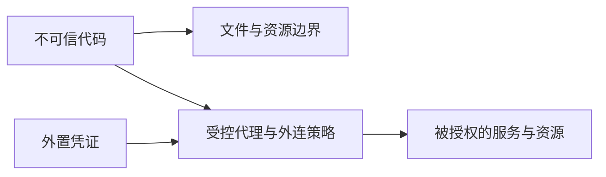

# Agent Sandbox — 安全沙箱选型

沙箱限定 Agent 的文件、网络、进程与资源权限。选型先明确不可信输入能触达什么数据和外部效果，再选择执行原语；没有任意代码执行也不代表没有工具越权风险。

| 维度 | 应核验的问题 |
|---|---|
| 文件 | 只挂载任务必需目录？路径和符号链接检查正确？ |
| 网络 | 限目的域名之外，是否还需限账号、资源、方法或路径？ |
| 资源 | CPU、内存、运行时间和并发是否有界？ |
| 复用 | 谁可复用状态？攻击内容或凭证会不会跨会话残留？ |
| 执行边界 | 共享内核、用户态内核或独立 guest kernel 适合哪种威胁？ |

图只展示职责；控制本身仍依赖可信基础。gVisor 是用户态内核方案，不是 microVM；普通容器与 VM 也不能仅以“软/硬防线”排序。

[LangChain 选型文章](https://www.langchain.com/blog/how-to-choose-the-right-sandbox-for-your-agent) 描述 LangSmith 使用独立 microVM、允许受控复用，并通过代理外置凭证。文章没有统一性能对照或“成本差 10 倍”的结果。真实 key 不进入沙箱，可减少凭证暴露，但经授权 API 仍可能滥用能力或泄漏工作区数据。

例如只需读 issue 的任务不应获得写整个组织仓库的凭证。评估同时检查越界读写、未授权外连、残留状态和合法任务成功率；审批与内容分类器不能替代执行边界。

详读：[[知识库/sources/web/langchain/right-sandbox-agent-精读]]；相关：[[Anthropic-Agent安全容器化实践]]、[[Parallax-Agent安全架构]]、[[Agent-Harness-Execution-Environment执行环境]]。
