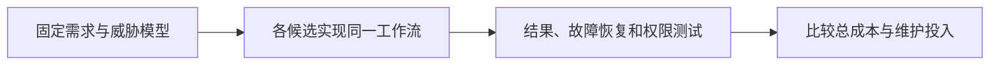

# Agent 框架 2026 — 能力与选型对照

本卡片按 2026-10-05 官方公开资料核验；没有执行统一性能/质量横评。各项目抽象层不同，先确定需要编排库、集成 SDK 还是可直接运行的 Agent 应用，再比较补齐组件后的整体方案。

| 项目 | 主要抽象 | 应核验的选型问题 |
|---|---|---|
| LangGraph | 可包含循环的状态图/工作流 | 持久化、恢复、副作用与部署组件如何配置？ |
| CrewAI | Crews + Flows | 角色协作与显式流程分别承担什么状态和控制？ |
| AutoGen | Core 事件运行时 + AgentChat | 已进入维护模式；新项目应评估官方推荐的替代方向 |
| Semantic Kernel | 多语言模型/插件集成 | 身份、权限和业务审计需要哪些额外组件？ |
| Hermes Agent | 含记忆、技能、工具和调度的 Agent 应用 | 默认行为、执行后端与持续运行的权限是否适用？ |

[AutoGen 官方 README](https://github.com/microsoft/autogen) 在核验时说明不再新增功能，社区维护，并推荐新用户使用 Microsoft Agent Framework；这里未验证迁移兼容性。

例如统一实现“生成草稿→人工审批→发布”，在发布响应丢失时验证不会重复发布；测任务成功率、恢复时间、未决状态和单位成功任务费用。把 [[Agent-Harness-Engineering-Survey综述]] 的七层作为检查清单，不把某项目的广告词或 Stars 当作覆盖与成熟度分数。

本次删除了无共同实验支持的“最完善、独有、治理领先”及“原生 SDK 零依赖”等排名。官方来源、版本状态与完整实验设计见 [[知识库/sources/web/agent-frameworks-2026/精读分析]]；相关：[[Hermes-Agent-自进化Agent框架]]、[[Custom-Agent-Harness-Middleware架构]]。
