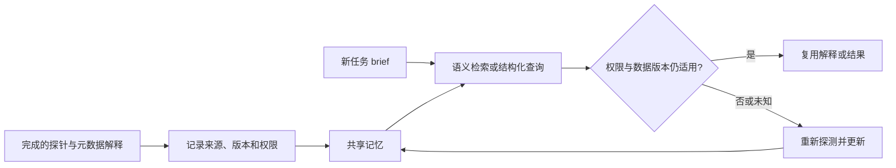

# Agentic Memory — Agent-First 语义缓存

## 定位与适用条件（Agent-First Data Systems，§5）

这里的 Agentic Memory 是**面向数据探索的共享语义记忆提案**，存储历史探针、元数据解释和探针之间的关联。它与 [[Agent-Memory-Survey-2026综述]] 中覆盖对话、经验和程序技能的通用 Agent 记忆有交集，但范围较窄。

适用前提是任务确有可复用信息，且来源、版本、权限和时效允许复用。语义相似不等于结果可直接复用；向量检索只能召回候选，不能替代有效性检查。

## 写入、检索与验证

图中版本与权限检查是根据论文开放问题补出的工程建议，论文没有实现这一完整管线。

| 记忆类别 | 例子 | 复用前需要确认 |
|---|---|---|
| 列语义 | `order_date` 是下单时间 | schema 与业务定义是否变更 |
| 数据特征 | `state` 存全称而非缩写 | 新数据是否改变分布 |
| 探针结果 | 销售相关表清单 | 是否新增表、是否与当前用户权限相同 |
| 探索经验 | 某个查询模式帮助找出相关数据 | 新任务目的与数据范围是否相同 |

例如上次“销售分析”发现了订单表，今天新增加了退货表。如果直接把旧清单当作完整答案，会漏算退货；合理做法是把旧清单当探索起点，并验证版本或重新列举。这说明缓存命中率不能单独代表任务正确率。

## 更新、共享与局限

论文讨论同步更新的开销与异步/惰性更新的陈旧风险，也考虑暂时容忍不一致；**没有确立唯一的首选一致性协议**。共享同一问题的历史结果还可能泄漏其他用户的访问范围或意图，权限过滤必须覆盖检索和结果返回，而不仅是原始数据库读取。

论文没有提供独立语义记忆原型、命中率/端到端准确率 benchmark 或可复现更新策略。建议同时测任务成功率、陈旧结果误用率、检索与刷新费用、权限越界率，再与无记忆及仅精确缓存比较。详见 [[知识库/sources/papers/Agent-First-Data/精读分析]]。
