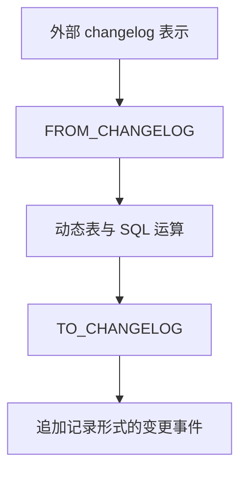

# Apache Flink 2.3.0：功能与采用边界

官方发布日期为 2026-06-25。本文对应这次发布公告，功能是否已在其他补丁或后续版本变化需另外核验。Flink 2.1.3 的发布日期是 2026-06-14，不能与 2.3.0 写作同一周发布。

| 改进 | 本版重点 | 采用时的边界 |
|---|---|---|
| FROM_CHANGELOG / TO_CHANGELOG | SQL 层在 changelog 表示与动态表间转换 | 2.3 实现基础能力，不能认为 FLIP 所有扩展均已完成 |
| Materialized Table | 列定义、DDL 演化、START_MODE | 仍需检查依赖、刷新语义和具体 DDL 限制 |
| Native S3 FS | AWS SDK v2，独立于 Hadoop/Presto | **2.3 为实验功能**，须验证配置、恢复和 sink 行为 |
| ON CONFLICT | 显式表达 sink 键冲突处理 | 不能把默认行为当作自动无损去重 |
| Adaptive Partition Selection | 动态考虑下游负载 | 对适用的 rebalance/rescale 等路径选择启用 |
| 恢复期间 checkpoint | 减少部分恢复链路的重复工作 | 默认未开启，需要相应配置与场景验证 |
| Watermark Alignment buffer | 改善对齐过程中的缓冲行为 | 默认行为有变化；应测试积压和迟到数据 |

追加的是描述变更的事件，不能因此把被描述的业务更新都当作单纯 append-only 数据。与 Fluss 的集成属于可探索方案，需要 connector、主键、格式和 sink 提交语义配套验证，不因两者都支持 changelog 就自然闭环。

公告还记录 MiniBatchGroupAggFunction 的缺陷修复：一阶段聚合处理 retract 情况时提前返回可能跳过其他 key。这个具体触发条件比“所有 retraction minibatch 都丢数据”更准确。PTF 的部分增强已包含，FLIP 余下能力仍有后续工作。

关联：[[流处理容错模型]]、[[流处理乱序数据管理]]、[[Fluss-整体架构]]。

## 核验来源

- [Flink 2.3.0 官方发布公告](https://flink.apache.org/2026/06/25/apache-flink-2.3.0-release-announcement/)
- [Flink 发布版本](https://flink.apache.org/downloads/)
