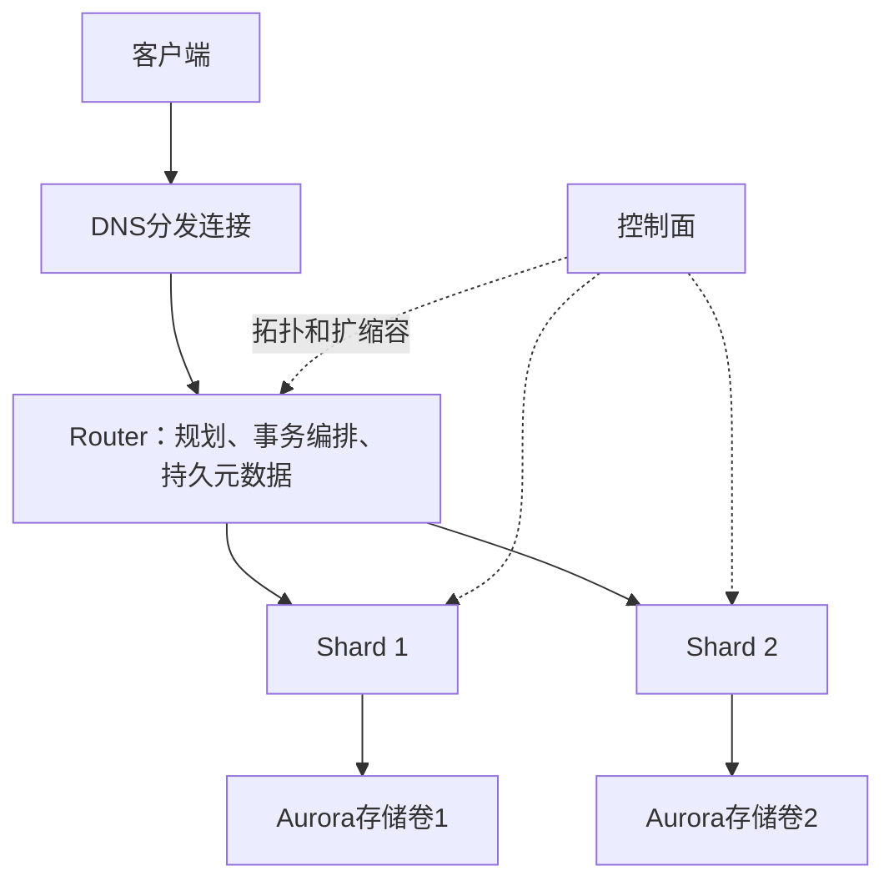

# Aurora Limitless 分布式架构

## 概述

Aurora Limitless Database 是 Amazon Aurora PostgreSQL 的水平扩展方案，通过 **Router/Shard 解耦架构** 实现透明分布式扩展，系统负责路由分片；客户仍需选择分片键、设计共置关系，并可能修改schema及SQL。系统已在 AWS 生产环境运行超过一年。

## 三层架构

- **Router**：服务应用流量，持有 schema + topology + shard mapping 元数据。无 standby（通过 DNS LB 实现高可用），每个连接绑定至一个 Router
- **Shard**：拥有数据分片。每个 Shard 是独立 Aurora PostgreSQL 集群。支持 0-2 个 standby（跨 AZ）
- **Control Plane**：集群管理、监控、热管理、备份恢复
- **Aurora Storage**：跨 3 AZ 6 副本，自动段修复，弹性容量。Aurora Limitless 利用其 quorum writes 避免了额外的 Paxos/Raft 共识层

## 三种表类型

| 类型 | 分布策略 | 声明方式 | 典型场景 |
|------|---------|---------|---------|
| **Sharded** | Hash(shard_key) 水平分区 | `limitless_create_table_mode = 'sharded'` | 大表（customers, orders） |
| **Reference** | 全量复制到每个 shard | `limitless_create_table_mode = 'reference'` | 小表常 JOIN（tax_rates） |
| **Standard** | 单 shard 存放 | `limitless_create_table_mode = 'standard'` | 不便分片 / 导入过渡 |

**Co-location**：相同 shard key 的表通过 `limitless_create_table_collocate_with` 声明共置，使 co-located join 可在单个 shard 内完成。

## 查询执行模型

### 单 Shard 查询（核心路径）
Router 利用 PostgreSQL partition pruning 识别所有数据在同一 shard 的查询，**直推到底**——单次往返。

### 跨 Shard 查询
1. Router 将 sharded table 表示为 PG **partitioned table** + **foreign table (FDW)**
2. 生成子计划下推到各 shard，**异步并行执行**（Async Foreign Scan）
3. 结果返回 Router 后 post-processing（排序、聚合）

**优化技术**：
- Predicate pushdown（IMMUTABLE 函数 + 内置操作）
- Co-located join pushdown（shard 本地 join，Router 仅 append）
- Reference table join pushdown（支持内连接 + outer join with ref as null-padded side）
- Partial aggregate/sorting pushdown
- Function 分发（声明 shard key 参数，执行推至对应 shard）

## 连接复用

Router 连接管理器以**事务粒度**在 shard 连接上复用客户端会话。事务完成后，其 shard 连接可被其他事务使用。Session 状态（认证、角色、变量）通过 session-context 传递跨事务保持。

## 与知识库关联
- [[存储计算分离数据库的-Tail-Latency]]：完全复用 Aurora 的 storage-compute separation
- [[Aurora-Limitless-时间戳事务]]：分布式事务协议
- [[Aurora-Limitless-自适应扩缩容]]：垂直+水平二维扩缩容机制

## 机制图与核验边界

来源：本地PDF §2–5、§7–8，页2–11；协议图3、扩展表2和图4–7。RR首个查询取快照，RC每语句取快照；Router持有持久元数据，无专用standby不等于无状态。实验NOPM不是TPS，NEWORD平均延迟不是P99。完整条件与r4→r5原文百分比勘误见[[知识库/sources/papers/Aurora-Limitless/精读分析|精读分析]]。
