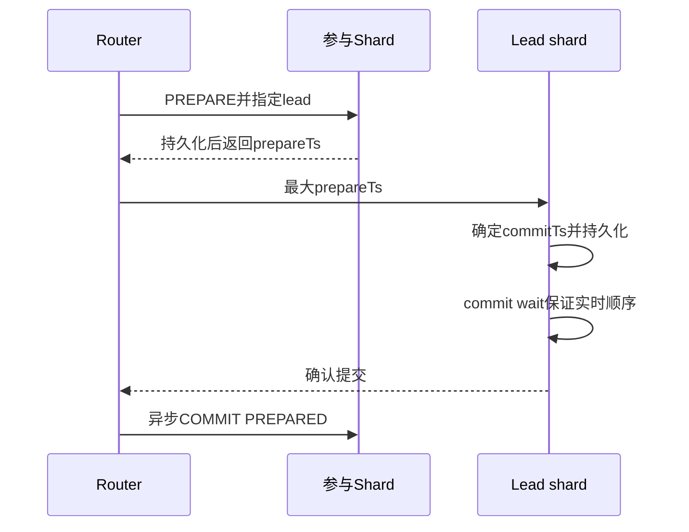

# Aurora Limitless 时间戳事务

## 概述

Aurora Limitless 通过 **基于物理时钟的时间戳快照隔离**（Clock-SI + HLC）替代 PostgreSQL 传统的 xid-based snapshot，实现分布式事务的一致性和高性能。支持 Repeatable Read (SI) 和 Read Committed 隔离级别，并通过commit wait尊重事务的实时先后顺序；论文称其为external consistency，但RR仍是SI。

## 核心机制

### 时间戳替代 xid

传统 PostgreSQL 的 xid-based snapshot 需要记录 `{xmin, xmax, xip_list}`，高并发下 snapshot 计算是 CPU 瓶颈，且在分布式环境中无法跨节点感知所有活跃事务。

Aurora Limitless 的方案：
- 事务执行首个查询时 Router 取 `now().latest`（Amazon Time Sync 上界）作为 `startTs`
- 行版本可见性判定：`xmin.commitTs ≤ T.startTs < xmax.commitTs`
- Shard 维护 xid → commitTs 映射（嵌入 PG commit log）

### Amazon Time Sync

AWS 各区域部署**冗余卫星同步原子钟集群**提供微秒级时钟精度：
- `now()` 返回 `{current_time, CEB}`
- CEB（时钟误差界）典型值 < 1ms，部分区域已降至低双位微秒
- 开源 ClockBound daemon ([github.com/aws/clock-bound](https://github.com/aws/clock-bound))

### HLC 消除因本地时钟落后产生的等待

传统 Clock-SI 的问题：shard 读请求的 snapshot timestamp 可能在 shard 本地时钟之后，需要等待时钟追上。

Aurora Limitless 使用 **混合逻辑时钟（HLC）** 避免单纯等待本地物理时钟追上快照：
- Shard 维护逻辑时钟 C
- 每次收到读请求 T：`C = max{C, T.startTs + 1}`
- Shard 的 prepare timestamp = `max{C, now().latest}`
- 效果：在推进时钟后才获取prepare/commit时间戳的事务被排到T快照之后；已prepare或COMMITTING的事务仍按下述状态处理，不能笼统说所有后续完成的事务都在快照之后

### Prepare 状态处理

读到 prepare 状态的行时，Shard 向事务的 Lead Shard 查询状态：
- 已提交 → 返回 commitTs 决定可见性
- 未提交 → Lead Shard 推进其 HLC ≥ `T.startTs + 1`，确保最终 commitTs > T.startTs

### COMMITTING 状态处理

事务已获得 commit time 但存储写入未完成 → 标记为 COMMITTING。若其 commitTs ≤ 读事务 startTs，读该行需等待 commit/abort 完成。

## 分布式提交协议（Lead Shard 2PC）

**设计动机**：Router 无专用 standby，其故障恢复可能需数分钟。因此仍由Router编排2PC，但把权威提交状态持久化在可配standby的lead shard，以缩短故障决定恢复时间。

**Lead Shard 2PC 流程**：
1. Router 选一个参与 shard 为 lead，向其他参与 shard 发 `PREPARE TRANSACTION`（含 lead shard ID）
2. 各 shard 计算 prepare timestamp（`max{C, now().latest}`），持久化 prepare 信息 + lead shard ID
3. Router 取所有 prepare timestamp 最大值发给 lead
4. Lead 取 `max(router_value, own_proposal)` 为 commitTs，本地持久化并提交
5. Lead在满足`now().earliest > commitTs`后回复Router；Router再通知客户端，并异步向其他shard发`COMMIT PREPARED`

**故障恢复**：Router 故障时，其他 shard 查询 lead shard 决定 commit/abort

**优化**：
- 只读事务直接 commit
- 单 shard 更新事务跳过 2PC，目标 shard 本地管理

## 外部一致性（External Consistency）

在SI基础上增加尊重实时先后顺序的性质：如果T2在写事务T1返回客户端后开始，则`T2.startTs > T1.commitTs`。这不把SI提升为Serializable或严格可串行化；并发事务仍可能write skew。

实现：**commit wait**——lead shard 确定 commitTs 后等待 `now().earliest > commitTs` 再回复 Router。由于 commit wait 与 storage write 并行执行，且 storage write latency 通常 > CEB（<1ms），wait 很少增加延迟。

## 隔离级别对比

| 属性 | Repeatable Read (SI) | Read Committed |
|------|---------------------|----------------|
| Snapshot timestamp | 首个查询确定，事务内复用 | 每个语句重新计算 |
| 获取行锁后的版本冲突检查 | 若存在快照后的已提交修改则中止 | 不做这一项SI版本检查，但仍持排他行锁 |
| 修改行锁 | 排他锁至 commit | 排他锁至 commit |

## 一致性解释边界

这是尊重实时顺序的SI，不是Serializable；SI仍可出现write skew。基于本文无法给其他数据库当前能力统一打勾或打叉。

## 与知识库关联
- [[事务模型深度调研]]：本文的 SI 实现（Clock-SI + HLC + external consistency）
- [[事务模型深度调研]]：时间戳替代 xid 的多版本方案
- [[事务模型深度调研]]：lead shard 2PC 变体
- [[CockroachDB-Leader-Lease-整体设计]]：CockroachDB 的 HLC-based 一致性 vs 本文的物理时钟方案
- [[事务模型深度调研]]：Clock-SI / 2PC / 3PC / Percolator 体系位置

## 机制图与核验边界

来源：本地PDF §2–5、§7–8，页2–11；协议图3、扩展表2和图4–7。RR首个查询取快照，RC每语句取快照；Router持有持久元数据，无专用standby不等于无状态。实验NOPM不是TPS，NEWORD平均延迟不是P99。完整条件与r4→r5原文百分比勘误见[[知识库/sources/papers/Aurora-Limitless/精读分析|精读分析]]。
