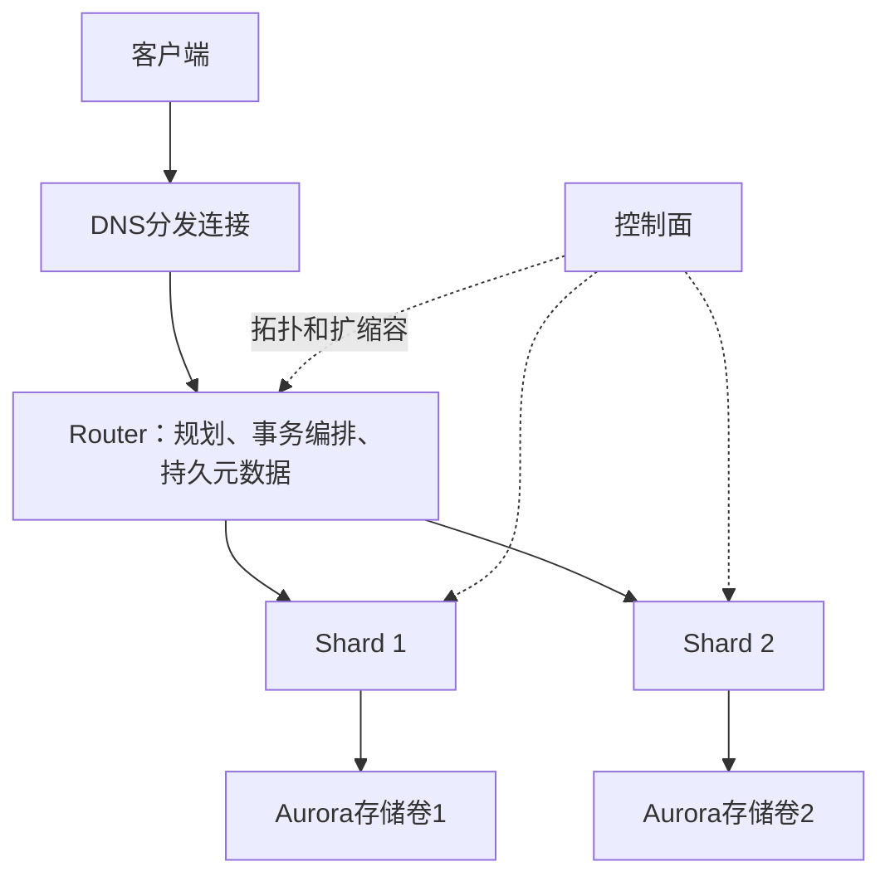

# Aurora Limitless 自适应扩缩容

## 概述

Aurora Limitless 实现了**二维自适应扩缩容**：垂直方向通过 Aurora Serverless V2 动态调整单节点 ACU，水平方向通过 table slice 粒度的 shard split 增加 shard 数量。这是本文提出的组合设计，其收益依赖分片分布与资源预算。

## ACU 模型

- **ACU (Aurora Capacity Unit)**：≈ 2 GB 内存 + 对应 CPU/网络
- 客户设置 shard group 的 **total min/max ACU**（不含 standby，standby 容量与主 shard 一致且不计入预算）
- 最大生产集群：64 shards + 32 routers；最常见配置：4 routers + 8 shards

## 垂直扩缩容 (Serverless V2)

### 动态容量分配

初始 ACU 预算均分给所有 shard group 成员。随后按实际消耗比例动态调整：

```
dynamicMinACU_i = shardGroupMinACU × (consumedACU_i / ΣconsumedACU)
dynamicMaxACU_i = shardGroupMaxACU × (consumedACU_i / ΣconsumedACU)
```

### Shard vs Router 差异化策略

| 维度 | Shard | Router |
|------|-------|--------|
| 扩缩容触发 | compute + buffer-cache 使用率 | heap memory 使用率 |
| 内存分配 | 偏向 buffer cache | 偏向 heap memory |

### 非对称速率

- **Scale-up**：快速响应负载尖峰
- **Scale-down**：保守防 thrashing（需更长低利用率周期）

## 水平扩缩容 (Shard Split + Router Addition)

### Table Slice 机制

- 每个 sharded table **典型为 512 个 slices**
- Slice 是数据迁移的最小粒度
- Shard 将所属 slice 表示为 PostgreSQL partitioned table（partition = slice）
- **Co-located 表的对应 slice 一起迁移**，保持 join 优化能力

### Shard Split 工作流（4 阶段）

```
Phase 1: Storage-level Clone (Copy-on-Write)
Phase 2: Redo-log Replay
Phase 3: Switchover (lock → remap → unlock)
Phase 4: Background Cleanup
```

#### Phase 1: 存储层克隆
- 使用 **Aurora copy-on-write 克隆**源 shard volume
- **不对源 shard 增加额外读负荷**（只触发修改时的写入）
- 源 shard 即使在满负载下也可以执行 split

#### Phase 2: Redo 日志回放
- 克隆需要时间，期间源 shard 继续产生 write
- 新 shard 追赶源 shard 的 redo log

#### Phase 3: Switchover
- 所有 Router/Shard **锁住待迁移表**（阻塞新写入）
- 无法立即获取的锁 → 相关事务被终止
- 新 shard 完成 redo 回放，Router 更新 slice→shard 映射
- 源 shard：`DETACH PARTITION` 已迁移 slices
- 新 shard：`DETACH PARTITION` 非归属 slices
- 释放锁，继续服务
- ⚠️ **客户感知**：短暂 DDL/更新阻塞 + 部分进行中事务被终止

#### Phase 4: 后台清理
- 两个 shard 后台清理不再归属于自己的 slices

### 自动 Shard Split

热管理服务（heat-management service）监控 shard 的 ACU 和存储消耗，超过预设阈值时自动触发 split（即使垂直扩缩容已达上限）。

### Router 添加

Router 添加流程类似：克隆现有 Router → 更新拓扑 → DNS 注册。新 Router 连接即可用于流量。

## 垂直 vs 水平扩展选择

两种扩展维度相互补充，非互斥：

| 场景 | 策略 |
|------|------|
| 非饱和系统 | 垂直扩展（增加 ACU）→ 提升单节点性能 |
| 饱和/热点系统 | 水平扩展（增加 shard）→ 分散负载 |
| 最优性价比 | 组合使用 |

## 实验验证

HammerDB TPCC 测试结果印证了这两种策略的有效性：

| 对比 | 类型 | 吞吐提升 | 延迟降低 |
|------|------|---------|---------|
| r1→r2 (2r4s → 4r8s) | 水平 | +58.7% | -29.1% |
| r3→r5 (8r16s, ×2 ACU) | 垂直 | +41.6% | -40.8% |
| r1→r5 | 叠加 | +128% | -67% |

ACU 分配图显示：更多 shard 带来更均衡的负载分布（shard 间峰值 ACU 方差更小）。

## 与知识库关联
- [[Aurora-Limitless-分布式架构]]：Router/Shard 解耦为二维扩缩容提供基础
- [[存储计算分离数据库的-Tail-Latency]]：copy-on-write 克隆依赖 Aurora Storage 层
- [[Silo-Compaction-迁移协议|HATS副本选择与配额]]：只调读流量和本地压实配额，不是shard数据迁移


## 机制图与核验边界



来源：本地PDF §2–5、§7–8，页2–11；协议图3、扩展表2和图4–7。RR首个查询取快照，RC每语句取快照；Router持有持久元数据，无专用standby不等于无状态。实验NOPM不是TPS，NEWORD平均延迟不是P99。完整条件与r4→r5原文百分比勘误见[[知识库/sources/papers/Aurora-Limitless/精读分析|精读分析]]。
