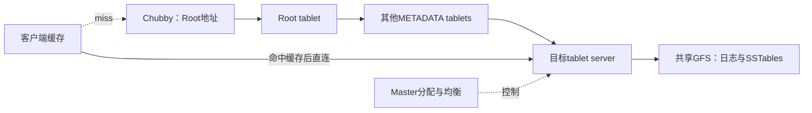
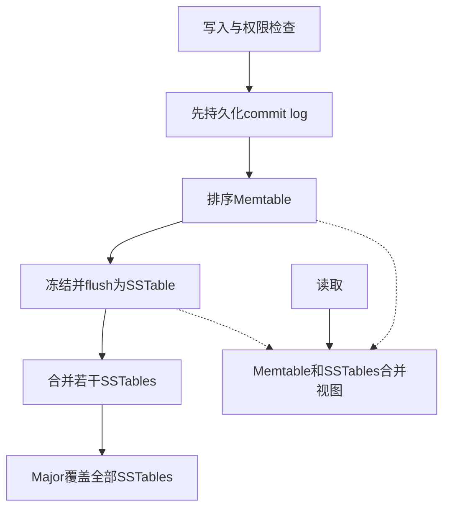

# Bigtable：分布式结构化存储系统

## 模型与边界

2006年论文的Bigtable是稀疏、持久、有序多维map：`(row,column,timestamp)→bytes`。row按字典序，column由family与qualifier组成，时间戳区分版本。同一行的读写原子性不等于跨行事务或SQL数据库。列族显式创建，qualifier可动态增加，版本保留按列族配置（§2–3）。

例：反转域名row把同网站页面相邻存放；页面内容和元数据可分到不同locality group。前者是行排序，后者是列族物理分组，不能混淆。

## 路由与所有权（§5.1–5.2）

每tablet一时只有一个server负责。server失去Chubby文件锁即停服；master确认获得该锁并删除server文件后才将其tablet重分配，防止旧server重新服务。Master不在普通数据路径，但其恢复仍影响需要重新分配的tablet，不能保证所有故障完全无中断。

三层定位按128MB metadata tablet、每行约1KB，可寻址`2^34`个tablet，而非`2^34`字节。空缓存需3次往返，旧缓存可能6次（§5.1，图4）。

## 持久化与Compaction（§5.3–5.4）

Memtable是排序缓冲，原文未指定COLA；SSTable不可变、含block与索引。Minor释放内存且缩短日志恢复；merging限制文件数；major将全部SSTables重写为一个，移除删除标记与被删值。非全量合并仍需tombstone遮蔽未合并旧文件，不能任意删除。

每server合用日志支持group commit；恢复先按tablet归属排序日志，避免每个接管节点重复扫描整份日志。计划迁移用两次minor compaction缩短尾部回放；§7报告迁移通常短于1秒，并没有“所有故障恢复100–200ms”保证。

## 优化与实验依据

§6：locality group分离不共访列族；Scan cache复用KV，Block cache复用SSTable块；可按组启用Bloom filter排除不存在的row/column；不可变SSTable可由分裂子tablet共享。

§7/图6：1GB内存的tablet server、1000-byte不可压缩value、共享1786台GFS机器、千兆网络。单server随机写8850 values/s，500server配置下每server2000；随机读由1212降为241。总吞吐提升但不线性，block读取放大和共享网络约束是原因。此表测的是吞吐，不是延迟分位；“10万写/s”和旧卡Chubby五个九目标未获该PDF支持。

## 工程启示

**推论**：缓存路由必须配失效重查；迁移与故障接管必须有owner fencing；小随机读应评估block大小，而scan应评估RPC摊薄。持久化副本、可见性、分片所有权是不同不变量。

来源：[[知识库/sources/papers/Bigtable/精读分析|完整精读与页码]]；相关：[[LSM-Tree]]、[[LSM-Tree-合并优化]]。
