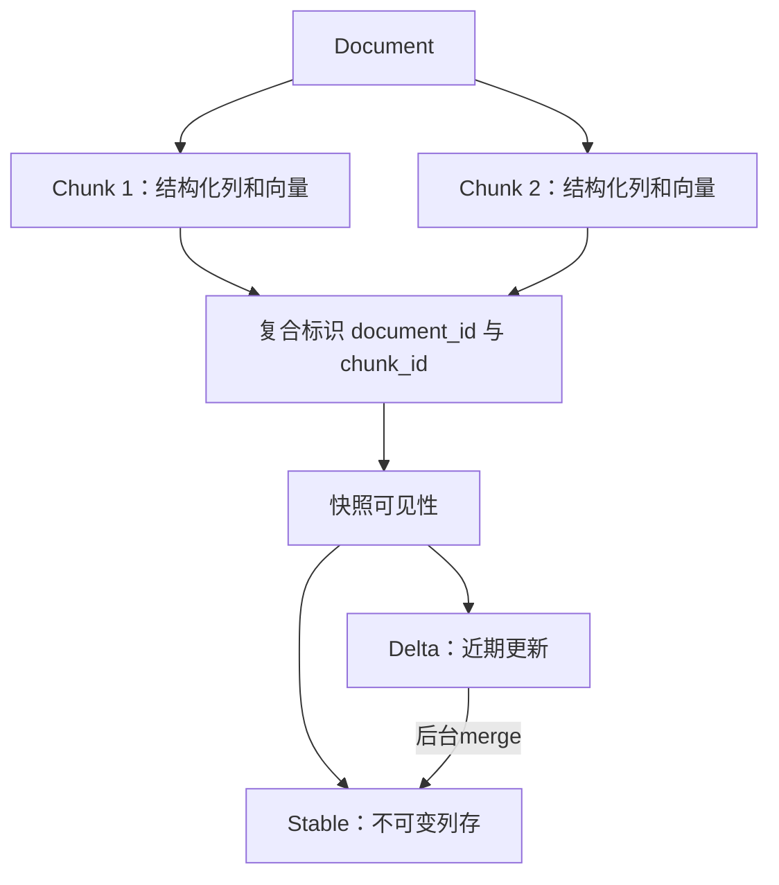

# ByteHouse 统一表引擎

## 定义

ByteHouse 的 Unified Table Engine 将结构化 OLAP、增量刷新、多模态检索统一到同一个存储引擎中，提供一致的表模型、统一元数据和事务可见性。

## 逻辑表设计 — Document/Chunk 两级抽象



- 复合主键: `(document_id, chunk_id)`
- 同一个表中既有结构化列（数值/字符串）又有向量列（embedding）
- 排序键：范围裁剪（扫描） + 低延迟点查（向量检索）

## 物理表设计 — Stable + Delta Segment

| 段类型 | 内容 | 特点 |
|--------|------|------|
| Stable Segment | 不可变列式数据 | 扫描优化，定期更新 |
| Delta Segment | 最近写入/更新/特征刷新 | 增量追加，频繁操作 |

**MVCC 版本控制**：
- 查询读一致性快照，不受后台刷新干扰
- 后台异步 Compaction 将 delta 合并到 stable
- Adaptive Compaction Controller：公式控制压缩强度

## 自适应 Compaction 控制

```
α = min(1, max(0, k · (N_Δ / N* - 1)))

- N_Δ: 活跃 delta segment 数量
- N*: 平衡状态阈值
- k: 灵敏度系数
- α: 压缩强度 [0,1] → 决定触发频率、批次大小、调度优先级
```

α 低 (N_Δ ≈ N*) → 保守压缩，避免 write amplification
α 高 (N_Δ >> N*) → 激进压缩，恢复扫描局部性
线性限幅控制让强度随积压平滑增加；完整系统是否振荡仍取决于反馈时延和参数

## 两阶段写入流水线

```
写入 → staging (ByteKV, row-oriented) → flush → columnar storage
  1. 暂存到分布式 KV                            2. 达到阈值/时间后转列存
```

- Staging 阶段：WAL 保证持久化 + 原子性
- Flush 阶段：schema evolution + 版本可见性保留
- 与 [[Log-as-the-Database-模式]] 思路一致：先写 WAL 再物化

## Sniffer 自描述文件格式

- 数据、索引（Min-Max/Bloom）、元数据 **colocate 在同一文件中**
- 减少文件级索引/元数据分散导致的额外访问；系统仍需要catalog
- **关键优势**：索引、数据与文件元数据共置，减少点查访问；实际I/O数依赖索引缓存和所需数据块

## CrossCache — SSD 集群缓存

- 独立扩缩容的 SSD 缓存层
- Chunk 粒度分片，一致性哈希路由
- Prefetching + 异步刷写
- 闭合存算分离 vs. 数据局部性的性能差距

## NexusFS — 虚拟文件系统

统一访问三种存储后端：
- 本地 SSD（最佳延迟）
- CrossCache 节点（中等延迟，共享缓存）
- TOS/HDFS 对象存储（最大容量）

Alignment-aware region management + buffer 编排。

## 对比边界

本卡描述论文版本的ByteHouse。删除未逐一验证的当前竞品能力矩阵；比较Doris、ClickHouse或Snowflake应固定版本、部署模式和相同工作负载。


## 证据与适用条件

核验本地PDF：§2–3（页2–6）架构与存储，§4–6（页6–10）执行和优化，§7（页10–12）实验。ClickBench 43查询各跑5次取最快，较ClickHouse总延迟降低25.4%；向量实验为99%召回、1%标量过滤；CrossCache对照含无缓存、100%/50%本地命中。不同实验不能混为统一收益。细节见[[知识库/sources/papers/ByteHouse/精读分析|精读分析]]。
