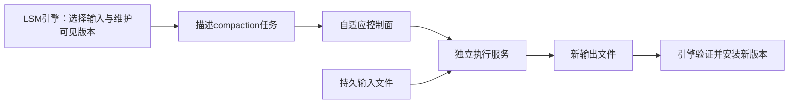

# CaaS-LSM：独立 Compaction 服务

> **来源层级**：本次只核验本地2025 LSM综述的页16的分布式架构与卸载段、参考文献[140]（页37）。这是二级来源概念卡，不是CaaS-LSM独立原论文精读；原有`draft`审核状态不升级。

## 综述明确支持的结论

2025综述明确描述：把compaction解耦成无状态服务，并用自适应控制面管理；远端执行是存算分离场景的一条路线。

## 服务化解决什么

本地线程池把compaction算力与数据库节点绑定；单独服务允许独立配置算力和跨任务调度。但“worker无状态”仅指执行角色，不等于整个数据库没有状态，也不意味着安装新SSTable不需要一致性协调。

图刻画综述能够支持的职责边界；存储后端、传输格式和原子安装协议尚未按独立原文核验，不能标定成HDFS/FaaS平台固定实现。

## 教学示例与正确性问题

若任务以文件A、B为输入生成C，期间前台继续写入新Memtable，C只覆盖既定输入范围，不能吞掉并发写。worker超时后重试可能产生重复结果，安装侧需要判定输入版本仍有效、输出完整且重试不重复改变可见状态。这些是服务化系统评审必须回答的问题，**不是声称CaaS-LSM采用了某种特定两阶段协议**。

## 成本与适用边界（工程推论）

需比较远程排队、读入、计算、写出、安装总时间与本地执行，关注网络、对象存储费用和失败重试。输入文件小、网络拥塞或远端也繁忙时，offload可能无利可图。无状态并不能推出“无需任何锁/状态协调”或“节点崩溃对服务绝无影响”。

旧稿的8×吞吐、98%P99、61%对SOTA、HDFS固定后端、O3-LSM同条件快3.4×及具体容错分级，本次无独立原文支撑，已移除为结论。待核原始配置、任务安装机制与公平基线。

相关：[[LSM-Tree-合并优化]]、[[Nova-LSM-分布式组件化LSM]]、[[Silo-Compaction-迁移协议|HATS副本选择与配额]]。HATS不迁移compaction job，与本方向不同。
