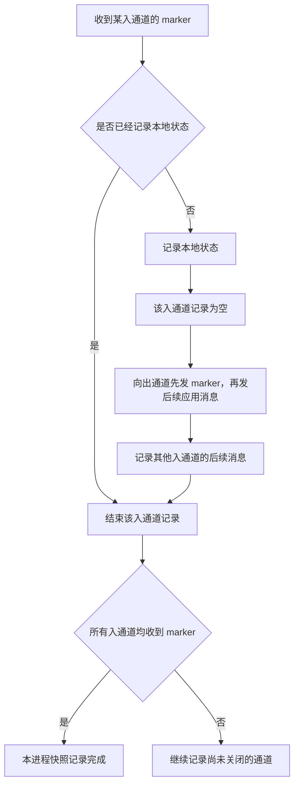

# Chandy–Lamport 分布式快照算法

## 定义与适用条件

在可靠 FIFO 有向通道、有限传输延迟与不考虑进程崩溃的模型下，进程继续运行时，协同记录进程状态和通道在途消息，形成一致的全局状态。原文见 §2–3（印刷 pp. 65–71；PDF pp. 3–9），完整推导见 [[知识库/sources/papers/Chandy-Lamport-Snapshot/精读分析]]。

**关键纠错：快照可能没有在原执行的任何一个时刻出现过。** §4 的 Theorem 1 证明它出现在一个保持因果关系、重新排列独立事件的合法执行中，并可从快照开始状态到达、继续到达结束状态。不能把“可能发生”解释为“确实发生但墙钟时间未知”。

## Marker 的发送与接收

发起者不必等待首个 marker：先记录自身，先发 marker，再发后续应用消息，并记录入通道直到对应 marker 到达。

首个 marker 所在通道为空是因为 FIFO，之前的消息已在本地状态记录前收到；**不是因为该通道从未发送消息**。后续 marker 封闭的记录，恰好是本地快照之后收到、发送方快照之前发送的消息。原算法不会要求收到 marker 后暂停所有应用处理。

## 不变量与示例

一致切割不允许“接收已发生、发送却未发生”；跨越切割的消息必须存入通道状态，不能漏掉，也不能重复计入进程状态。

自构转账例：发送方记录余额 90，接收方在转账到达前记录余额 100，通道中记录转账 10，总额仍为 200。若接收方在转账后才记录，则记录余额 110，通道为空，总额也为 200。两者都是合法一致切割。

## 终止与稳定属性

§3.3 的条件是每个进程自己启动，或可从某个启动进程沿有向路径到达，并且 marker 最终被接收。强连通只是一个充分条件。还要汇集各节点的记录，才得到可供查询或保存的完整全局快照。

§5 的稳定属性一旦为真不会再变假。快照中为真，可以推出快照结束时为真；快照中为假，只能推出启动时为假，不能推出结束时为假。本文讨论的典型例子是终止、无外部恢复动作的死锁和令牌消失。等待图环是否足以说明死锁，仍取决于具体资源等待模型。

## 对流处理的启发与边界

[[流处理容错模型]]、[[流处理状态管理]] 借助 barrier 建立一致恢复点，但 aligned 与 unaligned checkpoint 的通道处理不同，不能直接用同一张“阻塞后保存全部通道”的图概括。这里保留原始算法流程图；Flink 的工程图由相应技术卡片维护。

论文证据是模型、例子和定理，**没有性能基准实验**。每条通道一个 marker 是算法级开销；状态持久化、崩溃恢复、非 FIFO 通道以及 sink 的 exactly-once 协议不由本文单独解决。

> 核对依据：原始 PDF §3.2–3.3、Figure 8、Theorem 1、§5；TOCS pp. 70–75 / PDF pp. 8–13。保留原审核状态，本次更新表示来源核对，不等于独立生产验证。
