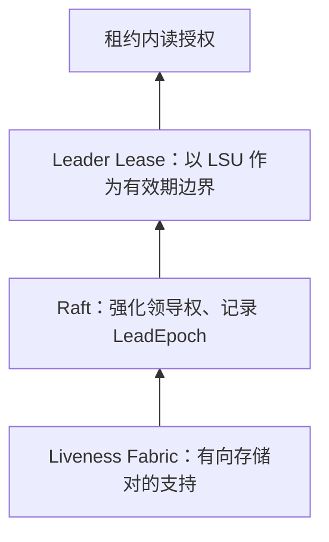

# CockroachDB Leader Lease：共享维护与安全读授权

## 目标与三层设计

原文 §3.1–3.2（PDF p.4）把常态租约续期从每个 Range 下沉到共享支持层。CockroachDB 使用 **Raft**；leader 取得 fortified term 后才可持有 Leader Lease。

Fabric 不是仅知道“某节点在线”，而是知道 A 是否仍被 B 支持；有共同共识组的节点/存储对共享支持。已建立 fortification 后可避免逐 Range 续租与常态心跳，但组级状态、写复制和 leader ticks 仍存在。

## 从支持到 Lease

Leader 向 follower 请求 MsgFortifyLeader，收到 quorum 承诺后，仅使用已确认且 LeadEpoch 匹配的支持计算 `LSU=max_Q min_r τ_r`。支持 epoch 变化需要重新强化，不能用新 epoch 的时间自动续旧承诺。具体见 [[CockroachDB-Leader-Fortification]] 和 [[CockroachDB-Liveness-Fabric-故障检测层]]。

非合作新 holder 必须先当选leader；合作转移暂时使用expiration lease，待领导权转移后再转换。因此“统一角色”是正常路径设计，不排除转移期短暂分离。

## 安全性和故障例

§4 的目标是 lease 区间不相交。节点4可以访问系统探活节点1–3，却不能访问数据同伴5–6时，集中lease会持续续租，导致数据组在该分区持续期间无法恢复。Fabric的有向支持及fortification让数据组的支持到期后释放领导权，不把集中节点可达当作数据quorum可达。

## 测试支持什么

§5、Figures5–8：统一3秒lease、1秒续约，在无负载的三节点CPU测试中，Leader Leases保持低于15%，expiration在80K Ranges超过90%；作者概括为CPU**最高减少85%**，不是85%以上的保证。相同期限的崩溃/全分区中，Leader Leases P50约4.0–4.7秒，旧类约3.0–3.9秒，反映恢复串行化代价。

Fabric的1800-store实验约0.225核，是观测实例CPU尺度，不能写作150节点全集群总共0.225核。每节点开销随对端数量增长，并不意味着集群mesh通信总体线性。

实验版本、硬件、TPC-C条件和磁盘stall解释见 [[知识库/sources/papers/CockroachDB-Leader-Leases/精读分析]]。本次核对原文；保持既有draft状态。
