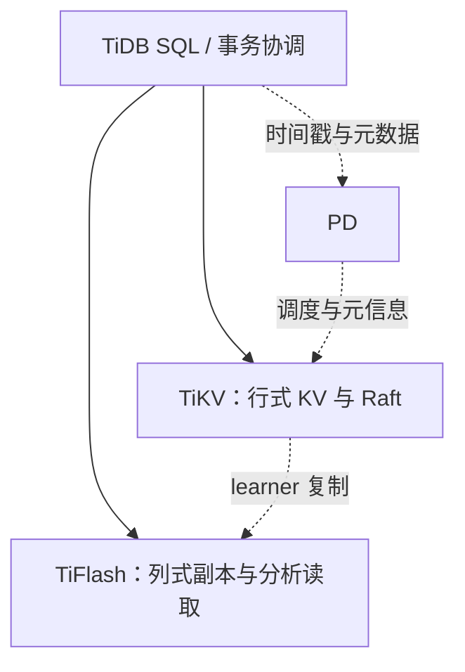

# CockroachDB 与 TiDB：事务和存储职责对照

本文比较架构，不提供没有同一负载基线的性能排名。产品版本与配置会改变行为，隔离级别和复制策略应按所用版本检查。

| 维度 | CockroachDB | TiDB 体系 |
|---|---|---|
| SQL 执行 | SQL 层将请求转为分布式 KV 操作 | 无状态 TiDB SQL 层协调 TiKV / TiFlash |
| KV 复制 | range 的 Raft 多数复制 | TiKV region 的 Raft 复制 |
| 事务协调 | 事务协议建立在复制 KV 之上 | 协调器与 TiKV 执行事务，PD 提供时间戳和元信息等 |
| 分析执行 | 向量化 SQL 执行不等于物理列式存储 | TiFlash 提供列存副本路径 |

图中的 PD 是控制与时间戳服务，并非每条用户数据都顺序经过的 `SQL → PD → KV` 中转节点。一次事务的多个 RPC、时间戳获取和提交优化要分开分析。

## 选型应验证什么

固定事务大小、热点分布、跨分片比例、读写比例和故障场景；分别测尾延迟、吞吐、分析与交易相互干扰。Raft 只解决副本间日志复制，不自动提供跨 range / region 的完整事务语义。

原稿“CockroachDB 内置列存”混淆执行向量化与存储布局；“TiDB 是 CNCF 毕业项目”混淆 TiDB 与 TiKV，已修正。许可与商业条款可能变化，不用旧稿许可标签作为采购判断。

关联：[[CockroachDB-Leader-Lease-整体设计]]、[[事务模型深度调研]]、[[Raft-共识算法协议核心]]。

## 核验来源

- [CockroachDB 架构](https://www.cockroachlabs.com/docs/stable/architecture/overview)
- [TiDB 架构](https://docs.pingcap.com/tidb/v8.1/tidb-architecture/)
- [TiFlash](https://docs.pingcap.com/tidb/stable/tiflash-overview/)
