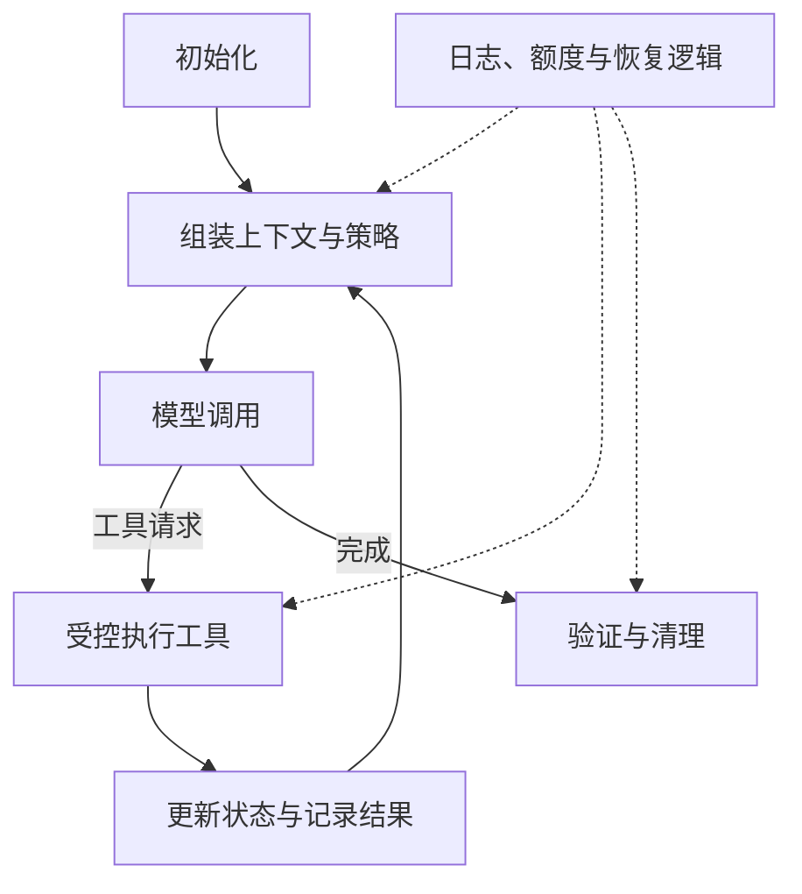

# Custom Agent Harness — Middleware 架构

Middleware 将上下文组装、工具生命周期、状态、重试与策略干预放到 Agent 循环的明确位置。它让逻辑可复用，但模块之间仍可能共享状态、改变控制流和竞争预算。

图为概念位置，不是当前库的字面 hook API。四种扩展杠杆是确定性逻辑、工具管理、自定义状态和流事件处理；一项能力可横跨多个模块，也可由一个模块承担多种职责。

**组合例子**：摘要先于审计，会改变审计可看到的原文；重试嵌套会放大调用量。为模块明确状态归属、顺序、失败和幂等语义，并共享任务预算，比单纯检查单个模块更重要。

[原文](https://www.langchain.com/blog/how-to-build-a-custom-agent-harness) 没有共同 benchmark 证明更强 Harness 永远胜过更强模型，也没有证明顺序执行等于无耦合。权限 middleware 还必须连接实际执行边界；仅在同权限进程里检查参数不足以提供 [[Parallax-Agent安全架构]] 所要求的隔离。

[[Loop-Engineering-多层Agent循环架构]] 决定运行与改进循环，middleware 决定具体干预位置。模型路由可借此接入，但替换模型后仍应验证工具调用、状态兼容和任务质量。

详读：[[知识库/sources/web/langchain/custom-agent-harness-精读]]；相关：[[Agent-Fault-Tolerance-容错设计]]、[[Agent-Cost-Control-Gateway成本控制]]、[[Agent-Sandbox-安全沙箱选型]]。
