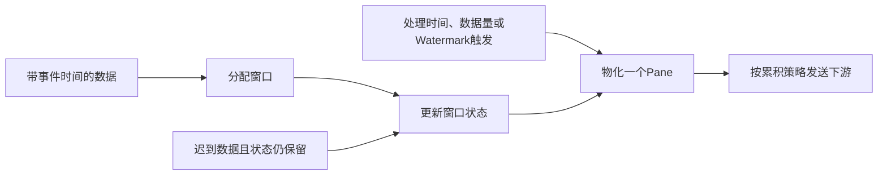

# Dataflow 模型

Google Dataflow Model 将有界与无界、按序与乱序数据处理放进统一的编程模型。此卡依据流处理综述 §3.5.3（PDF p.9）与其引用的 Akidau et al. VLDB2015 论文；不把它称为“首个批流统一模型”，也不把各运行时的API语义完全等同。

## 四问对应四个独立选择

| 问题 | 抽象 | 例子 |
|---|---|---|
| What | 数据变换 | 按用户求金额总和 |
| Where | 事件时间窗口 | 10分钟固定窗、滑动窗、会话窗 |
| When | 触发 | 处理时间提前触发、watermark越窗、迟到数据触发 |
| How | 多次输出的累积方式 | discarding、accumulating、accumulating-and-retracting |

## 时间与进度不能混为一谈

事件时间由数据提供，可能有时钟偏差或业务定义；处理时间是执行系统处理事件的时刻；ingestion time是入口记录的时刻，不能自动保证跨源事件顺序。Watermark表达相对于某个事件时间的进度：有的源可提供严格下界，有的只能估计。**并非所有watermark都不精确**。

Watermark越过窗口边界可以触发on-time输出；它不自动意味着永不迟到或删除状态。能否接受迟到事件还取决于watermark契约、allowed lateness及状态保留策略。Trigger控制何时输出，不能单独保证所有数据都已包含。

## 用同一笔迟到数据看三种累积策略

假设窗口先收到4、6，提前pane的和为10，后来又收到同窗口的3：

| 策略 | 第二个pane | 下游应如何理解 |
|---|---|---|
| Discarding | 3 | 只含上次触发后的贡献，需按其契约合并 |
| Accumulating | 13 | 含窗口截至目前全部贡献；sink需按窗口身份更新，不能直接追加求和 |
| Accumulating and retracting | 撤回10，再给13 | 下游必须支持撤回/更新语义 |

这是机制演示，未指定某框架的API。若状态已经清理，这条迟到记录可能被丢弃或送侧输出，不能继续套用表中的更新过程。

## 适用边界与验证

模型让开发者显式交换正确性、延迟与资源：更早输出需支持后续修正，更长迟到保留需更多状态。实现选型要测迟到分布、状态大小、早期/最终输出延迟和下游更新成本。批流统一不消除这组成本，也不自动带来端到端exactly-once。

Dataflow吸收了更早的punctuation、low-watermark与revision processing。Naiad并非第一代DSMS，不能把它机械放入“Dataflow的第一代前身”表。Beam、Flink、Spark等有相关抽象，运行时支持、默认值与sink契约需要分别核实。

## 关联与来源

- [[流处理乱序数据管理]]：进度机制及循环数据流。
- [[流处理状态管理]]：窗口状态何时持久化和回收。
- [[流处理容错模型]]：多个pane与重复执行是不同问题。
- [[知识库/sources/papers/SP-Survey/精读分析]]；[Google Research 原论文页](https://research.google/pubs/the-dataflow-model-a-practical-approach-to-balancing-correctness-latency-and-cost-in-massive-scale-unbounded-out-of-order-data-processing/)。
