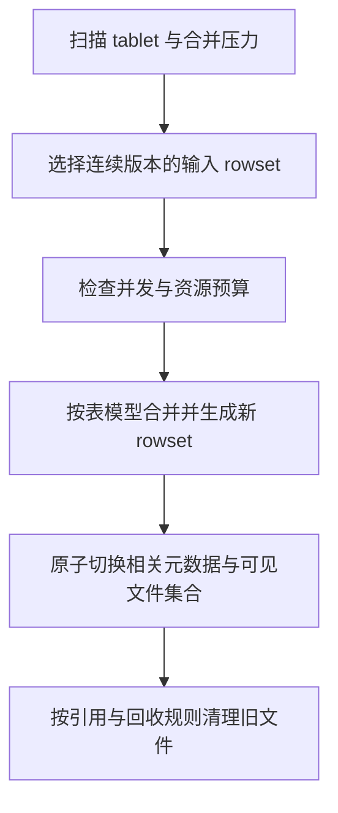

# Doris Compaction：选哪些文件与怎样合并

不能把 Cumulative、Base、Vertical 和一次导入内的 Segment Compaction 当成四个互斥的同级策略：前两者偏向 rowset 选择与合并范围，Vertical 是执行算法，Segment Compaction 位于导入内的 segment 合并过程。

| 机制 | 主要解决的问题 | 代价或限制 |
|---|---|---|
| Cumulative | 小增量 rowset 积累 | 与导入和读取竞争资源 |
| Base / Full | 更大范围的历史 rowset 整理 | 大任务的 I/O 与运行时间 |
| Vertical | 分列组处理，降低宽表合并工作集 | 需要维护行来源顺序；收益依赖宽度与 I/O |
| Segment Compaction | 单次大批量导入产生过多 segment | 需结合导入路径与版本配置 |

新输出必须保持原来版本范围和表模型的逻辑结果。更多线程并非必然更快：当磁盘或内存已饱和，会放大前台尾延迟。观察 rowset 数、compaction score、待处理字节、写入失败和查询 P99，再结合批量大小及时间序列策略调整。

官方宽表案例中的内存和速度收益只适用于其条件，不应改写为全部表的性能保证。LSM 的写放大框架有助于分析，但 Doris 的 rowset/version 与标准 RocksDB 层级并不一一对应。

关联：[[Doris-Segment-v2-存储格式]]、[[LSM-Tree-合并优化]]。

## 核验来源

- [Compaction 原理](https://doris.apache.org/docs/4.x/admin-manual/trouble-shooting/compaction-principles/)
- [Vertical 与 Segment Compaction](https://doris.apache.org/docs/dev/admin-manual/trouble-shooting/compaction/)
