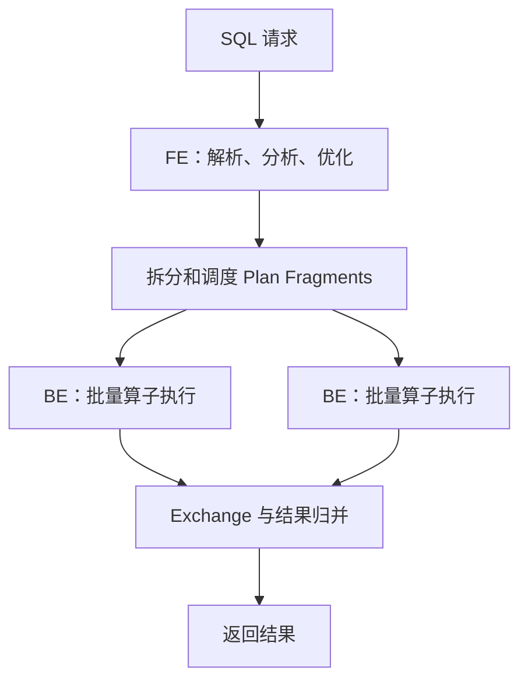
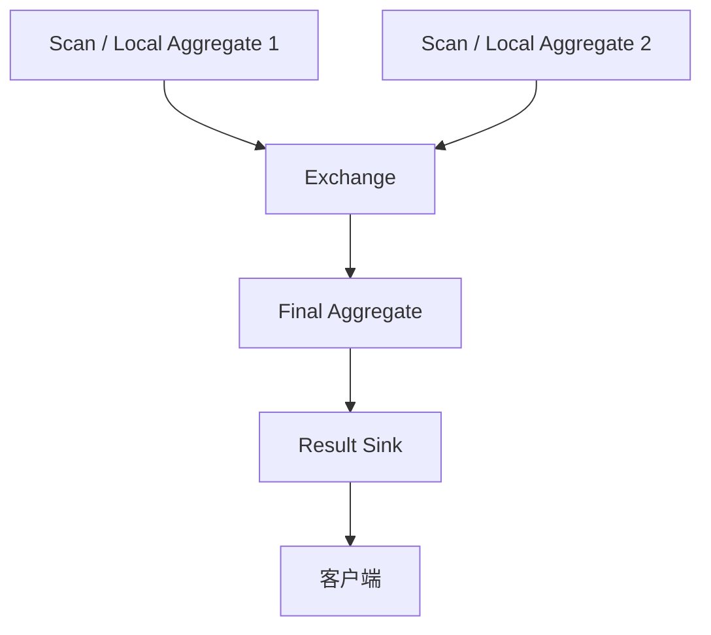
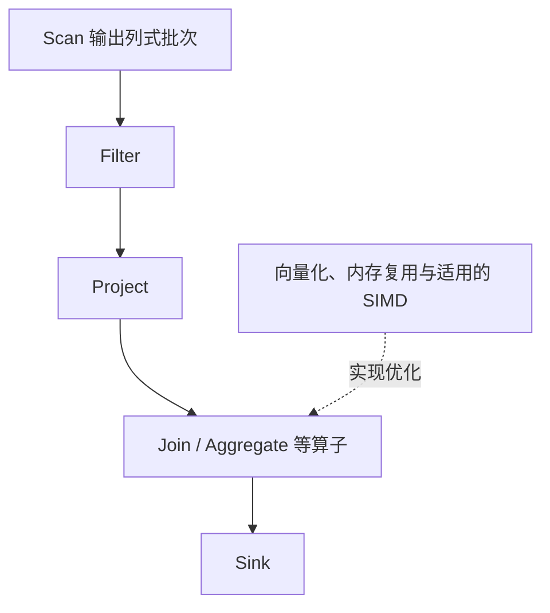

# Doris MPP 向量化查询引擎

## 概述

Doris 查询引擎基于自研 C++ 向量化执行引擎，支持标准 SQL 和 MPP 分布式执行，是其高性能查询的核心。查询从 FE（Java 优化器+协调器）到 BE（C++ 执行器）分 Stage 流水线执行。

## 查询架构





---

## MPP 分布式执行三阶段

### Phase 1: Plan Fragment 分发

FE 将 SQL Plan 拆分为多个 Fragment，每个 Fragment 由 BE 上一个 Instance 执行：





### Phase 2: Data Shuffle

BE 间通过 BRPC 进行数据交换，四种策略：

| 策略 | 触发条件 | 说明 | 开销 |
|------|----------|------|------|
| **Broadcast** | 右表 < broadcast_row_limit | 全量广播到所有 Scan Node | 网络 × N |
| **Hash Shuffle** | Join Key 或 Agg Key | 按 Key Hash 重分布 | 网络全量 |
| **Bucket Shuffle** | Join Key = 分桶键 | 直接按 Bucket 映射 | **零 Shuffle** |
| **Colocate Join** | 两张表同 Colocation Group | 本地 Join | **零 Shuffle，最优** |

> **Bucket Shuffle** 和 **Colocate Join** 是 Doris 独有的 Shuffle 优化——利用分区/分桶信息消除数据重分布，是高频 Join 查询的核心优化。

### Phase 3: Vectorized Execution

BE 内部以 **一批行（大小依配置）**为一个 Columnar Batch 流水线处理：





全程列式操作，利用 SIMD 指令集加速。

---

## 向量化引擎设计

| 设计元素 | 说明 |
|----------|------|
| Batch Size | 可配置的批次大小（平衡 CPU Cache 和函数调用开销） |
| SIMD | SSE/AVX2 指令集加速列运算 |
| 内存池 | 预分配内存池，避免频繁 malloc/free |
| Pipeline | 各算子间流水线执行，减少中间结果物化 |
| 表达式 JIT | 复杂表达式编译为 Native Code（Roadmap） |

---

## Runtime Filter

Doris Runtime Filter 是查询加速的核心技术：

```
1. Small Table (右表) Join Key → Build Bloom Filter
2. Broadcast Bloom Filter to Scan Node (左表)
3. Scan Node 用 Bloom Filter 过滤不需要的行
4. 大幅减少 Shuffle & Join 数据量
```

**典型收益**：大表 Join 小表场景，Runtime Filter 可过滤 50%~99% 的无效数据。

---

## Lakehouse 联邦查询

Doris 3.0 支持原生联邦查询多种数据源：

| Catalog | 引擎 | 能力 |
|---------|------|------|
| Hive | Hive Metastore | 读 Hive 表 |
| Iceberg | REST / HMS | Iceberg v2, Time Travel |
| Paimon | Filesystem / HMS | CDC 支持 |
| Hudi | HMS | MOR/COW 表 |
| JDBC | MySQL/PG/Oracle | 联邦查询 RDBMS |
| ES | Elasticsearch | 联邦查询 ES |

支持跨 Catalog 的 SQL Join：

```sql
CREATE CATALOG iceberg_catalog PROPERTIES (
    "type" = "iceberg",
    "iceberg.catalog.type" = "rest",
    "uri" = "http://iceberg-rest:8181/"
);

SELECT d.user_id, i.item_name
FROM doris_db.user_order_daily d
JOIN iceberg_catalog.item_db.items i ON d.item_id = i.item_id;
```

> 性能边界：向量化、Join Reorder、Runtime Filter 的收益依赖数据分布和计划；“小表”“左表”不固定等同于 build 侧。使用 EXPLAIN 与运行时 profile 验证实际计划。
