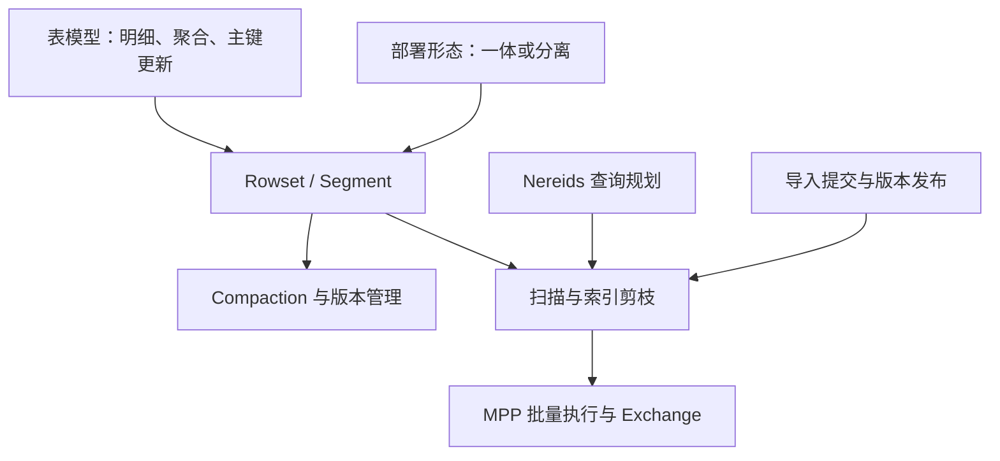

# Apache Doris 深度调研导航

[[Doris-数据模型]] 先决定同键数据含义；Unique 的 MoW / MoR 再决定版本合并位置。Aggregate 预聚合不保证查询不再聚合，MoW 逻辑删除也不等于旧字节立即消失。

[[Doris-Segment-v2-存储格式]] 解释不可变列式文件；[[Doris-Compaction-策略]] 将 rowset 选择策略、按列组执行和导入内 segment 合并分开。读写权衡要同时观察合并积压与前台 P99。

[[Doris-Nereids-CBO-优化器]] 与 [[Doris-MPP-向量化查询引擎]] 影响计划和执行效率。Colocate / Bucket Shuffle 需要数据分布和 Join 条件匹配，不是无需代价的“免费午餐”；数据倾斜和坏统计仍可能使计划失效。

[[Doris-架构演进]] 区分经典一体与存算分离；[[Doris-元数据与一致性复制]] 区分 FE SQL 元数据、数据层元数据、BE 副本及导入可见版本。Meta Service 不替代全部 FE 职责，FE 也不是多主同时写元数据。

## 系统性检查

写入延迟高时先区分批次、主键查找、持久化、副本确认、版本发布和合并压力；查询慢时检查剪枝、Join 分布、缓存、Exchange 与并发，而不是只调整一个线程参数。冷缓存与扩容恢复是存算分离的重要测试，不应承诺所有负载延迟不退化。

与 [[LSM-Tree-存储引擎体系综述]] 的联系在于不可变文件和合并成本；与 [[分布式数据系统一致性体系]] 的联系在于持久化、提交和可见性边界。相似设计思想不意味着协议和数据结构完全相同。
