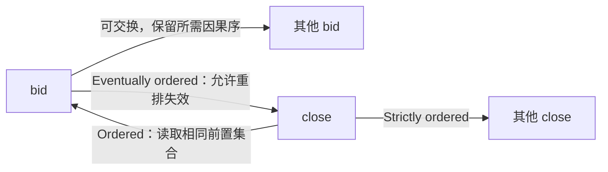

# Event Horizon：非对称依赖与半线性化

## 不变量与业务取舍

拍卖close要在每个副本看见相同的前置bid集合，确定之后赢家不能改变；bid之间可交换，且业务允许与close并发的bid之后被拒绝。只有接受这项重排/撤销语义，快速本地bid才不必先参与跨区全序（原文§2.1、§6，PDF pp.3、7–8）。

SL不是所有请求的全球线性一致性。弱操作已回复可代表暂时本地状态，尚未跨过强操作的稳定边界；不能把它当作不可撤销的全球持久成功。

## 四种依赖

| 类型 | 含义 | 例子 |
|---|---|---|
| Strictly ordered | 对称、实时线性化顺序 | close对close |
| Commutative | 对称、可交换，仍保留需要的因果序 | bid对bid |
| Ordered | v1在一处读到哪些v2，所有副本保持同一集合 | close对前置bid |
| Eventually ordered | 可重排v1，最终保持相同依赖集合 | bid相对并发close，可能最终失效 |

非对称在于两个方向**强度不同**，不是bid完全不依赖close。PoR是Partial Order-Restrictions，与Proof of Replication无关。

图中边表示语义依赖，不表示消息传输方向或所有事件的时间先后。

## DeMon 的实际路径

§4.1–4.2、Figure4（pp.5–6）：弱操作在unstable state本地执行后先回复，再可靠因果广播；副本交换接收进度，识别已quorum复制的弱前缀。强操作附该低水位watermark，与它一起通过OmniPaxos共识决定。

副本执行强操作前，须补齐watermark内的弱操作并应用至stable state，随后应用强操作。再用delta更新unstable state、重放被覆盖的近期弱操作。两份状态叫stable/unstable，不是Weak Guard/Strong Guard。只有本地看见数据不足以跳过quorum水位条件；缺失水位内数据时仍可能等待。

原文出价例：100和200已传播，300只在C本地出现，B提出close时水位`[a1,b1,c0]`排除300，赢家是200。300即使在某副本先出现，也可被重排到close之后失效。详见 [[知识库/sources/papers/Event-Horizon/精读分析]]。

## 实验证据与限制

§5五地域GCE n2-standard-4，RTT73.7–387.6ms；客户端与副本同机。RUBiS更新混合中Bid占60%，Figure5显示DeMon超过75%操作亚毫秒，强操作中位约245ms；CloseAuction在Gemini+/UniStore为371/391ms。这些数字不能直接外推到远端客户，也不能把“亚毫秒”解释为跨WAN持久化完成。

Figure6的非负计数器中，DeMon平均延迟随强操作比例增长，其他混合基线在50%之前或附近已超过OmniPaxos；不是50%以后所有协议收敛。吞吐优势受单主共识上限约束。摘要的四个数量级是作者针对实验整体的表述，不应凭“微秒vs毫秒”再生造精确对照倍数。

## 不应直接推出的工程改造

弱操作必须满足本模型的可交换和重排条件；不是任意不相关操作都可标弱。强路径是共识，不是通用2PC替换器。Kafka offset commit包含代际、回退与事务约束，不能直接认定可交换；Flink checkpoint的一致切割也不是SL的同义词。跨领域使用需要单独证明业务不变量及故障语义。

§6的BFT、§7的自然语言到模型/代码生成属于研究方向。阅读正文与定义见 [[知识库/sources/papers/Event-Horizon/全文翻译]]，事务语义背景见 [[事务模型深度调研]]。
