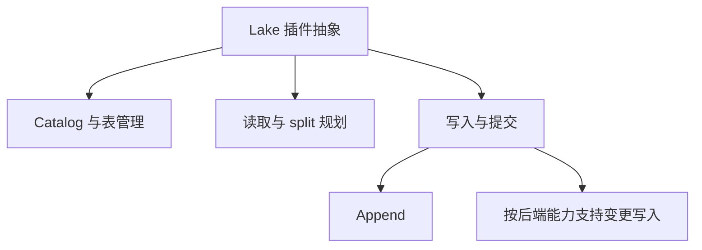
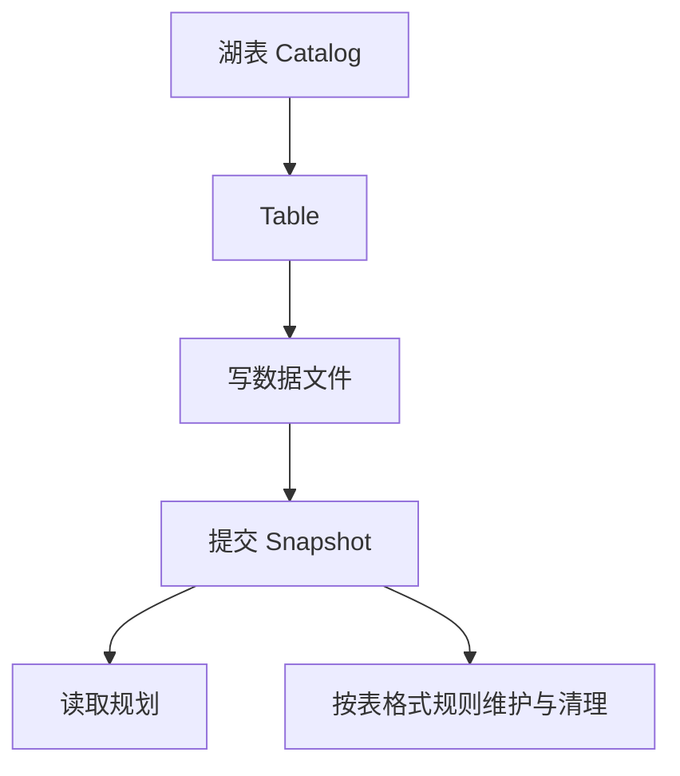
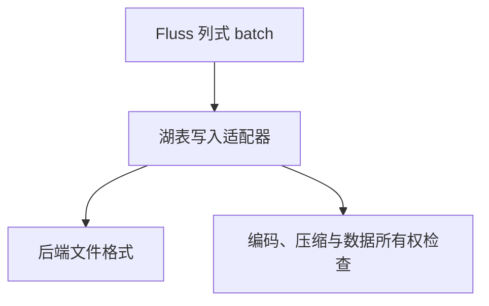
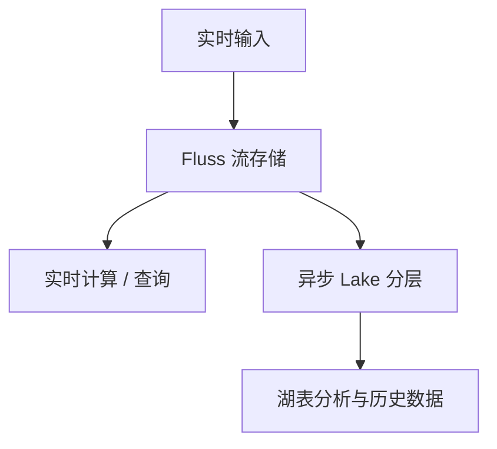

> 版本边界：本文源于未固定 commit 的历史源码阅读。组件职责已对照 [Fluss 架构文档](https://fluss.apache.org/docs/concepts/architecture/)；类名、数量、接口和兼容能力应在指定 release/commit 上复核，不能视为当前版本保证。图示为职责概括。

# Fluss Lake 层与湖仓融合 — 实时存储 + 数据湖一体化

> **Key Insight**：Fluss 的 Lake 层不只是"把数据存到 S3"——它是 **Streaming Table → Lakehouse Table 的一体化转换引擎**。通过 Tiering 作业将本地 Log/KV 数据实时转换为 Parquet/Arrow 格式写入 Iceberg/Paimon/Hudi/Lance，实现毫秒级写入 + 分钟级数据分析的统一架构。与 Kafka KIP-405 的根本区别在于：KIP-405 是"磁盘空间卸载"，Fluss Lake 是"语义级别数据湖融合"。

---

## 1. Lake 存储插件架构

### 四种 Lake 后端

| 后端 | 模块 | 文件数 | 完整度 |
|------|------|--------|--------|
| **Iceberg** | `fluss-lake-iceberg` | ~35 | ★★★★★ 完整 |
| **Paimon** | `fluss-lake-paimon` | ~30 | ★★★★★ 完整 |
| **Hudi** | `fluss-lake-hudi` | ~7 | ★★☆☆☆ 基础 |
| **Lance** | `fluss-lake-lance` | ~12 | ★★★☆☆ 部分 |

---

## 2. Iceberg 集成全链路

### 写入模式

| 表类型 | Writer | Iceberg 操作 |
|--------|--------|-------------|
| 普通表 (Log Table) | `AppendOnlyTaskWriter` | `AppendFiles` |
| PK 表 (KV Table) | `DeltaTaskWriter` + `GenericRecordDeltaWriter` | `RowDelta` |
| Merge-Engine 表 | `DeltaTaskWriter` (aggregate mode) | `RowDelta` + rewrite |

读取路径支持三级谓词下推：Partition filter（目录级）→ Row group filter（Parquet 统计信息）→ Arrow 统计信息 filter（列 min/max/null-count）。

---

## 3. Paimon 集成 — MergeTree 写入

Paimon 集成的一个关键亮点是 `MergeTreeWriter`——直接写入 Paimon 的 LSM 格式，支持 PK 表和 Merge Engine。此外还支持：

- **DV (Deletion Vector) 表**：Paimon 0.9+ 增量删除机制
- **SortedRecordReader**：按 PK 排序读取，支持 Merge-on-Read
- **AppendOnlyWriter**：Arrow 原生列式零拷贝写入

---

## 4. Lance — Arrow-Native 零拷贝

Lance 是新兴的 Arrow-native 列式存储格式。Fluss 集成它的核心优势：

这是四种后端中与 Fluss Arrow 内部格式最天然契合的方案。

---

## 5. 与 Kafka KIP-405 的本质区别

| 维度 | Fluss Lake | Kafka KIP-405 (2.8+) |
|------|-----------|----------------------|
| **目标** | 写入数据湖，支持分析查询 | 将日志卸载到 S3，释放本地磁盘 |
| **存储格式** | Parquet / Arrow / Paimon format | 原始 `.log` segment（二进制相同） |
| **可查询性** | ✅ Trino/Spark/Flink 可直接查询 | ❌ 仅内部读取 |
| **格式转换** | ✅ 实时 Arrow → Parquet 转换 | ❌ 不转换 |
| **Schema 管理** | ✅ Lake Catalog + schema evolution | ❌ 无 schema |
| **Delete/Update** | ✅ RowDelta / Position Delete | ❌ 不支持 |
| **Compaction** | ✅ RewriteDataFile | ❌ 仅 log compaction |

### 设计哲学

这不是"存储分层"，而是 **"实时存储 + 数据湖"的融合架构**——与 Kafka 的"消息队列 + 外部 ETL"是完全不同的范式。

---

*源文件: Fluss 源码分析 06，CHANG_AI_TEAM CTO，2026-06-10*
