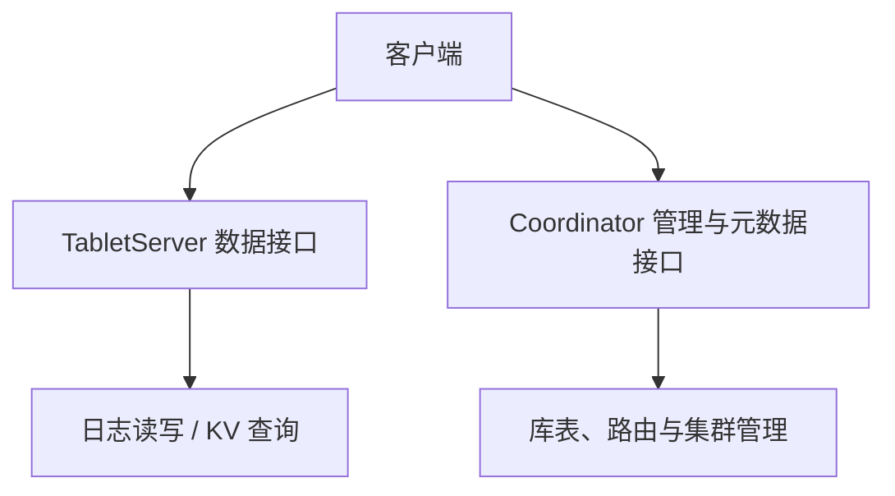
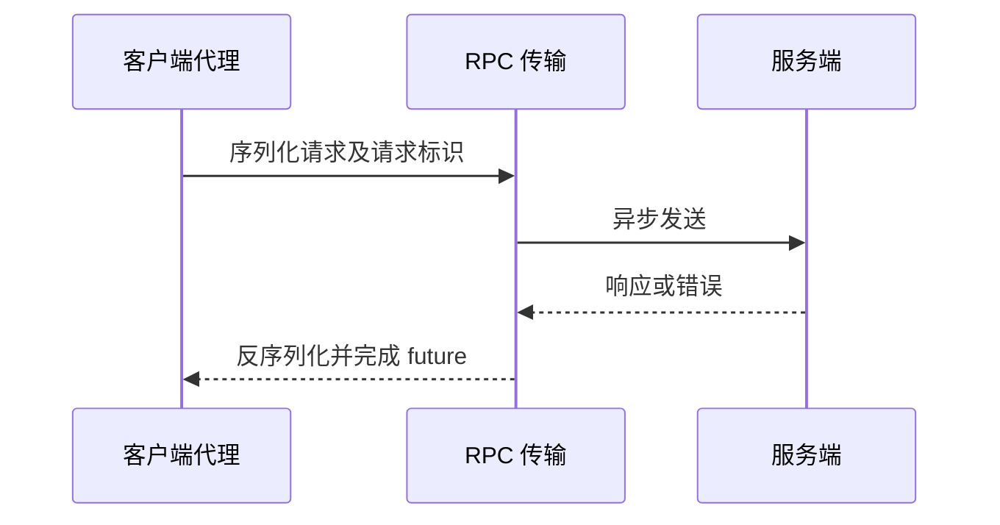
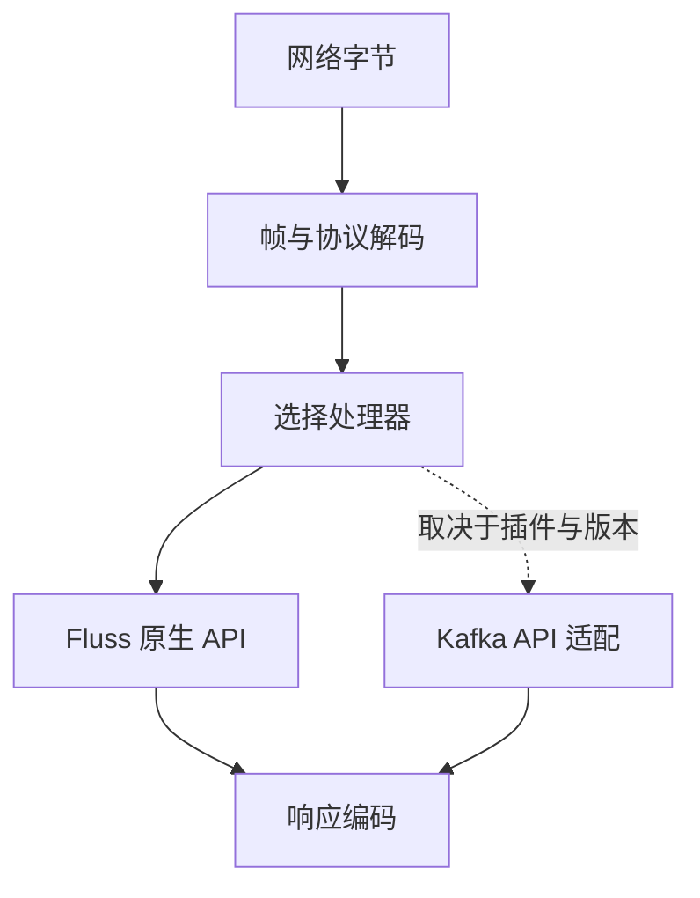

> 版本边界：本文源于未固定 commit 的历史源码阅读。组件职责已对照 [Fluss 架构文档](https://fluss.apache.org/docs/concepts/architecture/)；类名、数量、接口和兼容能力应在指定 release/commit 上复核，不能视为当前版本保证。图示为职责概括。

# Fluss RPC 与网络层分析

## 概述

Fluss 的 RPC 框架完全自研，采用 **Netty 4 + Protobuf** 技术栈，与 Kafka 自研 Java NIO + 自定义二进制格式完全不同。这是 Fluss 70% 自研代码中最大的基础设施级差异化。

## 协议栈对比

| 维度 | Fluss | Kafka 2.7.2 |
|------|-------|-------------|
| **传输** | Netty 4（shaded，避免依赖冲突） | 原生 Java NIO (`SocketServer` + `Selector`) |
| **序列化** | Protobuf（自动生成代码） | 自定义二进制格式（`Struct`/`Schema`） |
| **API 标识** | `ApiKeys` enum (ID 1000+)，字符串 method name + 反射 | `ApiKeys` enum (ID 0-99)，请求头 int16 apiKey |
| **方法分发** | `GatewayClientProxy` 动态代理 + 反射 | `KafkaApis.handle()` switch-case |
| **多协议** | `RequestType.FLUSS` / `RequestType.KAFKA` 双协议 | 单一 Kafka 协议 |
| **异步模型** | `CompletableFuture` | `ClientResponse` callback |

## API 清单（61 个，1000-1061）

Fluss 的 API Key 从 1000 开始（0-999 预留给 Kafka 协议兼容）：

### DDL / 管理（Public，16 个）
`CreateDatabase`(1001) / `DropDatabase`(1002) / `ListDatabases`(1003) / `CreateTable`(1005) / `DropTable`(1006) / `GetTableInfo`(1007) / `ListTables`(1008) / `ListPartitionInfos`(1009) / `TableExists`(1010) / `GetTableSchema`(1011) / `GetDatabaseInfo`(1035) / `CreatePartition`(1036) / `DropPartition`(1037) / `AlterTable`(1044) / `AlterDatabase`(1060) / `GetMetadata`(1012)

### 数据流（Public，12 个）
`ProduceLog`(1014) / `FetchLog`(1015) / `PutKv`(1016) / `Lookup`(1017) / `ListOffsets`(1021) / `GetLatestKvSnapshots`(1023) / `GetKvSnapshotMetadata`(1024) / `InitWriter`(1026) / `LimitScan`(1033) / `PrefixLookup`(1034) / `GetLakeSnapshot`(1032) / `GetTableStats`(1059) / `ScanKv`(1061)

### 内部协调（Private，16 个）
`UpdateMetadata`(1013) / `NotifyLeaderAndIsr`(1018) / `StopReplica`(1019) / `AdjustIsr`(1020) / `CommitKvSnapshot`(1022) / `CommitRemoteLogManifest`(1027) / `NotifyRemoteLogOffsets`(1028) / `NotifyKvSnapshotOffset`(1029) / `CommitLakeTableSnapshot`(1030) / `NotifyLakeTableOffset`(1031) / `LakeTieringHeartbeat`(1042) / `ControlledShutdown`(1043) / `PrepareLakeTableSnapshot`(1052)

### 集群管理（Public，17 个）
ACL 4 个、配置 2 个、标签 2 个、重平衡 3 个、Producer offset 3 个、快照租约 3 个

## Gateway 抽象层

Fluss 定义了三级 Gateway 接口，使用 JDK 动态代理实现 RPC 调用：

### GatewayClientProxy 核心机制

与 Kafka 的对比：Fluss 用**反射 methodName 自动映射**代替 Kafka 的 switch-case 硬编码，用 **Protobuf 自动生成**代替手动 Struct/Schema。这是工程效率的显著提升。

## 双协议引擎（Fluss + Kafka）

Fluss 通过 `NetworkProtocolPlugin` 接口实现协议热插拔：

协议检测：先检查 Fluss Magic Bytes，不匹配则 fallback 到 Kafka 协议解码器。

## 网络传输层

| Fluss (Netty) | Kafka (Java NIO) |
|---------------|------------------|
| `NettyServer` | `SocketServer` + `Acceptor` + `Processor` |
| `NettyClient` | `NetworkClient` + `Selector` |
| `ServerChannelInitializer` | `ChannelBuilder` |
| `RequestProcessorPool` | `KafkaRequestHandlerPool` |
| `FlussRequestHandler` | `KafkaApis` |

服务端请求路径：NettyServer → ChannelInitializer（协议检测）→ FlussRequestHandler/KafkaRequestHandler（解码）→ RequestChannel（队列）→ RequestProcessorPool（线程池）→ RpcGatewayService.processRequest()。

---

> **关键洞察**：Fluss RPC 层的两个核心设计决策——**Netty 替代自研 NIO**（降低维护成本）和 **Protobuf 替代自定义二进制格式**（更好的跨语言支持和工具链）——是工程现代化的典型取舍。代价是失去 Kafka 协议的极致性能控制，收益是大幅降低开发和调试成本。Kafka 兼容层（空方法骨架）的存在说明 Fluss 团队很清楚"兼容 Kafka 生态"是市场准入的必要条件，但目前尚未投入资源实现。
