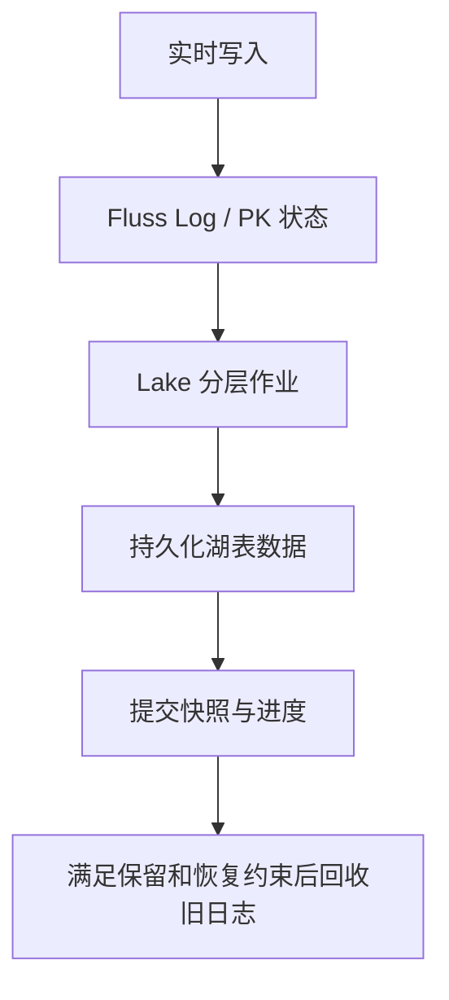
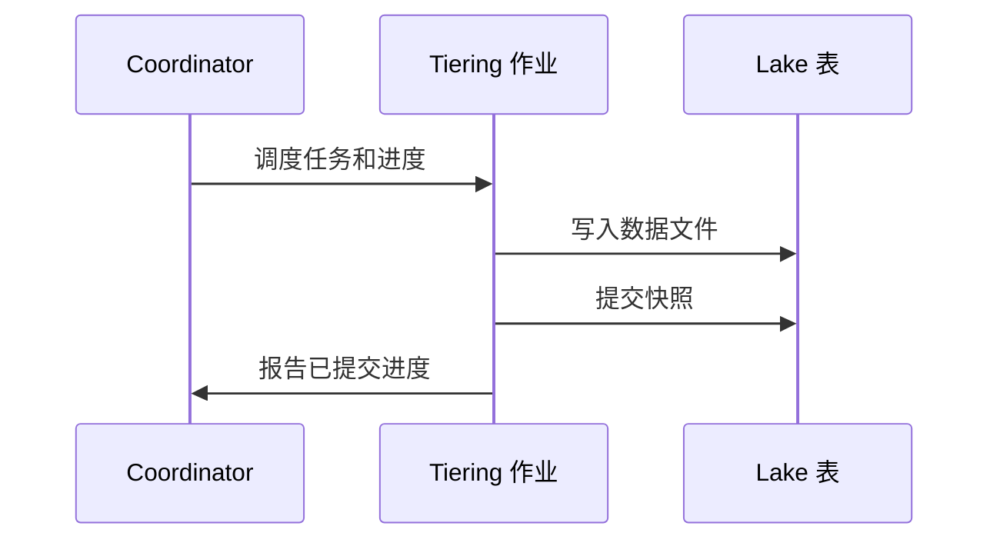
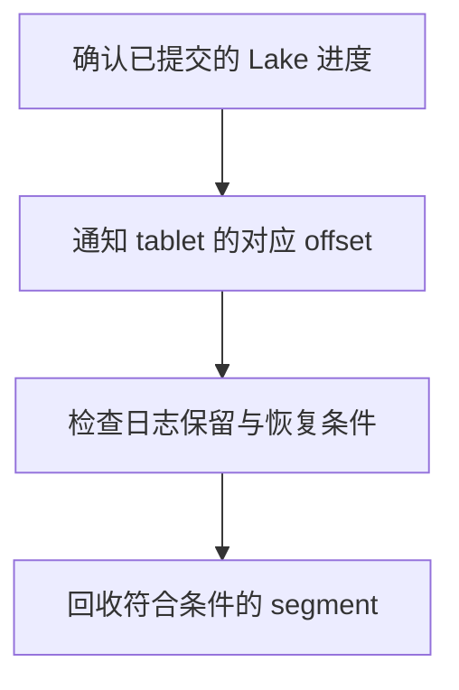

> 版本边界：本文源于未固定 commit 的历史源码阅读。组件职责已对照 [Fluss 架构文档](https://fluss.apache.org/docs/concepts/architecture/)；类名、数量、接口和兼容能力应在指定 release/commit 上复核，不能视为当前版本保证。图示为职责概括。

# Fluss Tiering 分层架构

## 定义

Tiering 是 Fluss 将本地 Tablet 数据**异步、持续**写入 Lakehouse（数据湖）的机制。它不是一个简单的后台任务——它是一个**独立的 Flink 流处理作业**（`FlussLakeTiering`），具有完整的 Source → Transform → Sink → Commit 流水线。

## 架构位置

这不是"冷热分层"（把冷数据搬到廉价存储），而是**数据模型的语义升级**——从 append-only log 变为可查询的 Lakehouse Table。

## Tiering 工作流

### 组件清单

| 组件 | 类 | 功能 |
|------|-----|------|
| 入口 | `FlussLakeTiering` / `FlussLakeTieringEntrypoint` | Tiering 作业启动 |
| Source | `TieringSource` → `TieringSplitReader` | 从 TabletServer 读取数据 |
| Writer | `LakeWriter` 接口 | 写入 Lake Storage |
| Committer | `TieringCommitOperator` / `TieringCommitter` | 提交 Lake Snapshot |
| Event | `TieringReachMaxDurationEvent` / `FinishedTieringEvent` / `FailedTieringEvent` | 事件驱动 |
| Metrics | `TieringMetrics` | 指标收集 |
| Split | `TieringLogSplit` / `TieringSnapshotSplit` | 分层 Split 定义 |
| Result | `TableBucketWriteResult` / `TableBucketWriteResultEmitter` | 结果回传 |

## Coordinator 端管理

| 类 | 功能 |
|-----|------|
| `LakeTableTieringManager` | 管理 Lake 表的 Tiering 进度与调度 |
| `LakeCatalogDynamicLoader` | 动态加载 Lake Catalog（支持运行时切换后端） |
| `CommitLakeTableSnapshot` event | 处理 Tiering 提交的快照信息 |
| `NotifyLakeTableOffset` | 通知 TabletServer 更新本地 Lake offset |

## 心跳驱动

TabletServer 通过 `lakeTieringHeartbeat` RPC 向 Coordinator 汇报 bucket 的本地日志进度。Coordinator 根据 `lakeLogStartOffset` vs `logEndOffset` 的差距决定是否需要触发 Tiering。

## 设计哲学

Fluss Tiering 的设计原则是：

1. **异步**：Tiering 不阻塞实时写入路径。Writer 写入本地 Log 后立即返回，Tiering 在后台异步进行
2. **独立作业**：Tiering 是独立的 Flink 作业，有自己的并行度、容错、Backpressure 机制
3. **组件化**：Source/Writer/Committer 都是可插拔接口，支持不同 Lake 后端
4. **事件驱动**：通过 `TieringReachMaxDurationEvent` 控制单次 Tiering 的最大时长，防止长尾

---

> **关键洞察**：Fluss Tiering 是"流批一体"在存储层的具体实现。传统架构中，"把 Kafka 数据写入数据湖"是一个独立的 ETL 管道（如 Kafka Connect + Hudi DeltaStreamer），而 Fluss 将其内建为系统的一部分。这意味着用户不需要部署和维护额外的 ETL 管道——Flink Tiering 作业本身就是 Fluss 集群的一部分。但这也有代价：Tiering 作业的稳定性和性能直接关系到数据的"可分析性"，如果 Tiering 延迟过高，分析师看到的数据就是过时的。
