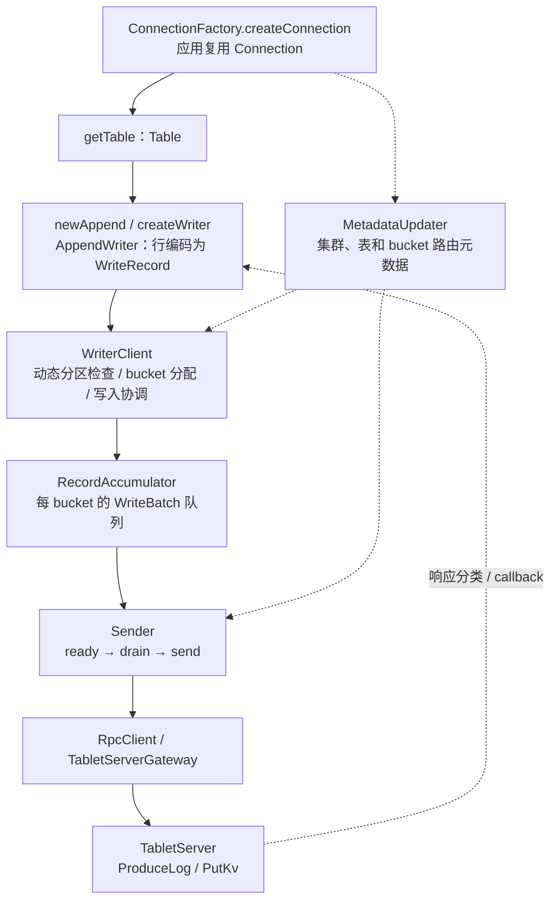

> 版本边界：本文源于未固定 commit 的历史源码阅读。组件职责已对照 [Fluss 架构文档](https://fluss.apache.org/docs/concepts/architecture/)；类名、数量、接口和兼容能力应在指定 release/commit 上复核，不能视为当前版本保证。图示为职责概括。

# Fluss 客户端写入流程 — 源码深度分析

## 一句话

历史材料中的客户端链路是共享 `Connection` → 表级 `Table` / `AppendWriter` → `WriterClient` → 按 bucket 聚批的 `RecordAccumulator` → 后台 `Sender` → RPC。`append()` 返回 Future，显式 `flush()` 等待批次完成；两者不能统称为“异步 flush”。

## 产出概况

- 长文见 [[项目文档/Fluss源码分析/05b-客户端写入流程深度分析|客户端写入流程深度分析]]，覆盖 API 示例、创建/运行/关闭、批缓冲、RPC 和异常处理。
- 2026-10-05 已将架构与流程图转为 Mermaid，保留原 Java 示例和方法伪代码。
- 原记录的 `a3a59fd ~ 53b4f65` 没有注明所属仓库，不能用作 Fluss 上游版本凭证。归档中的“8 模块完成”指已有历史文稿，不表示已重新核验全部源码。

## 三层架构约定

下面按历史长文概括调用职责，不据此承诺当前 release 的线程安全性、配置默认值或类实现。

### Connection — 共享连接入口

- 历史示例使用 `ConnectionFactory.createConnection(conf)`。复用重量级连接是使用建议，不能写成 JVM 强制的全局单例。
- 管理 RPC、元数据和写入引擎等资源；生命周期由应用显式管理。
- `close()` 还涉及后台写入的排空、超时和资源释放，不能把它简化成仅关闭网络连接。

### Table — 表级 API 句柄

- 通过 Connection 获取并绑定表信息；创建依赖元数据，不是“完全无状态”。
- 通过 `newAppend().createWriter()` 等 API 创建写入器。
- 原稿的 per-thread 使用方式不等同于已核验的线程安全契约，应在固定 release/commit 上复核。

### AppendWriter — 异步提交与等待式 flush

- 将行编码为 `WriteRecord`，经 `WriterClient` 进入批缓冲管线。
- `append()` 的本地入队不等于服务端已确认；最终成功或异常通过 Future 表达。
- 显式 `flush()` 等待相应批次完成。后台 Sender 的批量发送是另一层职责。

## 关键组件

### MetadataUpdater

提供集群快照、物理表/bucket 路由和 RPC gateway。历史长文记录了 leader 未知、metadata 失效后重新获取元数据的路径；不能推导出任何 schema/bucket 变更都透明且不阻塞写入。

### WriterClient — 路由与写入协调

- 协调动态分区检查、BucketAssigner 和 `RecordAccumulator.append()`。
- 原稿区分有 bucket key 时的 Hash 分配，以及无 key 时的 Sticky / RoundRobin；不是一律根据 partition key 路由。
- 按 bucket 的批队列属于 `RecordAccumulator`。旧摘要的 `Map<bucketId, AppendWriter>` 没有长文依据，已删除。

### RecordAccumulator 与 Sender — 缓冲、发送和完成

- `RecordAccumulator` 管理按物理表/bucket 组织的批队列和内存资源；`AppendWriter` 不是“单 bucket 缓冲器”。
- Sender 依据批大小、等待时间、内存压力等条件读取就绪批次，再按目标 TabletServer 组织请求。
- Log 与 KV 写入分别走 `ProduceLog` / `PutKv`；响应处理按 bucket 区分成功、可重试和不可重试错误。
- 重试受错误类型、次数和幂等 writer 状态约束。不能声称任意 transient error 均可无条件幂等重试；当前默认开关与错误码应在固定版本中核验。

### RpcClient — 底层通信

提供 [[Fluss-RPC与网络|RPC gateway 与连接资源]]，连接写入引擎、TabletServer 和协调服务。具体传输线程、超时、心跳及连接恢复策略不从本卡的职责图中推出。

## 与 Flink/Spark 集成

历史归档提到 Flink Sink 在 `fluss-flink-common/sink/writer` 中封装客户端写入，并协调 checkpoint 与 flush。仅凭这条调用关系，不能推出“checkpoint 成功才使数据可见”或“失败会撤销服务端已写数据”。端到端 exactly-once、恢复和提交可见性，需要结合固定版本 connector 的提交协议独立核验；相关入口见 [[Fluss-客户端与计算集成]]。

## 架构洞察

1. **对象职责不同**：Connection 管资源，Table / AppendWriter 提供 API，RecordAccumulator 管批队列。
2. **路由需要恢复**：元数据失效和 leader 变化可能带来等待或重试。
3. **聚批与发送层次不同**：按 bucket 聚批，再按目的节点组织 RPC。
4. **异步提交仍有完成边界**：调用方通过 Future 和 flush 区分本地入队、最终确认与失败。
5. **共享连接需要生命周期管理**：复用减少重复资源，关闭仍须处理未完成请求。

## 8 模块完成进度

以下保留历史归档状态，不表示本轮重新核验了 8 个模块。

| # | 模块 | Wiki 卡片 | 状态 |
|---|------|----------|------|
| 01 | 整体架构对比 | [[Fluss-整体架构]] | ✅ |
| 02 | 存储引擎 | [[Fluss-存储引擎]] | ✅ |
| 03 | 分布式协调 | [[Fluss-分布式协调]] | ✅ |
| 04 | RPC 与网络 | [[Fluss-RPC与网络]] | ✅ |
| 05 | 客户端与计算集成 | [[Fluss-客户端与计算集成]] | ✅ |
| **05b** | **客户端写入流程** | **本文** | ✅ |
| 06 | Lake 层与湖仓融合 | [[Fluss-Lake层与湖仓融合]] | ✅ |
| 07 | Kafka 兼容层 | [[Fluss-Kafka兼容层]] | ✅ |
