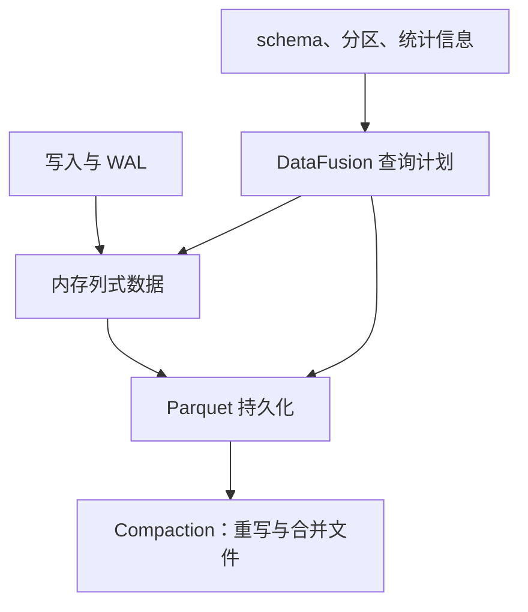

# InfluxDB 3 的列式引擎：格式、执行与部署

Arrow 面向内存列式表示，DataFusion 执行查询计划，Parquet 面向持久化列式数据。三者分别回答“如何表示数据、如何计算、如何落盘”，不能合并成“没有索引、没有合并、无限基数零成本”。

图描述数据职责，不代表独立进程数。Core 与 Clustered 的 WAL 及组件拓扑见 [[InfluxDB-写入与查询路径]]。

## 与 TSM 的比较应避免什么

| 维度 | 可用的比较 | 错误的绝对结论 |
|---|---|---|
| 格式 | TSM 是时序专用格式；Parquet 是开放列式格式 | TSM 文件可变、Parquet 不可变 |
| 剪枝 | 分区和列统计帮助减少读取 | 不需要任何索引或元数据 |
| 基数 | 避开原 TSI 设计的部分扩展限制 | 任意基数都不增加内存与查询成本 |
| 写放大 | 取决于刷盘、文件大小、合并与重写 | Parquet 只写一次，没有 compaction |
| 扩容 | 取决于具体产品部署形态 | 所有 3.x 版本原生同样水平扩展 |

压缩倍数受排序、列类型、分布、编码与压缩算法共同影响；没有同一数据集、相同统计口径，就不能宣称固定降低十倍成本。开放文件格式方便工具互操作，但还需遵守 Catalog、权限和一致性约束，直接扫描所有对象文件可能包含已被逻辑替换的数据。

关联：[[InfluxDB-TSM存储引擎]]、[[InfluxDB-指标设计与基数管理]]、[[InfluxDB-Catalog元数据]]。

## 核验来源

- [Clustered 引擎及 compactor](https://docs.influxdata.com/influxdb3/clustered/reference/internals/storage-engine/)
- [Core 存储引擎](https://docs.influxdata.com/influxdb3/core/reference/internals/storage-engine/)
