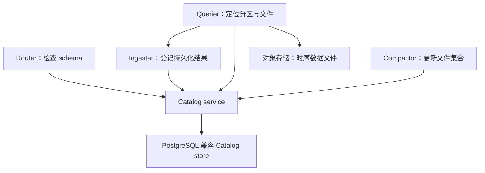

# InfluxDB Catalog：元数据边界取决于产品

这里的独立 Catalog 服务图专指 InfluxDB Clustered，不应推广为全部 InfluxDB 3 Core / Enterprise 部署的固定要求。

Clustered 把 Catalog 分成缓存及访问管理服务和 PostgreSQL 兼容的 Catalog store。它描述 schema、分区及对象存储中文件的位置；实际时序列值仍位于 Ingester 的近期数据和持久化 Parquet 中。

## 为什么不能只备份数据文件

文件存在和文件属于哪张表、哪个分区，是两个问题。恢复方案需要 Catalog 与对象数据的对应关系，必须按所用产品的备份恢复流程验证。上图也显示 Querier 与 Ingester 直接通信，因此 Catalog 不是“组件唯一的通信渠道”。

Catalog 数据库的复制、备份周期、保留期和故障域配置依赖部署。旧稿把“固定 100 天备份、三可用区、自动 PostgreSQL 主从”写成产品普遍保证，没有足够依据，已移除。也不能把 v1/v2 的 BoltDB、旧集群元数据服务、etcd 与新产品 Catalog 简单合并为一条实现史。

## 应验证的恢复不变量

1. Catalog 引用的有效文件仍可读。
2. Compaction 切换后的旧文件不会被新的读取计划当作额外有效数据重复统计。
3. 备份恢复与写入恢复路径共同覆盖最近确认的数据。

这些是审查设计的工程问题，不是本文声称已对所有产品做过的故障注入结果。

关联：[[InfluxDB-多副本与高可用]]、[[InfluxDB-写入与查询路径]]。

## 核验来源

- [Clustered：Catalog store 与 service](https://docs.influxdata.com/influxdb3/clustered/reference/internals/storage-engine/)
