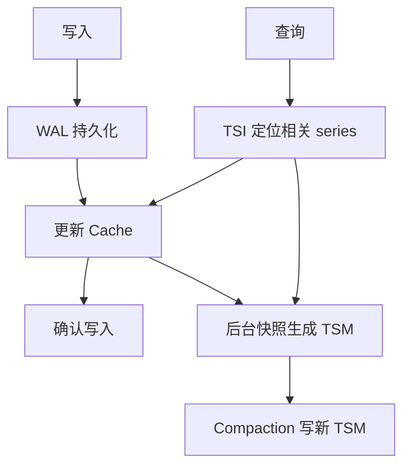

# InfluxDB TSM 存储引擎

TSM 是 v1/v2 时序存储路线中的不可变列式文件组织，与 WAL、Cache 和 TSI 索引共同工作。不能把 TSM 与所有 InfluxDB 产品的部署架构等同。

TSM 把相关 field 的值按时间组织为块，利用数据类型及分布选择编码压缩；不能把 WAL 使用的压缩方式推广为所有 TSM 列统一采用的编码，更不能给出无数据集条件的固定压缩倍数。

Cache 支持读取最近数据，查询合并 Cache 与 TSM。重启使用未被安全淘汰的 WAL 恢复内存，而非无条件重放数据库全部历史。Compaction 通过新文件重组数据，旧文件按引用及删除规则回收；删除标记不等于直接原地覆盖文件中的值。

## TSI 与过滤器不是同一种索引

TSI 支持从 measurement、tag 等条件定位 series；Bloom filter 回答的是一个候选文件中某键是否可能存在。两者不能作为一一对应组件交换。高基数会增加索引、内存和查询成本，但“百万即必然 OOM”不成立，应结合机器、版本、分布和查询测量。

持久化和后台合并思想与 [[LSM-Tree]] 相近，具体文件层级和调度不可照搬 RocksDB 的任意层数模型。比较新引擎见 [[InfluxDB-3-列存引擎]]，数据设计见 [[InfluxDB-指标设计与基数管理]]。

## 核验来源

- [InfluxDB OSS v2 存储引擎](https://docs.influxdata.com/influxdb/v2/reference/internals/storage-engine/)
