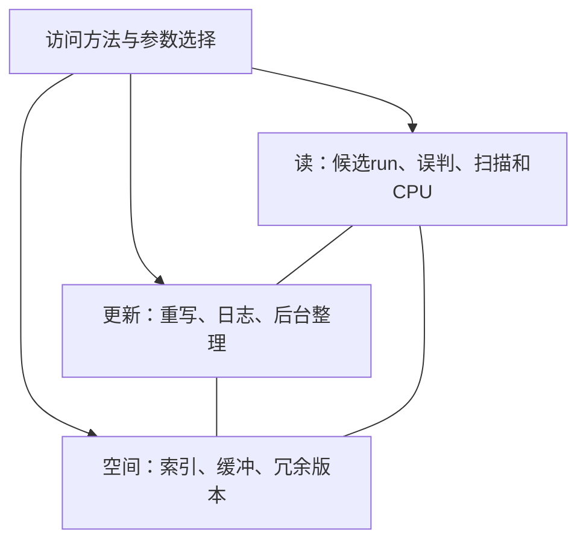

# LSM-Tree 与 RUM 猜想

## 定义与解释边界

RUM讨论访问方法中读（Read）、更新（Update）与内存/空间（Memory）开销的权衡。它是帮助分析设计空间的**猜想与框架**，不是“任何改善必然同时恶化另外两项”的严格三选二定理。原稿与CAP的类比过强，现撤除。

本卡依据LSM综述§2.3、§3和表3（PDF6–8、20页），未把RUM原论文的完整形式化前提独立复核。减少一个糟糕实现的冗余工作、利用更多硬件能力或改变工作负载假设，都可能改善多个观测指标，不能据此宣称证实或推翻猜想。

图表达相互作用，不表示三个维度只能任取两个。空间应分清磁盘/PM/DRAM预算，性能应分清平均吞吐与尾延迟。

## Leveling 与 Tiering 的典型取舍

固定T（层大小比例）、L（层数）和B（每页条目数）时，综述成本模型给leveling摊销写I/O `O(TL/B)`，tiering `O(L/B)`。Tiering允许更多重叠run，降低重复重写，同时增加负查、短范围初始化和最坏空间开销。这些O式是摊销I/O复杂度，不能当成实测字节写放大倍率。

Dostoevsky在较小层tiering、最大层leveling：最大层支配的空间/长扫描特性接近leveling，中间层少重写，但短范围可能需更多run。它扩展了可调设计空间，不是证明所有负载存在同一条可画出的连续性能前沿。

## “无损改进”为什么要加条件

Monkey在相同filter总预算下调整bits/key，能减少模型中负查的期望I/O；并不免除CPU探测、训练/调参或运行时管理代价。Lim等通过建模热点更新导致的早期版本淘汰优化参数，也依赖分布假设。表3中其他栏为“-”只是该表的定性比较，不表示现实世界所有成本不变，更不能断言历史上“只有两个无损方案”。

## 教学示例

两种配置A/B的负查平均I/O是4/1，但B把filter内存从100MB增至1GB。若不记录内存，容易称B全方位更好；若业务本来有闲置1GB、I/O很贵，B仍可能是正确选择。反过来，比较两种相同预算的分配策略时，减少误配可以改善读取而无需新增空间。这两种实验回答不同问题。

## 工程用法

1. 固定数据、负载、正确性与资源边界。
2. 分别记录读/写/空间放大、CPU、成本与P99。
3. 分辨“换资源”“换布局”“减少无效工作”三种改进来源。
4. 在负载变化后复测，避免把一个点的最优当作所有场景最优。

相关：[[LSM-Tree-写放大]]、[[LSM-Tree-自动调参]]、[[LSM-Tree-合并优化]]、[[LSM-Tree-硬件适配]]。
