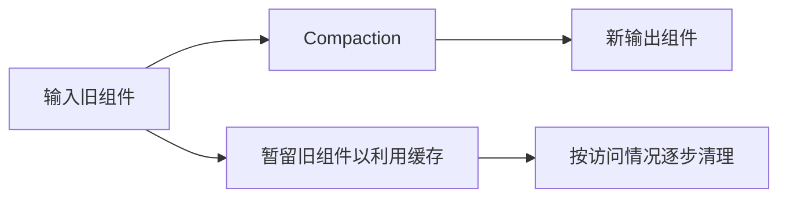

# LSM-Tree 合并优化 (Merge Optimization)

## 定义

LSM-tree 的合并（compaction/merge）是将一个或多个 SSTable 按 key 排序合并为新的 SSTable 的过程。合并是 LSM-tree 的核心操作——它既决定了写放大，也决定了查询性能和空间利用率。优化合并过程主要有三个维度：**合并性能**、**缓冲区管理**、**写入停顿控制**。

## 三大优化方向

### 1. 合并性能优化 (Merge Performance)

#### VT-tree Stitching（指针拼接）

**原理**：当两个参与合并的 SSTable 的某些 page 在 key 范围上完全不重叠时，不拷贝数据，而是通过指针直接引用旧 SSTable 的 page。

| 优点 | 缺点 |
|------|------|
| 减少数据拷贝，提高合并速度 | 导致文件碎片化 |
| 内存开销降低 | **与 Bloom Filter 不兼容**（BF 依赖 SSTable 完整性） |
| | 需要额外索引管理 stitched pages |

**适用场景**：数据不重叠较多的场景（如时间分区数据），但由于碎片化和 BF 不兼容，实际应用受限。

#### 流水线合并 (Pipelined Merge)

**原理**：将合并操作拆分为多个流水线阶段（读 → 排序 → 写），各阶段并行执行，隐藏 I/O 延迟。

**效果**：提升合并吞吐量，但不改变合并的总 I/O 量。

### 2. 缓冲区管理 (Buffer Cache)

#### LSbM-tree（延迟删除缓冲区）

**核心思想**：合并完成后**不立即删除**旧 SSTable，而是将其附加到目标层的缓冲区中。利用操作系统的 buffer cache 访问频率信息，逐步清理访问最少的旧文件。

| 优点 | 缺点 |
|------|------|
| 热数据主动留在 cache，查询受益 | 冷数据场景有额外空间开销 |
| 利用 OS buffer cache 的成熟 LRU 机制 | 增加合并操作的复杂度 |
| 减少因过早删除导致的 cache miss | |

**适用场景**：有明显热数据的工作负载。

### 3. 写入停顿控制 (Write Stalls)

#### 问题描述

当 L0 文件数达到阈值或合并速度跟不上写入速度时，LSM-tree 必须停顿（stall）写入来等待合并完成。这导致**写入延迟尖刺（latency spike）**，严重影响 P99 延迟。

#### bLSM — Spring-and-Gear 调度器

**2019综述收录范围内聚焦写入停顿的代表**（SIGMOD 2012）。

**核心机制（综述§3.3.3）**：每层容忍额外组件以便不同层的merge并行；调度进度使上层生成下一组件前，下层上一轮merge已完成。这种背压最终约束内存写入速度。论文针对unpartitioned leveling，并不只处理内存到磁盘的单阶段。

| 已解决 | 未解决 |
|--------|--------|
| Bounded 了写入内存组件的延迟 | 未解决排队延迟 |
| 提供可预测的写入延迟 | 端到端延迟方差仍是盲区 |
| | 面向未分区的leveling；没有覆盖全部实现 |

**时间边界**：这是2019综述的研究空白判断，不代表2026仍无人研究。2025综述收录SILK、Vigil-KV、ADOC等，2026还有HATS。

## 与其他优化的关系

| 优化类别 | 关联概念 |
|----------|---------|
| 合并频率控制 | [[LSM-Tree-写放大]] — Tiering 降低合并频次 |
| 合并策略选择 | [[LSM-Tree-自动调参]] — Dostoevsky lazy-leveling 混合合并策略 |
| 合并与硬件 | [[LSM-Tree-硬件适配]] — 多核并行合并（cLSM）、NVM 持久化内存组件 |
| 二级索引合并 | [[LSM-Tree-二级索引]] — 关联合并同步多个索引 |

## 未来方向

1. **写入停顿的系统性解决**：需区分局部服务时间上界与端到端排队尾延迟
2. **流水线合并与多核**：将现代多核架构与流水线合并结合的潜力未充分挖掘
3. **合并策略与负载自适应**：根据实时负载特征动态切换合并策略

---

*参考论文: Luo & Carey, "LSM-based Storage Techniques: A Survey", VLDB Journal 2019*

## 来源核验与边界

2026-10-05核验本地[[知识库/sources/papers/LSM-Survey/LSM-Survey-VLDBJ2019.pdf|2019综述]]相应章节；这是综述级证据，不等于每个被引方案已独立复现。基础成本模型参见§2.3/表1（页6–7），合并优化§3.3（页11–12），硬件§3.4（页12–14），二级索引§3.7（页17–19）。较新的调度、卸载和硬件方向见[[LSM-tree-KV-Survey-综述]]。
