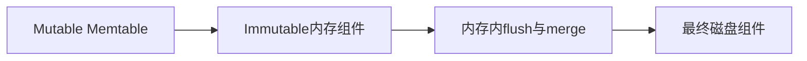
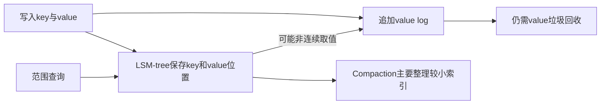

# LSM-Tree 硬件适配 (Hardware Adaptation)

## 定义

LSM-tree 最初为 HDD 设计（优化顺序写、减少随机 I/O），但现代硬件（大内存、多核 CPU、SSD、NVM）改变了底层假设，催生了大量硬件适配的优化。Survey 将硬件适配分为四个子方向。

## 四大方向

### 1. 大内存适配 (Large Memory)

#### FloDB / Accordion — 多层内存架构

**核心思想**：当内存足够大时，在内存中实现多层存储结构，减少磁盘 I/O。

| 系统 | 特点 |
|------|------|
| FloDB | 两层内存（可变 + 不可变），内存内 merge 减少磁盘 compaction |
| Accordion | 多层内存（mutable → immutable → disk），更细粒度内存管理 |

**效果**：数据在内存中存活更久，write-intensive workload 下磁盘 I/O 显著降低。

### 2. 多核适配 (Multi-Core)

#### cLSM

**问题**：传统 LSM-tree 的合并操作是单线程的，无法利用多核。

**cLSM 方案**：对合并操作进行并发控制，允许多个合并线程并行执行。

**关键挑战**：
- 合并操作的 key 范围可能有重叠
- 需要细粒度的锁或无锁数据结构
- 与 MVCC 并发控制的协调（参见 [[事务模型深度调研]]）

### 3. SSD / NVM 适配

#### 3.1 WiscKey — KV 分离 (Key-Value Separation)

**核心思想**：LSM-tree 的写放大主要来自值（value）的反复重写。将 key 和 value 分开存储：
- **LSM-tree** 只存 `key → (offset, size)`
- **Value Log**：值追加写入独立的 append-only log

| 维度 | 传统 LSM-tree | WiscKey (KV 分离) |
|------|-------------|-------------------|
| 写放大 | 高（value 随 key 反复重写） | **极低**（value 不参与合并） |
| 点查 | 快（一次 I/O） | 慢（两次 I/O：key → offset → value） |
| 范围查询 | 快（key+value 顺序存储） | **慢**（value 可能分散在 log 各处） |
| 空间利用 | 好（合并删除旧版本） | **差**（旧 value 需独立 GC） |

**核心代价 — Garbage Collection (GC)**：
- Value Log 中的旧版本不会被自动清理
- 需要独立的 GC 机制来回收无效 value 空间
- **HashKV** 改进：按 key hash 将 value 分区到独立的 log 段，每个段独立 GC，减少 GC 开销

#### 3.2 HashKV

**核心改进**：解决 WiscKey 的 GC 瓶颈。

- 将 value log 按 key hash 分区 → 每个分区独立 GC
- 热分区 GC 频繁、冷分区 GC 稀疏 → 避免全局 GC 的写放大
- GC 粒度更细，单次 GC 影响范围更小

#### 3.3 NoveLSM — NVM 持久化内存

**核心思想**：利用 NVM（Non-Volatile Memory）的持久化和低延迟特性，在内存和磁盘之间增加一层持久化内存组件。

**效果**：
- NVM 组件写入不阻塞磁盘写入
- 延迟更低，不依赖 WAL 即可保证持久化
- 适合有 NVM 硬件的场景（如 Intel Optane）

#### 3.4 FD-tree — 碎片化树

**核心思想**：通过在相邻层之间建立多个小的 intermediate level 来平滑合并开销，适合 SSD 的高随机读能力。

### 4. 原生存储 (Native Storage)

绕过文件系统的抽象层，直接管理存储设备：

| 系统 | 方法 | 特点 |
|------|------|------|
| LDS | 绕过文件系统 | 直接管理原始块设备 |
| LOCS | 开放通道 SSD | 直接利用 SSD 内部并行性 |

**适用场景**：对延迟和吞吐有极致要求的场景，但开发和运维复杂度显著增加。

## 各方案的 Trade-off 总结

| 方案 | 写放大 | 点查 | 范围查询 | 空间 | 复杂度 |
|------|--------|------|---------|------|--------|
| Accordion (大内存) | ↓ | — | — | — | ↑ |
| cLSM (多核) | — | — | — | — | ↑↑ |
| WiscKey (KV 分离) | ↓↓↓ | ↓ | ↓↓ | ↓↓↓ | ↑↑↑ (GC) |
| HashKV (改进 GC) | ↓↓↓ | ↓ | ↓↓ | ↓↓ | ↑↑ |
| NoveLSM (NVM) | ↓ | ↑ | — | — | ↑ |
| LDS/LOCS (原生存储) | — | ↑ | — | — | ↑↑↑ |

## 未来方向

- KV 分离的 GC 效率和范围查询性能是持续的研究热点
- NVM 与 LSM-tree 深度融合（不仅仅是增加一层）
- CXL 内存等新硬件的 LSM-tree 适配

---

*参考论文: Luo & Carey, "LSM-based Storage Techniques: A Survey", VLDB Journal 2019*

## 来源核验与边界

2026-10-05核验本地[[知识库/sources/papers/LSM-Survey/LSM-Survey-VLDBJ2019.pdf|2019综述]]相应章节；这是综述级证据，不等于每个被引方案已独立复现。基础成本模型参见§2.3/表1（页6–7），合并优化§3.3（页11–12），硬件§3.4（页12–14），二级索引§3.7（页17–19）。较新的调度、卸载和硬件方向见[[LSM-tree-KV-Survey-综述]]。
