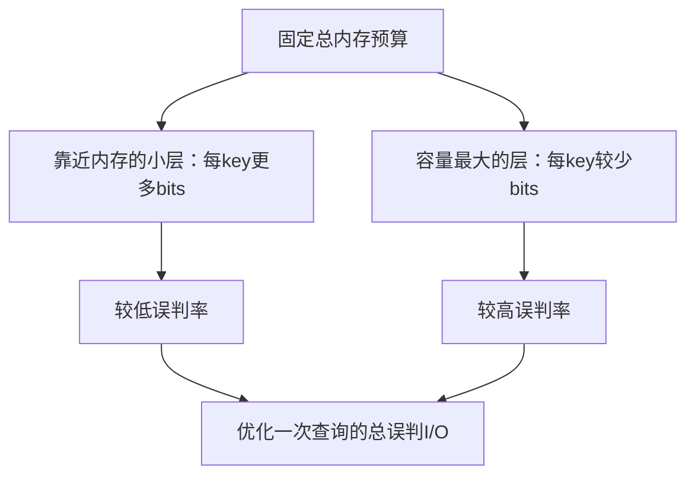
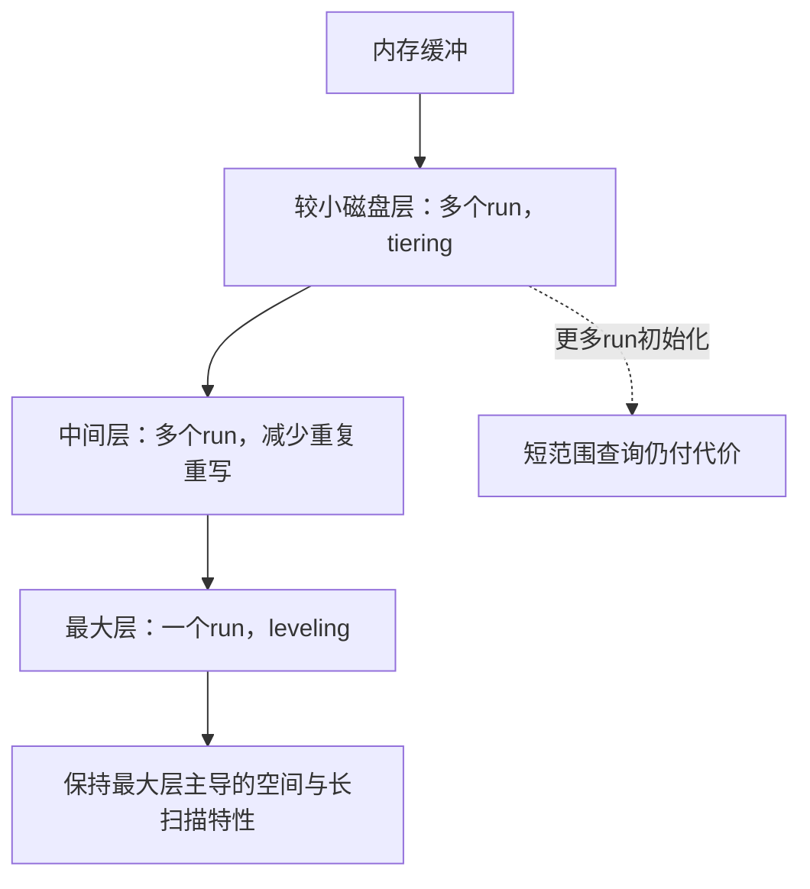

# LSM-Tree 自动调参：模型、过滤器与合并策略

> 本次核验Luo与Carey综述§3.6（PDF15–17页）；这些是特定成本模型下的调参结论，不是所有产品版本的默认配置。

## 先定义优化目标

必须确定读写比例、负查比例、短/长范围查询、数据量、内存预算和存储成本。调参不是在所有指标上同时最优，而是搜索满足约束的组合：size ratio T、buffer/filter内存、各层run数和数据放置。

## Monkey：纠正每 key 内存的分配方向

旧稿把“小层”解释为最大数据层，导致bits示例方向写反。综述§3.6.1指出：最大层含大量数据，即使投入很多总bits，也只能消除少数候选run的I/O；在固定总预算下，应让**靠近内存的较小层每key得到更多bits**，假阳性率向最大层指数增大。不是给最大层每key更多bits。

误判率降低不减少真正命中记录需要的读取；过滤器构建/探测仍有CPU与内存代价。综述的“其他成本不变”指其分析模型中的指标，不等于完整系统没有任何成本。

## Lim等：更新分布影响写成本

这里的数据冗余主要是同一key反复更新/删除的版本，可在早期merge被淘汰；并非“重复value或NULL做压缩”。模型用key写入概率估计多次写入后仍需保存的唯一key数，再计算未来merge工作。若均匀插入与热点更新混为同一种负载，会错误估计写放大。

## Dostoevsky — Lazy-Leveling

较小层采用tiering，容量最大的最后一层采用leveling。最大层支配空间、长范围与优化后负查成本，而每层都贡献写成本，因此不必所有层采用相同策略。更一般的设计用K控制中间层run数、Z控制最大层run数。

教学例：写入密集而短范围很少时，可接受中间层多run来减少重写；若改成大量短范围，每次初始化多个run的成本就不能忽略。**这不是“所有范围查询都取中间性能”的统一表格关系**。

## ElasticBF：根据访问热度动态调整

§3.6.3：把每组件filter拆成多个可激活部分，热点组件使用更多，减少其误判I/O；不活跃部分回收预算。它不是按key划分1/N子集后关闭，也不允许产生false negative。综述中4bits/key时收益更明显，10bits/key时误判已少，收益有限。详见[[ElasticBF-弹性BloomFilter]]。

## 数据放置与在线反馈

Mutant把成本、延迟和数据热度纳入跨存储层放置。迁移热点可换得低延迟，但迁移也有网络、I/O和暂态开销；“自动”不表示收敛无代价。

2025综述补充LLM选项预测：作者的一次DeepSeek V3+db_bench实验约100s，不适合直接置于每个请求关键路径，但不能推导为所有离线调参无用。见[[LSM-tree-KV-Survey-综述]]。

## 工程验证清单

固定总资源和已调参基线；报告steady-state吞吐、P99、读写空间放大与调参探索成本；加入突变热点、只读转写密集等场景。模型收益只能在其假设范围内成立，需明确不确定性和回退配置。

相关：[[LSM-Tree]]、[[LSM-Tree-写放大]]、[[LSM-Tree-RUM猜想]]、[[LSM-Tree-硬件适配]]。
