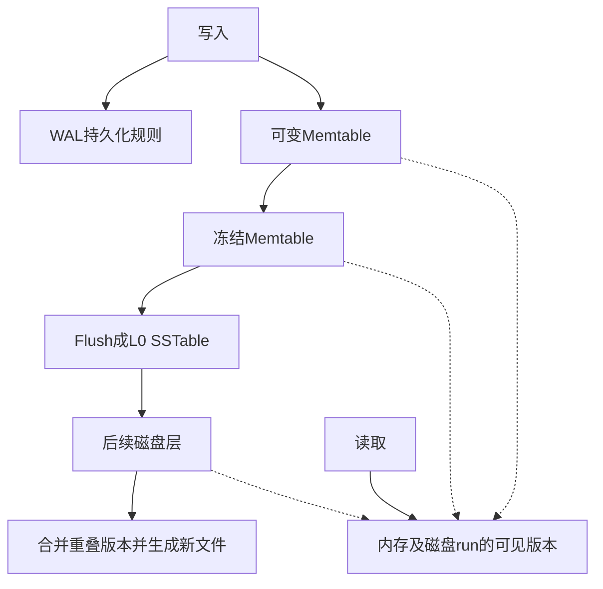

# LSM-Tree (Log-Structured Merge-Tree)

## 定义

**LSM-Tree** 是一种面向写密集型负载的持久化存储结构，核心思想是将随机写转化为顺序写，通过后台合并（merge）来维护读性能。由 Patrick O'Neil 等于 1996 年提出。

## 发展历史

| 时间 | 里程碑 | 说明 |
|------|--------|------|
| 1976 | Differential Files | 最早的 out-of-place 更新结构 |
| 1980s | Postgres 日志存储 | 追加写入 + vacuum cleaner 后台清理 |
| 1992 | LFS (Log-Structured File System) | 文件系统层利用顺序写带宽 |
| 1996 | **LSM-tree 原始论文** | O'Neil 提出，含 rolling merge 和 size ratio 理论 |
| 1997 | Stepped-merge (tiering 雏形) | Jagadish 等提出 T 组件合并策略 |

**关键洞察**：LSM-tree 通过将合并过程集成到结构本身，解决了早期 log-structured 存储的三大问题：查询性能差、空间利用率低、无法灵活调参。

## 核心架构

### 关键组件

1. **MemTable**：内存中的可变写入缓冲区，通常用跳表（skip list）或红黑树实现
2. **WAL (Write-Ahead Log)**：持久化写入日志，保证 crash recovery
3. **Immutable MemTable**：写满后变为不可变，等待 flush 到磁盘
4. **SSTable (Sorted String Table)**：磁盘上的有序不可变文件，包含 key-value 对和索引
5. **Bloom Filter**：每个 SSTable 附带，加速点查的"不存在"判定

## 两种核心合并策略

参见 [[LSM-Tree-写放大#Leveling vs Tiering 写放大对比]]

| 维度 | Leveling | Tiering |
|------|----------|---------|
| 每层组件数 | 1 | ≤ T |
| 写放大 | 高 O(T·L/B) | 低 O(L/B) |
| 点查（零结果） | 低 O(L·e^(-M/N)) | 高 O(T·L·e^(-M/N)) |
| 短范围查询 | 快 O(L) | 慢 O(T·L) |
| 空间放大 | 小 O((T+1)/T) ≈ 1 | 大 O(T) |

**核心结论**：Leveling 优化查询和空间，Tiering 优化写入。Size ratio T 越大，两者差异越大。这是所有 [[LSM-Tree-自动调参]] 工作的基础。

## 经典优化（Survey §2.3）

1. **Bloom Filter**：每个磁盘组件建 BF，10 bits/key → ≈1% 假阳性，点查几乎 O(1)（Monkey 提出非均匀分配策略，详见 [[LSM-Tree-自动调参]]）
2. **Partitioning**：将组件切分为固定大小 SSTable，边界合并时间、支持键范围裁剪
3. **并发控制**：多版本 (MVCC) 或锁方案；flush/merge 用引用计数 + snapshot（与 [[事务模型深度调研]] 中的 MVCC 机制高度相关）
4. **恢复**：WAL + no-steal buffer + 时间戳组件列表或 metadata log

## 代表系统

| 系统 | 合并策略 | 特色 |
|------|----------|------|
| LevelDB | Partitioned Leveling | 首创分区 leveling，Round-Robin 选 SSTable |
| RocksDB | Leveling/Tiering/FIFO | 弹性 L0 tiering、动态 level 大小、冷优先/删除优先合并、rate limiter |
| HBase | Tiering + Exploring | Exploring 选最优序列合并、Date-tiered 支持时序 |
| Cassandra | Leveling/Tiering/Date-tiered | 本地二级索引 |
| AsterixDB | Tiering-like + Correlated | 通用 LSM-ification 框架、关联合并同步所有索引 |

## 未来方向（Survey §5）

1. 全面的性能评估（多数改进未与良好调参的基线对比）
2. 分区 Tiering 结构对比（垂直分组 vs 水平分组）
3. 混合合并策略（[[LSM-Tree-自动调参#Dostoevsky — Lazy-Leveling]] 的 lazy-leveling）
4. 最小化性能波动（[[LSM-Tree-合并优化#bLSM — Spring-and-Gear 调度器]] 是唯一尝试但远不完善）
5. **走向数据库存储引擎**：从 KV-store 走向多索引 DB engine（参见 [[LSM-Tree-二级索引]]）

---

*参考论文: Luo & Carey, "LSM-based Storage Techniques: A Survey", VLDB Journal 2019*

## 来源核验与边界

2026-10-05核验本地[[知识库/sources/papers/LSM-Survey/LSM-Survey-VLDBJ2019.pdf|2019综述]]相应章节；这是综述级证据，不等于每个被引方案已独立复现。基础成本模型参见§2.3/表1（页6–7），合并优化§3.3（页11–12），硬件§3.4（页12–14），二级索引§3.7（页17–19）。较新的调度、卸载和硬件方向见[[LSM-tree-KV-Survey-综述]]。
