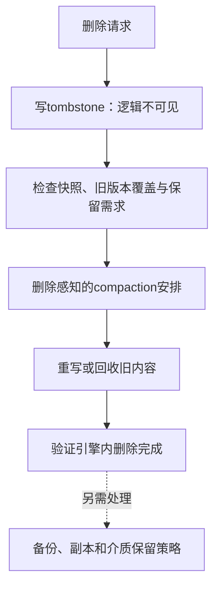

# Lethe：删除持久化也是 LSM 设计目标

> **来源层级**：本次只核验本地2025 LSM综述的页21删除操作段、参考文献[94]（页34）。这是二级来源概念卡，不是Lethe独立原论文精读；原有`draft`审核状态不升级。

## 综述明确支持的结论

综述介绍Lethe通过compaction策略和存储布局，在写放大与删除持久化阈值之间取舍；原作为Sarkar等SIGMOD 2020。

## 问题：逻辑不可见与物理回收不同

写入tombstone可以让后续逻辑查询看不到key，但旧版本仍可能存在于SSTables、快照或备份中。为了不让旧值复活，compaction只能在覆盖了被遮蔽的旧版本且满足保留约束时删除标记。不能只用“tombstone到了最底层”替代所有持久化和保留条件。

图为删除生命周期解释，不声称Lethe同时自动清除了备份或满足所有法规。

## 示例：为什么不能过早丢标记

新SSTable A含delete(k)，旧SSTable B含k=v。如果只重写A便删除标记，读取B会使v复活。删除感知设计要让覆盖B的必要工作及时发生，代价是可能在常规容量阈值前安排compaction，增加后台I/O。这是机制取舍，不是越频繁越好。

## 证据边界与工程问题

本地综述没有完整解释FADE、KiWi、分层TTL递推和delete tiles的原作算法，因此不保留旧稿自行指定的2/5/10分钟流程、O(1)整页删除保证或细节图。也不能把删除阈值简单等同于“tombstone比例达到某数”。

旧稿的读吞吐1.17–1.4×、空间减少2.1–9.8×、写放大+4%–25%未在综述获得可重现条件，暂撤为结论。后续独立原文核验需区分点删/范围删、删除键与排序键、快照、后台预算和按时完成比例。

**工程推论**：评价应给逻辑删除到不可恢复清理的时间分布，同时报告写放大、资源峰值和保留对象范围；引擎内及时回收只是隐私治理的一部分，不是合规认证。

相关：[[LSM-Tree-写放大]]、[[LSM-Tree-二级索引]]、[[LSM-tree-KV-Survey-综述]]。
