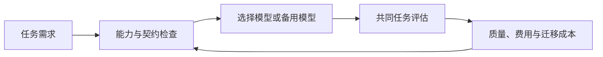

# Model Neutrality — 模型中立与反锁定

模型中立的工程目标是保留替换和组合后端的选择权，避免任务状态、工具协议和业务逻辑难以迁移。它不是每次请求都必须换模型，也不是让不同模型表现完全相同。

[LangChain 观点文章](https://www.langchain.com/blog/model-neutrality) 主张开源、多模型和能力 profile；其关于供应商策略及能力领先者的判断有时间与商业立场，不能作为当前性能结论。

迁移需要核验消息角色、上下文、工具 schema、结构化输出、缓存、限流和恢复语义。兼容 API 只减少接口改动，不保证任务结果等价；开源提高可审计性，不保证不存在漏洞或不利默认设置。

**例子**：模型 A 调用付款后连接中断，切换 B 前先用业务标识确认付款状态；只重放对话可能重复付款。模型路由与 [[Agent-Fault-Tolerance-容错设计]] 应共享副作用状态。

验证备选模型时，在固定任务与预算下比较成功率、工具错误、费用和 P95 时延，并测试中途切换。单供应商也能做缓存、限额和重试优化；多模型是否值得取决于收益能否覆盖适配与评估成本。

详读：[[知识库/sources/web/langchain/model-neutrality-精读]]；相关：[[Custom-Agent-Harness-Middleware架构]]、[[Agent-Cost-Control-Gateway成本控制]]。
