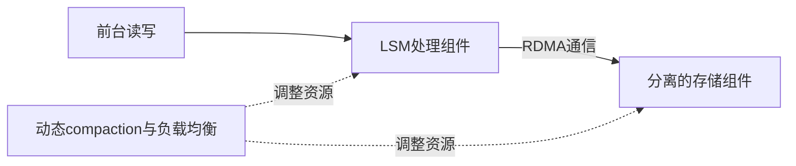

# Nova-LSM：基于 RDMA 的组件化 LSM

> **来源层级**：本次只核验本地2025 LSM综述的页15分布式架构段、参考文献[50]（页31）。这是二级来源概念卡，不是Nova-LSM独立原论文精读；原有`draft`审核状态不升级。

## 综述明确支持的结论

综述描述Nova-LSM用RDMA将存储与处理解耦，通过动态compaction与负载均衡改善扩展和倾斜负载性能；引用为Huang与Ghandeharizadeh，SIGMOD 2021。

## 从单体引擎到组件化

单体LSM把前台服务、内存缓冲、日志和持久数据绑在同一机器，热点写入与后台压实可能使某机器成为瓶颈。组件化的设计方向是让处理资源和存储资源可以独立配置；网络从偶发路径变成常规数据路径，故网络与远端资源也成为预算的一部分。

此图是综述级示意，未把未核验的LTC/LogC/StoC内部协议、Drange/Trange参数或QP拓扑画成确定事实。

## 例子与边界（工程推论）

假设热点集中在一个key range，增加存储容量并不自动增加该range的前台处理能力。应先判定瓶颈是CPU、内存、磁盘队列还是网络，再选择拆分处理、重分配范围或调整后台任务。RDMA可以改变传输开销，但不能自动解决owner切换、内存注册生命周期、日志持久化或并发可见性。

不变量仍包括：确认的写可恢复；迁移期间key范围有明确owner；读取能找到正确版本；压实只回收已无可见引用的数据。具体如何实现，需独立原文。

## 实验解读与来源限制

综述说倾斜负载下比LevelDB/RocksDB有显著优势，但没有提供可逐项重现的完整配置和数值。旧稿中的4×/65%、power-of-6与ρ=3、13天/55.4年/30年可靠性估算和各负载倍数，不能靠这一个综述验证，已撤出已确认结果。

后续需核验总节点资源是否相同、是否含复制/日志开销、倾斜程度、数据库大小、RDMA网络和磁盘类型。不能只凭一个吞吐倍数归因于“RDMA更快”。

相关：[[Hailstorm-存算分离LSM数据库]]、[[CaaS-LSM-Compaction即服务]]、[[LSM-tree-KV-Survey-综述]]。
