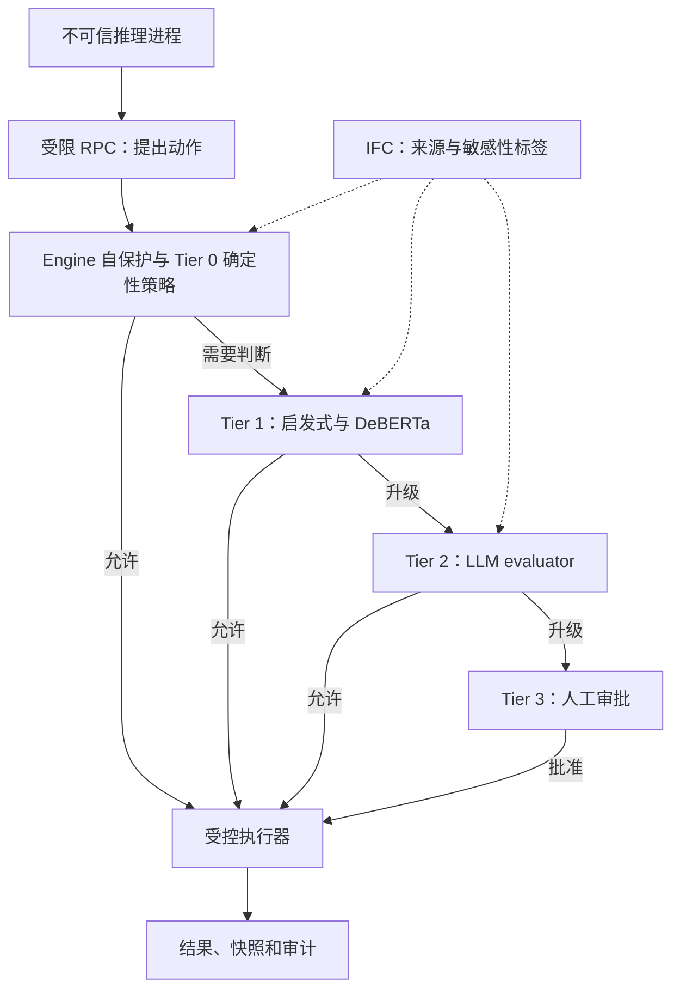

# Parallax — Agent 安全架构

## 威胁模型与信任边界

Joel Fokou 的 *Parallax: Why AI Agents That Think Must Never Act*（arXiv:2604.12986v1，2026-04-14，20 页）假设推理 Agent 已被攻破，转而约束它能造成的真实副作用。可信基础是 OS/沙箱、engine 进程和策略/验证层。**分离进程需要配合文件、网络和凭证权限隔离**，不能只在同一权限内加一个 hook。

图简化 Fig.1 与 §5，省略拒绝分支；任一层拒绝或验证故障均应阻止执行。并非所有动作都跑完四层。Chronicle 对可控资源保存执行前状态，不能撤销已发邮件、第三方 API 效果或已泄露的信息。

**例子**：读凭证与发送 HTTP 各自可能是合法工具；IFC 必须跟踪凭证数据经过字符串拼接后的来源，并在外发前拒绝。事后恢复本地文件无法收回远端数据。

## 作者报告的评估（§6，表 3–5）

直接注入工具动作，绕过模型推理：280 个恶意用例、50 个合法用例，加 7 个模拟人工审批用例。默认配置阻断 277/280（98.9%），误拦截 0/50；最高安全配置阻断 280/280，**误拦截 18/50（36%）**。

这不是所有 prompt 防御与 Parallax 的自然语言攻击横评。Config B 的 prompt-only 在直接注入模式没有可应用阶段；论文初步 LLM 模式下三个模型均拒绝测试危险请求，无法区分配置。策略也在同一测试集上调过，未报告独立留出攻击上的结果。

表 5 的实测 P50：Tier 0 <1ms，Tier 1 **1947ms**，Tier 2 **2089ms**。Tier 1 的 10–50ms 是讨论中的优化预期，不能当作实测。表 4 按层阻断合计 280，与默认配置的 277 不同，配置归属不够清楚。

## 工程含义与局限

外部执行边界、最小权限和信息流检查值得借鉴，但其有效性依赖策略覆盖、标签传播和可信基础未被攻破。作者自建用例、单机参考实现和未复现实验不支持“绝对安全”或“任何外部操作可回滚”。部署评估要加入合法任务误报、未参与调优的攻击、故障时拒绝执行和真实任务时延。

完整证据：[[知识库/sources/papers/Parallax/arxiv-2604.12986-精读]]；关联：[[Agent-Sandbox-安全沙箱选型]]、[[Agent-Harness-Governance治理]]、[[Custom-Agent-Harness-Middleware架构]]。
