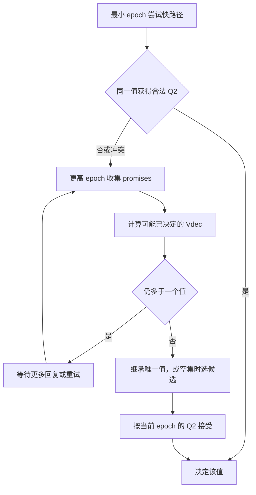

# Paxos Epochs Revised：共享 epoch 与恢复

> 依据 Howard UCAM-CL-TR-935 Ch.7，pp.113–139；[官方 PDF](https://www.cl.cam.ac.uk/techreports/UCAM-CL-TR-935.pdf)。原稿将多数 quorum 的快路径和最坏恢复成本混为一谈，现按式(7.1)–(7.2)、Algorithms 24–29 和 Table 7.1 修订。

## 四种讨论方向

| 机制 | 位置 | 关键约束 |
|---|---|---|
| 动态 allocator | §7.1 | 避免静态 proposer 分配，但增加 allocator 往返及可用性依赖 |
| 值映射到 epoch | §7.2 | 每个 epoch 对应确定值；二元例为奇偶数，选值变化可能导致重新执行准备阶段 |
| Epochs by recovery | §7.3 | 同 epoch 不同 proposer 可提出不同值，靠 acceptor 不覆盖与恢复选值维持安全 |
| Hybrid / Multi-path | §7.4 | 不同 epoch 使用不同机制，快路径失败后转入受约束慢路径 |

值映射并非随意哈希：epoch 与值的对应关系必须满足协议定义，哈希碰撞不能破坏同 epoch 值唯一性。Allocator 方案也不是在所有部署下都只有一个网络 RTT。

## 共享 epoch 必须增加的三道约束

1. **同轮 phase-2 quorum 相交**（式7.1）。否则两个不相交 Q2 可分别决定不同值。
2. **同一 acceptor 同 epoch 不改值**（Algorithm 24、Property 17）。接受 `(e,A)` 后不能再接受 `(e,B)`。不同 acceptor 仍可能分别接受 A 和 B；此规则不等于整个 epoch 中只会出现一个提案值。
3. **恢复只在可能决定值最多一个时继续**（Algorithms 25–26、Properties 18–19）。若剩余多值不确定性，要等更多 promise，不能选择“得票最多”就结束。

最坏情况下，式(7.2)要求恢复 Q1 与每个旧 epoch 中任意两个 Q2 的交集都有交点。这是充分进展边界；实际收到的内容可能允许更早结束，但不能据此删除最坏故障下的等待需求。

## Table 7.1 的真实含义

N 个 acceptor、任意 k 个作为 Q2 时需 `2k>N`。准备阶段所需回复范围为 `N-k+1` 到 `2N-2k+1`（p.128），Table 7.1 给出：

| N | k（phase 2） | phase 1 回复数范围 |
|---|---|---|
| 3 | 2 | 2–3 |
| 5 | 3 | 3–5 |
| 5 | 4 | 2–3 |
| 7 | 4 | 4–7 |

这是理论计数，不是实测 RTT/吞吐。N=5、k=3 时普通多数写可成功，但冲突恢复最坏需要全部 5 个回复；原稿仅写“恢复也只需多数”会隐藏关键可用性成本。

自构例：三 acceptor 中 a1 接受 A、a2 接受 B，a3 暂无回答。恢复只见 a1/a2 时，a3 可能接受过任一值，不能确定哪一个曾形成 2 节点 quorum。a3 的回答可消除这种不确定性；这正是“安全尚未破坏，但暂时不能决定”的区别。

## 与 Revision C 的交互

p.127 的固定 quorum 例明确提醒：共享 epoch 下，收到 `(f,v)` 所复用的证据覆盖**严格小于 f** 的历史，不自动排除同 epoch f 中其他提案。不能直接套用唯一 epoch 时的 `≤f` 推理。

§7.4 的 Multi-path 组合提供按 epoch 切换的路径，不意味着一个未经证明的“失败后用普通多数忽略旧值”回退。完整框架见 [[共识算法族系-从Paxos到广义解]]、[[Paxos-Value-Selection-Revised]]。
