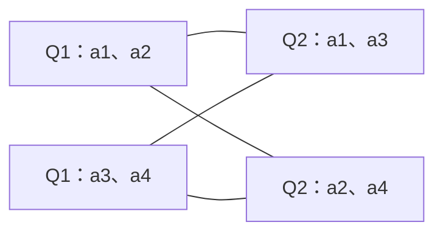

# Paxos Quorum Intersection Revised

> 核对 Howard 技术报告 UCAM-CL-TR-935，Ch.4–5，pp.75–96。[官方 PDF](https://www.cl.cam.ac.uk/techreports/UCAM-CL-TR-935.pdf)。这里讨论的是保留每 epoch 单值等规则后的放宽，不是独立于其余协议条件的 quorum 配方。

## Revision A：跨阶段相交

式(4.4)只要求任意 Q1∈phase-1 quorum 集与任意 Q2∈phase-2 quorum 集满足 Q1∩Q2≠∅。同阶段 quorum 可以不相交；经典多数只是满足条件的一个选择。

每条线表示一个非空交集；两个 Q1 可以不相交，两个 Q2 也可以不相交。此例与 Figure 4.1 的 quorum 配置一致，线不表示网络通信。

若任意 q1 个节点可构成 Q1、任意 q2 个可构成 Q2，则 `q1+q2>N` 保证相交。例如 N=4、q1=3、q2=2，稳定写只需 2 个确认，恢复却需 3 个；“写还能继续”和“故障后能选新 leader”是不同可用性条件。

## Revision B：不是只检查前一轮

式(4.6)、p.81：epoch e 的每个 Q1 要与**每一个 f<e 的每个 Q2** 相交；同轮与未来轮不需要由这条式子约束。e=9 不能只考虑 e=8 而忽略 e=6 已经决定的值。最小 epoch 没有更早历史，可跳过 phase 1；更大 epoch 是否可以缩短准备，须基于已证明的 quorum 与证据。

## Revision C：历史证据而非集合传递律

pp.91–93、式(5.1)、Algorithm 15：收到 `promise(e,f,v)` 后，在这些章节沿用的唯一 epoch/单值条件下，合法提案 f 的选值已约束了 ≤f 的历史。继续覆盖 f 与当前 e 之间的 epoch 即可。

自构例：e=9 得到 f=5 的提案，只能用它覆盖 ≤5；还要覆盖 6、7、8。若只是收到 `promise(9,nil,nil)`，它没有提供一个合法历史提案供复用。共享 epoch 时相关规则进一步变化，不能照搬到 [[Paxos-Epochs-Revised]]。

## 证明、用途与局限

§4.1.2、§4.2.2 与 §5.3 逐项修改安全证明中的 quorum 使用条件。所谓“经典要求过强”不表示经典证明有缺陷。§4.3.3 把读/准备大 quorum 与稳定写小 quorum 的取舍连接到 Multi-Paxos；没有提供本卡旧稿中笼统的性能倍数保证。

性能分析需要同时统计 steady-state 提交和故障恢复。重配置时还须确保跨 epoch 的 quorum 关系，不得仅在每轮内部检查一个大小阈值。完整链路见 [[知识库/sources/papers/Distributed-Consensus-Revised/精读分析]] 与 [[Paxos-Value-Selection-Revised]]。
