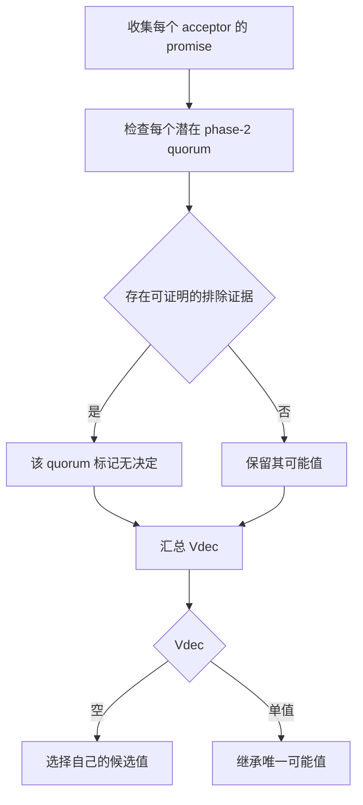

# Paxos Value Selection Revised

> 依据 Howard UCAM-CL-TR-935 Ch.6，pp.97–111；[官方 PDF](https://www.cl.cam.ac.uk/techreports/UCAM-CL-TR-935.pdf)。核心是 Algorithms 16–20，不是把多数投票改成“选最流行的值”。

## 经典选值保留了什么

Classic Paxos 从 promise 报告中选取最高 accepted epoch 的值；若全部无已接受提案，才选自己的候选值。这保证安全，但一些局部接受的值从未形成 quorum 决定，新增回答可能证明它无需继续继承。

## Epoch 无关 quorum：Algorithm 18

先收齐足以与每个 Q2 相交的 promises。R[a] 有三类状态：未回复 `no`、明确无提案 `nil`、返回 `(epoch,value)`；未回复不能当作 nil。

对每个 Q2：

1. **任一成员**返回 nil ⇒ 该 quorum 不可能在此前决定值。
2. quorum 中成员返回 `(f,w)`，同时任意已回复成员返回更高 `(g,x)` 且 x≠w ⇒ 按 Lemma 20 排除含较低提案成员的该 quorum；较高提案的回答者不必也属于这个 quorum。
3. 若未被排除，则保存它仍可能决定的值。汇总所有未排除 quorum，形成 Vdec。

Vdec 为空才能提出自己的值；为单值则继承。不是“每个 quorum 都必须返回同一个值才继承”；已有一些 quorum 被排除时，其余一个仍可能决定 v，就必须保留 v。

## 自构例：什么时候可以选新值

令 Q2 只有 `{a1,a3}` 与 `{a2,a4}`，准备阶段收到 a1=(1,A)、a3=nil、a4=nil。每个 quorum 都被一个 nil 成员排除，因此可以选 B；经典选值仍会取 A。这个例子没有覆盖全部运行轨迹，安全性由原文 Lemmas 19–20 及后续证明提供。

不能把规则简化为“看到两个不同值就任选新值”。若只是 epoch 相同但值不同，已经离开 Ch.6 依赖的同 epoch 单值模型，需要 Ch.7 的共享 epoch 协议。

## Epoch 相关 quorum 与未知状态

§6.2 的 Algorithms 19–20 为每个旧 epoch 的 quorum 跟踪「未知 / 不可能决定 / 只能决定某值」。若仍有未知 quorum，可能值集合不能被当成空集。收集到足够信息使集合至多一个值，才能进入 phase 2。把未观察到的决定当成不存在，是会破坏安全性的实现错误。

## 证据与成本

证据来自伪代码、Lemmas 19–20 和安全/进展证明。此章未测数据库吞吐；更细的记录与 quorum 枚举有计算/存储成本，实际实现可优化，但不能从理论灵活性直接推出固定性能增益。

与 [[Paxos-Quorum-Intersection-Revised]] 联读以理解准备阶段何时完成；与 [[Paxos-Epochs-Revised]] 联读以理解同 epoch 冲突恢复。
