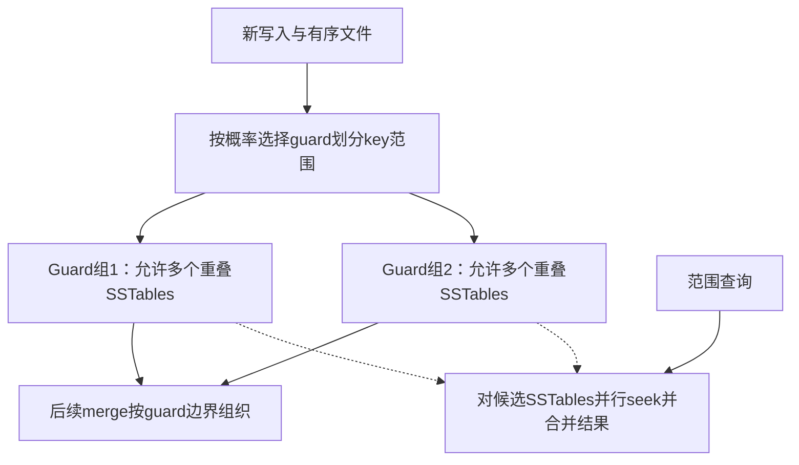

# PebblesDB：通过 Guard 组织分区 Tiering

> 本次核验2019综述§3.1.1（PDF第8页，PebblesDB段）与2025综述分类。未独立核验SOSP 2017原论文，保留原始书目供追溯，审核状态仍为draft。

## 机制与代价

在leveling中，为维持层内key范围不重叠，合并输入往往要重写下一层相交数据。PebblesDB采用垂直分组的partitioned tiering，以guard定义SSTable组的key范围；同一个组内允许多个文件重叠。Guard从插入keys中按概率选择，借鉴skip-list，以平衡组的负载；新增guard在下一次merge时惰性应用。综述还提到并行seek改善范围查询。

## 一个范围示例（教学）

Guard边界为m，左组负责[a,m)，右组[m,z]。输入文件中[a,c,n,x]可按边界组织到两组；左组若已有[c,h]，允许文件范围重叠意味着不必为每次新增立即把它变成唯一run。不过读c要处理多个候选版本，范围扫描也需合并。降低重复重写的成本转移到了查询和空间管理，不能说与tiering“本质无关”或完全无代价。

新增guard不能令旧文件中的keys丢失；惰性应用期间读路径必须仍覆盖实际旧布局。Compaction删除旧文件前也须满足快照与版本引用约束。这些是解释数据结构时需要检查的不变量，具体协议待原文核验。

## 实验与来源边界

综述支持guard选取、垂直分组tiering与并行seek的机制概括，未提供本卡原有微基准全表。旧稿的2.7×/6.7×吞吐、58%–67%写IO减少、MongoDB/HyperDex数字、171% CPU及精确配置阈值，现不作为已验证结果。它们若需恢复，应从独立原论文带上数据集、设备、基线调参、缓存状态和稳态条件。

**工程推论**：读写比偏写时这种布局值得测试；短范围、写后纯读、空间预算紧或冷热极偏时，要同时测run数、查询初始化、空间放大和后台积压。已有[[LSM-Tree-写放大]]与[[LSM-Tree-RUM猜想]]可解释这些取舍。
