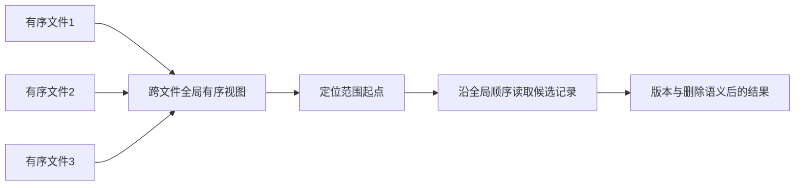

# REMIX：跨文件全局有序视图

> **来源层级**：本次只核验本地2025 LSM综述的页20范围查询段、参考文献[151]（页37）。这是二级来源概念卡，不是REMIX独立原论文精读；原有`draft`审核状态不升级。

## 综述明确支持的结论

综述把REMIX描述为跨文件提供全局有序视图的KV索引，用于加快二分定位与范围查询，原作为Zhong等FAST 2021。

## 为什么多 run 使范围扫描变贵

每个SSTable内部有序，但多个run之间key范围重叠。常规范围迭代先在各候选run seek到起点，再持续决定哪个run给出下一个key；逻辑结果还要处理同key多版本和删除。全局排序视图试图把这部分顺序信息预先编码为可复用索引。

该图展示职责，不把未核验的Anchor/Cursor/Selector字段布局当作本次确认的原作实现。

## 走通例子与不变量（教学）

run A有[a,c,f]，run B有[b,c,e]，跨文件次序是a,b,c(A),c(B),e,f。若B的c版本更新，面向当前快照输出应仅保留适用的c；全局物理顺序本身不自动解决版本可见性。Compaction替换了A/B后，旧视图不能继续引用已回收位置，需要与文件版本/读者生命周期协调。

这个例子说明“知道下一个候选来自哪里”可减少反复比较，但不意味着每次next的总成本都是O(1)：数据读取、删除处理与快照过滤仍有成本。

## 成本与实验边界

预先维护顺序信息需索引空间和重建/增量维护时间，应按读写比例、run数、范围长度、重复key和缓存命中验证收益。只测全内存只读扫描会低估更新成本。

旧稿的约1%空间、所有场景固定O(1) next及量化倍数缺少独立原文核验，已撤除为结论。综述也未承诺完整全局索引始终驻留内存；其存储布局需后续读原作。

相关：[[LSM-Tree]]、[[LSM-Tree-合并优化]]、[[LSM-tree-KV-Survey-综述]]。
