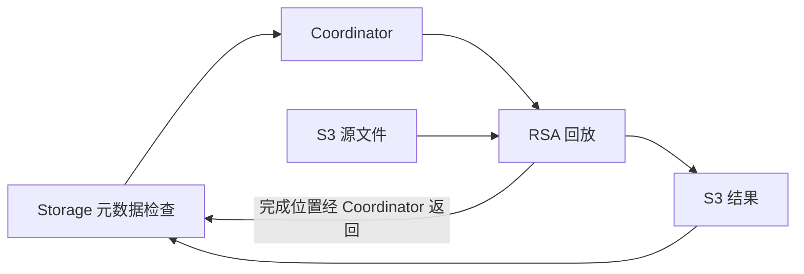

# RaaS（Replay-as-a-Service）

> **论文**：*Reducing Tail Latency in Storage-Disaggregated Database Systems* — SIGMOD 2026，Purdue University  
> **核心思路**：把数据库后台日志回放从存储引擎中解耦为独立服务，跑在集群空闲实例上，缓解原存储节点的CPU竞争与尾延迟。

---

## 1. 一句话定义

**RaaS 是一种架构模式**：将 [[存储计算分离数据库的-Tail-Latency|存储计算分离数据库]] 中 CPU 密集的后台日志回放（log replay）任务，从存储节点剥离为独立的无状态微服务，调度到集群空闲实例上执行。**核心效果来自"让空闲资源干活"而非"加机器"。**

---

## 2. 架构

### 两个新组件

| 组件 | 职责 | 特点 |
|------|------|------|
| **RSA** (Replay Service Agent) | 执行回放任务，从 S3 拉日志数据、写回物化结果 | 无状态、可任意扩缩 |
| **Control Coordinator** | 接收卸载请求 → 监控集群资源 → 调度到最优 RSA | 有状态（维护任务状态），单节点即可 |

### 关键设计：S3 作为数据总线

- Storage Node 只发 **18KB metadata**（KeySpace + LsnRange + page→log mapping + location index）给 Coordinator
- RSA 自己去 S3 拉数据 / 写结果
- → **该实验storage node传输量降低93.9%**（49GB → 3GB）

---

## 3. 四大技术挑战与解法

| # | 挑战 | 解法 |
|---|------|------|
| **C1** | 回放逻辑与前台 GetPage@LSN 代码强耦合 | 识别最小元数据边界（KeySpace + LsnRange + page→log mapping + location index），**只解耦 compute-intensive 的 page materialization step** |
| **C2** | 回放数据量巨大，存储节点 CPU 有限 | S3 中转：只发 metadata，RSA 自己去 S3 拉数据/写结果 → 该实验storage node传输量降低93.9% |
| **C3** | 原来单线程回放浪费 RSA 的多核资源 | 并行 MergeSort 按 page 分组日志 + 多线程并行 apply → Avg 延迟 -17.3%，P95 -23.7% |
| **C4** | 任务调度策略 | 优先级同时考虑任务量与等待时间（论文未给乘法公式）；选 RSA：① 过滤 CPU>75% ② 过滤资源不足 ③ 优先上次服务过的（缓存亲和） ④ 选资源最多的 |

---

## 4. 任务卸载流程

1. Storage Node 检测到 CPU 不足 → 提取元数据
2. 发 metadata → Control Coordinator（**不传数据文件**）
3. Coordinator 选 RSA → 派发任务
4. RSA 从 S3 拉文件 → 执行 `remote_compact_tiered()` → 结果写回 S3
5. RSA 通知 Coordinator → Coordinator 通知 Storage Node 结果位置
6. Storage Node 更新本地索引

**关键行为**：如果 Storage Node 有空闲资源，任务在本地执行，不触发卸载。RaaS 只在资源争抢时才介入。

---

## 5. 实验效果

### 核心指标（SysBench 86GB，mixed read/write，8 实例）

| 指标 | Without RaaS | With RaaS | 改善 |
|------|-------------|-----------|------|
| **Avg Throughput** | 1351 TPS | **2376 TPS** | **+75.9%** |
| **P95 Latency** | 68.28 ms | **40.9 ms** | **-40.1%** |
| **P99 Latency** | 106.75 ms | **62.19 ms** | **-41.7%** |
| 请求 >100ms 占比 | 1.33% | 0.06% | **-95.5%** |
| <10ms 完成占比 | 32.5% | 53.3% | +20.8 个百分点 |

### TPC-C 验证

| 指标 | Without RaaS | With RaaS | 改善 |
|------|-------------|-----------|------|
| P95 | 225.49 ms | 129.08 ms | **-42.76%** |
| P99 | 300.43 ms | 189.84 ms | **-36.81%** |

### CPU 利用率变化

- **Without RaaS**：storage node 后台回放期间 CPU 打到 400%（满核），前台查询饿死
- **With RaaS**：workload 期间 CPU 200-320%，后台回放在 idle interval 由 RSA 执行
- Storage node 空闲率：48% → 18%，**资源利用率大幅提升**

---

## 6. 容错设计

| 故障场景 | 系统行为 |
|----------|----------|
| S3 上传失败 | RSA 自动重试，对 storage node 透明 |
| 单个 RSA 崩溃 | §7.6注入实验：Coordinator检测后剔除并重调度到其他RSA（延迟约 +200ms，无性能影响） |
| 全部 RSA 不可用 | Coordinator 拒绝任务 → storage node 跳过本次回放 → 下次重新触发 |
| Coordinator 崩溃 | Storage node **回退到本地回放模式** → 无数据丢失 / 无宕机风险 |

---

## 7. 边界与局限

| 场景 | 表现 |
|------|------|
| Read-only workload | RaaS 无影响（无日志积压，任务在触发前取消） |
| Non-bursty（全集群持续高负载） | co-located RSA 无改善（预期内）；dedicated RSA 部署可提升至 2151 TPS（+71.6%） |
| 本地并行回放（不卸载） | **反而恶化**：P99 +38.3%（资源争抢加剧） |
| 提高本地回放频率 | 效果有限：P99 仅改善 3%（频繁 cancel + 资源争抢） |

---

## 8. 对分离式 Kafka / 流存储的启发

RaaS 的思路可直接迁移到分离式流存储系统（如 AutoMQ、Confluent Cloud）：

| 场景 | RaaS 模式映射 |
|------|--------------|
| **Log Compaction 卸载** | Kafka compaction 是 CPU 密集型操作，可卸载到空闲 broker |
| **Tiered Storage 回放** | 从 S3 拉 cold segment 回放时，借鉴 S3 中转减少 broker 网络开销 |
| **调度框架** | Coordinator 的 Monitor/Scheduler/Dispatcher 模式可直接复用 |

---

## 9. 论文评价

### 亮点
- 通过OpenAurora插桩分析存储分离OLTP的两条尾延迟路径
- 思路简洁有效：解耦后台回放——本质是"让存储层回归存储"
- 实现务实：基于 OpenAurora 真实系统，**不改读写路径**
- 评估扎实：SysBench + TPC-C，覆盖容错、边界、non-bursty 场景
- 开源：[purduedb/OpenAurora/tree/RaaS](https://github.com/purduedb/OpenAurora/tree/RaaS)

### 局限
- COTS 数据库（Aurora/Socrates）验证依赖封闭系统，主要实验在 OpenAurora
- Non-bursty 场景 co-located 部署无增益，需 dedicated RSA 节点
- 未涉及多租户环境 tail latency 分析（论文列为 future work）
- Memory-disaggregated 数据库（RDMA/CXL 场景）待探索

---

## 10. Key Takeaways

1. **解耦是解法**：把 CPU 密集的后台任务从资源受限的存储层剥离
2. **S3 作为数据总线**：metadata 通过控制面，data 通过 S3 对象存储——该实验storage node传输量减少93.9%
3. **错峰资源复用的价值**：RaaS 核心效果来自利用空闲资源，而非加机器
4. **渐进式容错**：RSA 不可用时自动回退本地模式，保证可用性

## 原文定位与复现边界（2026-10-05 核验）

本地 [[知识库/sources/papers/RaaS/RaaS-SIGMOD2026.pdf|26 页 PDF]]：§3/图3–5（页6–9）验证日志链和 CPU 竞争；§5.1–5.2（页11–12）定义元数据/对象存储卸载边界；§5.4–5.5（页13–14）描述调度和失败处理；§7.1–7.3/图8–9（页15–17）给吞吐与延迟；§7.6（页19–20）给故障注入；§7.7（页20）给网络流量。

主实验每实例 86 GB SysBench、32线程，8个 OpenAurora 实例。10分钟预热后，3轮5分钟混合负载，中间各有10分钟空闲；db5–8比db1–4晚8分钟开始。这种错峰创造可借用资源，是 +75.9% 吞吐与 P95 -40.1% 的重要前提。Aurora 10GB观测、OpenAurora 24GB根因实验和86GB主评估是三组不同设置，不得合成同一实验。本文未直接给 AWS Aurora 安装 RaaS 后的性能。

**走通示例（教学）**：页 P 现有物化版本位于 LSN 100，请求读取 LSN 150。Storage 根据原始 page→log mapping 选择100之后至150所需日志；后台任务把一个完整 keyspace/LSN 范围交给 RSA 时，原始日志和索引仍是正确性依据。RSA 先把输出文件持久化，返回位置，再由 Storage 取回并同步索引。它不是“远端回放完成就立即覆盖所有快照”，也不改变事务提交的 WAL 持久性路径。

**失败边界**：§5.5 对 RSA 故障描述为 coordinator 通知 storage 重试卸载；网络错误由 RSA 重试，损坏数据通知 storage，coordinator 全失效则回退本地回放。副本/日志持久性故障仍依赖原数据库。页20的49 GB→3 GB、93.9%衡量减少经过受限 storage node 的传输；不是整个集群含 S3 流量归零或普遍网络节省比例。

**工程推论**：部署前应测长日志链占比、可借用CPU窗口和 S3传输开销；若全集群持续繁忙，共置 RSA 不会创造新算力，应比较专用 worker 的成本与收益。

> **失败路径的原文差异**：§5.5（PDF14页）描述RSA故障后通知storage重新卸载，§7.6（PDF19页）实验描述coordinator自行重调度、storage不重新发任务。本笔记分别保留两处的语境，不把其合成为已经完全说明的统一重试协议；准确实现需进一步对照对应版本源码。
