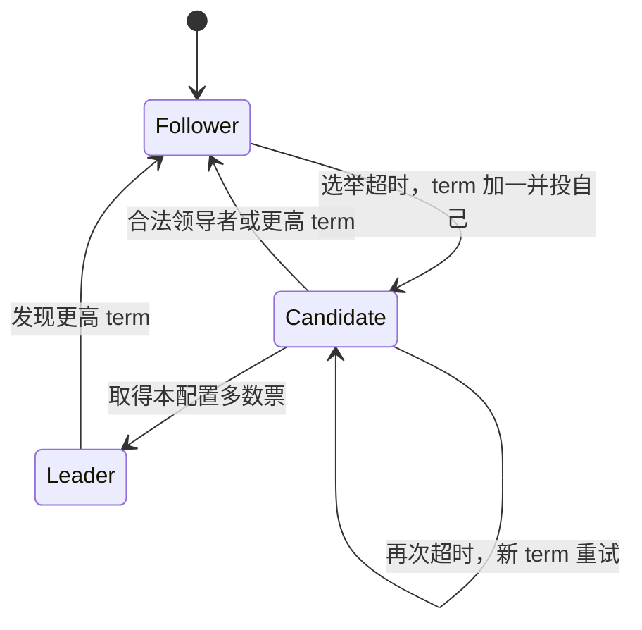

# Raft 共识算法协议核心

> 依据 Ongaro 博士论文 Ch. 3（印刷 pp. 11–31 / PDF pp. 28–48）；选举是 §3.4、复制是 §3.5、安全性是 §3.6。旧稿引用的 Ch.5/6/7 属于误编号。

## 状态机与持久化

`currentTerm`、`votedFor` 和日志属于持久状态；相关 RPC 回复前必须落盘。每节点每 term 至多投一票，保证同 term 至多一名当选领导者。网络分区中旧领导者可能暂时不知道已被替换，因此“至多一个”不能理解为任意墙钟时刻只有一个进程自认为 leader。

## 选举、复制与提交

1. Candidate 广播 RequestVote，携带最后日志 term/index。投票者先比较 term，再比较 index；只有候选日志不比自己旧才可投票。
2. Leader 追加 `(term,index,command)`，通过 AppendEntries 发送前一条目的 index/term 与新条目。Follower 先验证前缀，不匹配则拒绝，leader 回退后重试。
3. 同 index 同 term 的条目对应相同历史前缀（Log Matching）。只覆盖冲突后缀，不能抹去已提交条目。
4. 若 index=N 的条目属于**当前 term**，且多数节点已持久化到 N，leader 才能根据副本数把 commitIndex 推进到 N；此前条目随之前缀一起提交。
5. 各状态机按 index 顺序应用已提交命令，再向客户端返回业务结果。

## 为什么“复制到多数就提交”不完整

§3.6.2 的 Figure 3.7（pp. 24–25）给出了反例：旧 term 条目一度在多数节点上，但另一个拥有更高末尾 term 的候选者仍可能合法当选，覆盖它。新 leader 先提交本 term 条目，就把旧前缀锁定进未来领导者日志。因此不能删掉提交规则里的 `log[N].term == currentTerm`。

安全性分解为 Election Safety、Leader Append-Only、Log Matching、Leader Completeness 和 State Machine Safety；后两项分别约束未来领导者包含已提交条目、同 index 不能应用不同命令。安全性不要求固定消息延迟，可用性却依赖多数派和适当超时（§3.9）。

## 证据与局限

Ch.8 提供形式化规范/证明相关讨论；Ch.9 的 150–300 ms 是实验环境下的保守超时建议，不是任意网络下的 SLA。§10.3 的三节点 LogCabin 约 19500 次 1 KiB 写/秒是特定硬件与负载的初步结果。完整实验条件见 [[知识库/sources/papers/Raft-Dissertation/精读分析]]。

扩展安全性还需要 [[Raft-集群成员变更]]、[[Raft-日志压缩]]、[[Raft-客户端交互]]。Raft、Paxos 和 Zab 有共同的问题背景，但不应把 Raft 简单标成“Multi-Paxos 的实现”。
