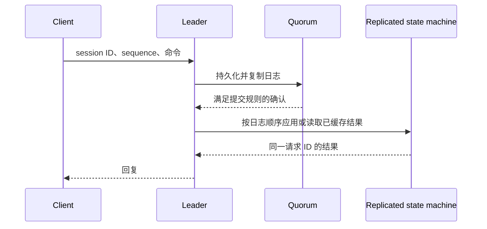

# Raft 客户端交互：去重、读屏障和会话

> 依据 Ongaro 博士论文 Ch.6（印刷 pp.66–75 / PDF pp.83–92），核心为 §6.3、§6.4 与 Figure 6.1。保留论文协议条件，避免把现代实现名称误当原文规范。

## 写请求：复制只是其中一环

客户端定位 leader 后，leader 把命令写入并复制；满足 [[Raft-共识算法协议核心]] 的提交规则，再按日志顺序应用到状态机、保存结果并回复。若回复丢失，客户端不知道操作已完成还是未完成，因此重试必须携带原来的逻辑请求 ID。

线性一致性要求操作可放在调用与返回之间的某个点上，保持实时先后关系；不要求所有副本在同一墙钟时刻观察到 commitIndex 变化。

## 去重不能返回另一个命令的结果

§6.3：复制状态机保存会话、序列号和响应。单个客户端串行发送时，保存最新请求结果足够；并发请求则需保存 `(sequence,response)` 集合，客户端附带尚未收到响应的最小 sequence，服务端才能安全丢弃更旧响应。

自构例：seq=3 与 seq=4 并发，4 先执行。只用 `if seq <= latest: return latestResponse` 会把 4 的结果误给 3；即便把这段逻辑搬到 apply 阶段，也没有修复错误。必须分别识别两个请求，或禁止同一会话并发。业务状态和去重状态需要一起复制、快照和恢复。

会话过期也必须确定性地发生。若请求携带的会话已经丢失，不能自动分配新会话并重放旧命令，否则无法排除重复执行。原文采用 RegisterClient 建立会话，未知/过期会话返回错误；LogCabin 用复制日志中的时间输入作确定性过期，而非每个节点独立依据本地时钟清理。

## 无时钟读：四个条件缺一不可

§6.4 的只读优化允许绕过写日志，但需要：

1. Leader 已提交本 term 的至少一个条目，例如就任后的 no-op，以确定完整提交前缀。
2. 保存当前 commitIndex 为 readIndex。
3. 对这批读发起新一轮心跳并取得多数回应，确认领导权。
4. 等待本地状态机应用到至少 readIndex，再读并返回。

只看到本地角色仍为 leader、或只读取一个较大的 commitIndex，不足以排除分区旧 leader 读到过时数据。这个思路常被称为 ReadIndex，实际批量化/转发机制由实现决定。

## 时钟租约是额外假设

§6.4.1 讨论在时间假设成立时减少只读通信。Follower 的选举约束与 leader 自己保守计算的有效窗口必须配套；时钟速率、进程暂停和消息延迟会影响安全边界。不能写成“心跳回复到了，再给予完整 election timeout 的租约”，也没有论文通用的 `election timeout - 最大时钟偏移` 公式。

[[CockroachDB-Leader-Fortification]] 给出了另一种在多 Raft 组环境中以明确承诺稳定领导权的工程协议；它并不意味着所有基本 Raft 都天然获得相同租约。

## 路由与边界

§6.1–6.2 讨论动态集群定位及非 leader 重定向；地址缓存可能过时，探测可能多次失败，不能保证随机探测最多一次重试。完整数据库还需要处理跨分片事务和外部副作用，单个 Raft 日志加去重表不等于任意外部操作 exactly-once。

§6.3 的正确性论证与协议描述是主要证据；本文不引入未经该论文测量的“租约读小于 1 ms”性能承诺。完整来源及实验导航见 [[知识库/sources/papers/Raft-Dissertation/精读分析]]。
