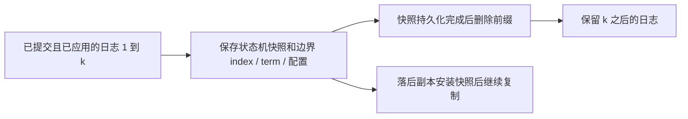

# Raft 日志压缩

> 依据 Ongaro 博士论文 Ch.5（印刷 pp.48–65 / PDF pp.65–82）。旧稿写作 Ch.9，并把分块快照等同于增量快照，现已纠正。

## 安全地替换前缀

日志压缩删除到达当前状态已不再需要的历史操作，降低磁盘占用和重放时间。只有**已提交并应用**的日志前缀可以由状态快照替代；未提交日志可能仍需回退。

快照应含业务状态、`lastIncludedIndex`、`lastIncludedTerm` 和截至该位置的最新成员配置。用于 [[Raft-客户端交互]] 的去重会话也属于状态机状态。成员配置并非可有可无的装饰字段。

每个节点可独立压缩，不要求 leader 为所有节点同步生成快照。创建一致镜像和继续执行状态机之间需要同步或 copy-on-write，不能一边修改任意数据结构、一边无保护序列化。

## InstallSnapshot 的边界匹配

§5.1 的 Figure 5.3 描述分块 InstallSnapshot。请求带 term、leaderId、lastIncludedIndex/Term、offset、data 与 done，响应携带 currentTerm 让过期 leader 退位；不能把“返回最后 offset”当成此图定义的响应字段。

接收方完整保存快照后，判断本地日志是否在快照边界上有**相同 index 且相同 term**：

- 匹配：可保留其后日志，因为日志匹配性质保证前缀一致；
- 不匹配：不能因为某条日志 index 更大就保留它，应丢弃不兼容日志，并从快照重建状态与后续复制。

自构例：快照边界 `(100,7)`，本地 index=100 的 term=6，则本地 101、102 可能属于另一分支，不能无条件保留；若边界也为 term=7，才具备保留后缀的依据。

`offset` 表示同一个快照传输流内的字节偏移，用于分块；它**不自动提供跨快照版本的 delta 编码**。

## 论文比较的压缩方式

| 方式 | 位置 | 取舍 |
|---|---|---|
| 内存状态机全量快照 | §5.1 | 简单；可用 fork/copy-on-write 并发保存，但存在资源峰值 |
| 磁盘状态机快照 | §5.2 | 需保留最后应用位置与一致磁盘镜像；随机写可能限制吞吐 |
| 日志清理 / LSM | §5.3 | 分小块回收旧数据，减少峰值与重复写；复杂性可交给 LevelDB 等库 |
| Leader 集中方式 | §5.4 | 讨论小状态机及日志中存快照的替代方案，不是唯一标准方案 |

原文没有按“100 MB / 1 GB / 10 GB”给出强制选型阈值，也没有断言所有系统最终都应选择全量快照。状态大小、写入率、落后节点速度和恢复目标需一起测量。

## 如何验证工程效果

应测快照耗时、额外写入量、请求尾延迟、恢复时间和追赶时间，并保留负载与硬件条件。这是从机制导出的评估建议；Ch.10 的初步性能测试明确**没有启用日志压缩**，其吞吐不能用来证明快照开销低。

对接 [[LSM-Tree-合并优化]] 时要区分共识日志保留和状态机底层 LSM compaction：前者保护复制与恢复边界，后者清理键版本；两者不是一个操作。
