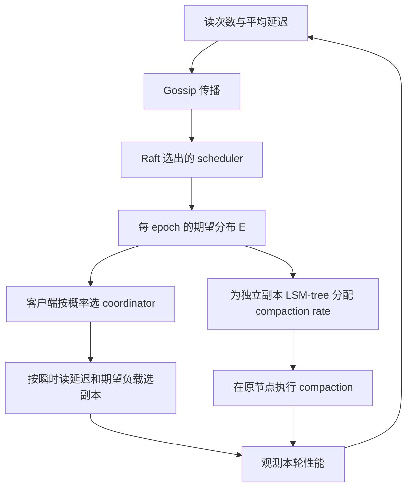

# HATS：分布式 LSM 的读请求与 Compaction 协同调度

> **历史误命名**：此文件原名 Silo，原有 WAF 调度、Anti-hog/Pro-hog 迁移和 62%/57% 实验不对应所引 PDF，已撤除。实际来源为 FAST 2026 HATS（Ren 等）。路径保留，显示名称以本标题为准。

## 要解决的矛盾

读流量均匀不保证延迟均匀，因为 compaction 的资源消耗会随节点和时间变化。但一直推迟 compaction 又会增加 SSTables 和读放大。HATS 把“请求送给哪个合法副本”与“每个副本得到多少本地压实预算”放在同一反馈循环里（§3–4）。

## 三层决策各用什么信号

| 环节 | 信号 | 决策 |
|---|---|---|
| 粗粒度，§4.2 | 上一 epoch 读次数、平均存储层延迟 | 在同一复制组中调整读请求期望数 |
| 细粒度，§4.3 | 网络+存储瞬时延迟，已有期望总负载 | 选择额外容量得分最大的副本 |
| 本地压实，§4.4 | 各 key range 的期望读占比 | 对不同副本 LSM-tree 分配速率 |

这不是以 WAF 为主的远端 compaction 服务。数据不随读调度迁移，写路径仍遵守 Cassandra 复制协议和所选一致性级别。replica decoupling 把不同 key range 放到不同 LSM-tree，才有单独压实的控制粒度。

## 正确性和性能边界

Gossip 状态带版本；expected state 带 Raft term 与 epoch，不能让旧决策覆盖新决策。Raft 在这里选调度器，不是替代 Cassandra 用户数据复制。算法移动读负载必须保持每 range 请求数守恒，副本资格和响应数量不能因调度而降低。

**推论**：调度模型过期可以导致性能不佳，但不应变成读取无权服务该快照的副本；强一致系统迁移该方法时先满足合法 follower-read 条件。

## 评估定位和意义

本地PDF：§4与图5在第5–8页，§6在第8–14页。基于 Cassandra 5.0，默认10台四核i5、16GiB、SATA SSD server，10Gbps网络；R=3，读响应数1、写3；100M记录、100客户端线程，YCSB A–F，5次运行和95%置信区间。基线mLSM、C3、DEPART统一实现于同版本Cassandra。

摘要及图7报告 read-dominant YCSB 中，相较C3/DEPART，P99减少58.6%/59.9%、吞吐为2.41×/2.90×；不是旧稿的SLO达标率。图11扩展至20节点，不能据此声称已验证千节点。§6.6说明写密集A中P50可略高于mLSM，尾部改善有代价。

相关：[[Silo-Compaction-迁移协议|HATS：副本选择与 Compaction 配额]]、[[LSM-Tree-合并优化]]、[[CaaS-LSM-Compaction即服务]]（真正的卸载方向，区别于HATS）。
