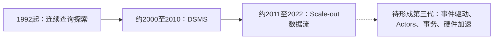

# 流处理系统代际演化

## 定义

论文重点比较两代系统，并展望可能的第三代，每代有不同的架构哲学、处理模型和能力边界。作者将其定位为从演化视角审视流处理系统的综述，覆盖从 1992 年 Tapestry 到 2022 年 Stateful Functions 的 30 年发展。

## 演化时间线（Figure 1）

## 两代比较与第三代展望

Table1比较前两代；下表第三列为Fig.1与展望的方向性归纳，**不是Table1原文或已实现能力保证**。

| 维度 | 1st Gen (DSMS) | 2nd Gen (Dataflow) | 3rd Gen (Emerging) |
|------|---------------|-------------------|-------------------|
| **时间** | 2000–2010 | 2011–2022 | 2022– |
| **架构** | 单机 Scale-up | 分布式 Scale-out Shared-Nothing | 事件驱动、微服务、硬件加速 |
| **查询模型** | 全局共享查询计划 | 独立 Job/DAG，各自分配资源 | Actor 模型、定点计算 |
| **数据模型** | Relational 扩展（CQL，Schema-on-System） | Dataflow（Schema-on-User，仅需 Timestamp） | 事件原生 |
| **查询语言** | SQL 扩展（CQL） | UDF 为主（Java/Scala/Python）+ SQL-like | 编程语言原生（Python/Java） |
| **结果保证** | 因方案而异 | 依赖输入、状态与sink协议 | 研究方向，未统一定义 |
| **执行模型** | Pipeline | Data / Pipeline / Task 并行 | 事件触发 + 定点迭代 |
| **时间与进度** | Heartbeats, Slack, Punctuations | Low-Watermark, Frontiers | 待定义 |
| **状态管理** | Shared Synopses, In-Memory | Per-Query, Partitioned, Persistent, Larger-than-Memory | 外部化 + 可插拔 |
| **容错** | 高可用与正确性的多种折中 | 分布式快照及可配置处理保证 | 事务化等研究方向 |
| **负载管理** | Load Shedding, Load-aware Scheduling | Backpressure, Elasticity | 自动弹性 |

## 三大基石的演化历程

论文阐述流处理系统在三个基石概念上经历了根本性转变：

### 架构哲学：从 DBMS 到 Dataflow

> 1st Gen 的架构是 DBMS + 流适配层——共享查询计划、QoS 监控器、降载器
> 2nd Gen 的架构是独立 Job + 分布式执行——每查询独立资源、状态、配置

### 数据模型：从 Relational 到 Dataflow

| | Relational Model | Dataflow Model |
|---|---|---|
| **Schema 定义者** | 系统（CQL 在系统层定义 schema） | 用户（应用开发者定义语义） |
| **时间语义** | 隐性（流被建模为演变的关系） | 显性（Event/Processing/Ingestion Time 三域分离） |
| **更新模型** | 插入+删除（如 STREAM 的 insertion/deletion flag） | 任意（用户自定义如何更新状态） |
| **代表** | STREAM (CQL), Aurora, TelegraphCQ | Flink, Beam/Dataflow, Spark Streaming |
| **关键突破** | 形式化的流式查询语义 | 批流统一、无序处理原生支持 |

### 状态：从 Synopsis 到 System-Managed State

参见 [[流处理状态管理]] 的完整分析。核心转变：
- **1st Gen**：Synopsis 是系统内部实现细节，用户不可见
- **过渡期 (Storm)**：用户全权管理，系统不提供任何支持
- **2nd Gen**：User-Defined, System-Managed——用户定义语义，系统管理物理

## 论文的独特贡献

1. **首个演化视角综述**：不仅描述当前状态，还解释为什么某些早期设计存活而其他被淘汰
2. **术语统一**：首次将不同社区、不同系统中不一致的术语（disorder, watermark, state, processing guarantee）归一化
3. **系统级对比表**：Table 2（乱序管理）、Table 3（状态管理）、Table 4（容错）提供 18+ 系统的横向对比
4. **被忽略工作的挖掘**：如 Punctuation、Low-Watermark 等 1st Gen 概念在 2nd Gen 的"再发现"

## 对知识库的补全

论文覆盖了当前知识库缺少的四个方向：

1. **乱序语义体系**：Watermark / Trigger / Refinement 的完整理论框架
2. **容错语义分级**：从 At-Least-Once 到 Exactly-Once on Output 的递进关系
3. **Dataflow Model**：批流统一的原理和影响
4. **弹性与运行时重配置**：Scale-Out 架构下的动态扩缩容策略

与 [[LSM-Tree]] 的关联：论文多处指出 RocksDB等LSM后端是Out-of-Core的一类实现；FASTER为hash index + hybrid log，不应视为LSM变体，且 LSM-Tree 的合并策略直接影响流处理状态的写放大和读性能。

## 展望：3rd Gen 的趋势

论文对 3rd Gen 的判断：
- **从数据流到事件驱动**：Stateful Functions, Ambrosia 等将 Actor 模型与流处理结合
- **从流处理引擎到通用计算集成**：Ray 等将流处理嵌入通用分布式计算
- **硬件加速**：GPU/FPGA 加速流处理算子
- **微服务原生**：流处理作为微服务通信的通用层
- **事务化**：从可扩展处理到可扩展事务处理（S-Store 开创的方向）

---

*参考论文: Fragkoulis et al., "A Survey on the Evolution of Stream Processing Systems", arXiv:2008.00842v2, 2023*
*关键框架: Table 1 (Evolution of streaming systems), Figure 1 (Evolution overview)*

## 如何使用这张分类图

本页核对的是2023年v2综述（Fig1、Table1），不是当前产品排行榜。做选型时从[[流处理状态管理]]、[[流处理容错模型]]和[[流处理弹性与重配置]]逐项验证假设；代际标签无法替代吞吐、延迟、故障与迁移实测。详细证据与FASTER源文纠正见[[知识库/sources/papers/SP-Survey/精读分析]]。
