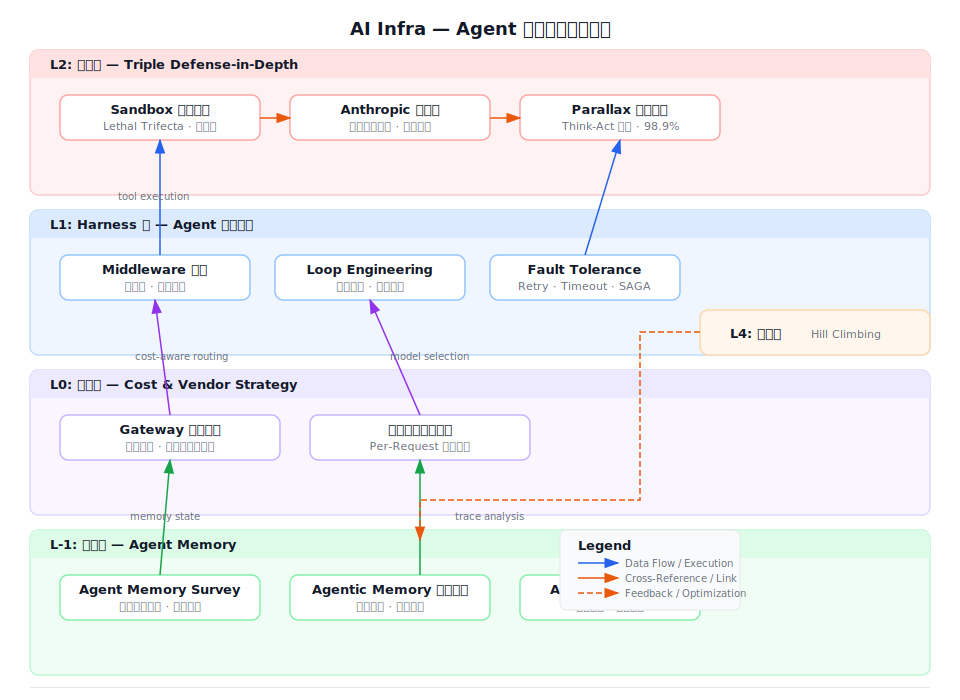

# AI Infra — Agent 基础设施体系综述

> 基于 10 张 wiki 卡片 + 2 篇论文 + 7 篇 blog 精读的跨层整合。AI Infra 是 Agent 时代的"基础设施层"——不是 Agent 本身，而是 Agent 运行所需的所有支持系统。



---

## 一、全景结构

Agent 基础设施不是一个系统，而是**一个分层体系**。10 张 Wiki 卡片分布在四个互锁层面：

```
                    L2: 安全层
   Sandbox 选型  |  Anthropic 容器化  |  Parallax
     (环境隔离)         (产品实践)      (架构分离)

                    L1: Harness 层
   Custom Harness  |  Loop Engineering  |  Fault Tol.
    (执行引擎)         (循环架构)           (可靠性)

                    L0: 控制面
   Cost Control/Gateway  |  Model Neutrality
      (成本管控)             (供应商策略)

                    L-1: 状态层
   Agent Memory Survey  |  Agentic Memory 语义缓存
      (理论全景)             (工程实践)

                    L4: 进化层
             Hill Climbing — 自我优化循环
```

---

## 二、Harness 层：Agent 执行引擎

### 2.1 核心范式：agent = model + harness

[[Custom-Agent-Harness-Middleware架构]] 确立了 Agent 基础设施的**核心范式**：harness 的职责不是在模型层做优化，而是在每一步为模型提供正确的上下文。`create_agent` 是最小化核心 Loop，所有逻辑通过 middleware 注入。

**Middleware 四个控制杠杆**：

| 杠杆 | 干什么 | 为什么不能放在 prompt 里 |
|------|--------|------------------------|
| **Deterministic Logic** | 商业规则、合规检查、动态模型切换 | prompt 是概率性的——规则必须确定性执行 |
| **Tools** | 工具全生命周期管理（注册/初始化/清理） | 工具的依赖注入应靠近治理逻辑，非散落在 agent 定义各处 |
| **Custom State** | 跨 hook 共享状态 | agent 需要"知道自己走了多少步、遇到什么错误" |
| **Stream Handlers** | 输出流分发（UI/审计/监控） | 不同消费者需要不同类型的事件 |

**能力决定 Middleware 的 1:1 映射**是这套架构的核心洞察：

| 要什么 | 用什么 Middleware | 不需要 | 需要 |
|--------|-------------------|--------|------|
| 防上下文溢出 | SummarizationMiddleware | agent 人工管理上下文 | prompt compaction 自动化 |
| 记忆存取 | MemoryMiddleware / SkillsMiddleware | agent 每次从零开始推理 | 启动时加载相关记忆 |
| 故障恢复 | ToolRetryMiddleware / ModelFallbackMiddleware | agent 自己决定是否重试 | middleware 层决定策略 |
| 策略执行 | PIIMiddleware / HumanInTheLoopMiddleware | agent 自己判断是否安全 | 每通 call 必须触发 |
| 成本控制 | ModelCallLimitMiddleware / PromptCachingMiddleware | agent 自己决定模型选择 | Gateway 层统一管理 |

### 2.2 多层循环架构：从"能跑"到"能进化"

[[Loop-Engineering-多层Agent循环架构]] 把 Agent 运行模式分解为四层循环，每一层解决不同的问题：

| 层 | 做什么 | 关键飞跃 |
|----|--------|---------|
| **L1 Agent Loop** | 模型反复调用工具直到完成任务 | 让模型有行动能力 |
| **L2 Verification Loop** | 输出质量校验 + 失败反馈重试 | 让质量可持续，不只"有时对" |
| **L3 Event-Driven Loop** | cron/webhook/message 触发 Agent 运行 | 从离散工具变成持续服务 |
| **L4 Hill Climbing Loop** | 分析生产 trace → 自动优化 harness 配置 | **自我进化——最重要的复利引擎** |

Harness 层和 Loop 层的关系是正交互补：
- **Loop Engineering** 定义 Agent 的骨骼（循环层级怎么设计）
- **Middleware Harness** 定义 Agent 的肌肉（每一步注入什么逻辑）
- Agent Core Loop（L1）是 Middleware Hook 附着的地方

---

## 三、安全层：三重纵深防御

### 3.1 Sandbox 选型：缩小风险面

[[Agent-Sandbox-安全沙箱选型]] 基于 **Lethal Trifecta**（敏感数据 + 不可信内容 + 对外通信）和 **Rule of Two**（三项俱全则 Agent 不可完全自主）构建了沙箱选型框架。

**安全 Sandbox 五要素**：

| 要素 | 目的 | 标准 |
|------|------|------|
| 隔离文件系统 | 缩小条件 1（敏感数据可达性） | 仅显式挂载所需路径 |
| 有限网络访问 | 缩小条件 3（对外通信能力） | 白名单，精确到 endpoint+method |
| 资源限制 | 防止 DoS | CPU/内存/时间硬上限 |
| 受控复用性 | 防止跨会话攻击积累 | 高威胁场景用 ephemeral |
| **内核级隔离** | 防止容器逃逸 | microVM（Firecracker）而非共享内核容器 |

**关键警告**：市面上自称"sandbox"的 Kubernetes Pod 默认不提供内核级隔离——一旦 Agent exploit kernel bug 就能逃逸到其他容器或宿主机。

### 3.2 Anthropic 容器化：生产验证的案例集

[[Anthropic-Agent安全容器化实践]] 是 **AI Infra 安全的最重要的生产参考**——Anthropic 在三个产品上实践了三种隔离模式，并坦诚地记录了失败。

**三种隔离模式**：

| 模式 | 产品 | 隔离层 | 爆发半径 |
|------|------|--------|---------|
| Ephemeral Container | claude.ai | gVisor + 服务端隔离 | 最小（per-session filesystem） |
| Human-in-the-loop Sandbox | Claude Code | Seatbelt/bubblewrap + 审批 | 中等（用户可审批例外） |
| Devcontainer | Claude Code Auto | 硬边界容器 | 小（无例外通道） |

**三个未预见风险**是这篇材料最有价值的部分：

1. **信任对话框之前的执行**：Claude Code 在用户接受信任提示前就解析 `.claude/settings.json`，hook 在信任建立前自动执行。教训：**project-local config 的解析必须延迟到信任确认后**。
2. **用户作为注入向量**：研究人员发送"帮我跑这个"的 prompt → 内含 `cat ~/.aws/credential` → b64 encode → POST 到外部。25 次尝试中 24 次成功。模型层防御无信号（instruction 来自用户本人的消息），**唯一有效的防御是环境层出站控制**。
3. **审批疲劳**：93% 用户默认批准——意味着 human-in-the-loop 的实际可靠性远低于设计意图。

### 3.3 Parallax：层间架构隔离

[[Parallax-Agent安全架构]] 从不同方向解决问题——不在运行环境中加沙箱，而是在**架构层面分离认知和执行**。

**四原则**：

| 原则 | 机制 | 防御什么 |
|------|------|---------|
| Cognitive-Executive Separation | think 系统只产意图，execute 系统是独立进程 | prompt injection 无法直接获得执行权 |
| Adversarial Validation | 三层验证器（规则/ML/LLM）在 think→act 之间 | 被攻破的推理系统产出的恶意 intent |
| Information Flow Control | 数据敏感性标签随信息流传播 | 敏感数据被不该读的组件读取 |
| Reversible Execution | 执行步骤前 snapshot + 失败回滚 | 验证失败后的副作用残留 |

**实验结果**：默认配置阻断 98.9% 的攻击（280 对抗用例，9 类攻击，0% 误报）。

**Parallax 与 Sandbox 的关系**：不是互斥而是互补——Parallax 在架构层切断 think→act，Sandbox 在环境层切断 act→world。`Parallax + Sandbox` 是最强纵深。

### 3.4 三层安全方案的防御矩阵

| 攻击路径 | Sandbox 选型 防御？ | Anthropic 容器化 防御？ | Parallax 防御？ |
|---------|-------------------|----------------------|----------------|
| prompt injection → 直接执行恶意命令 | 部分（sandbox 限制可达资源） | 部分（审批 + 模型过滤） | ✅ 完全（架构分离切断） |
| 越狱沙箱（escape） | ❌（如果用了非 kernel 级隔离） | ⚠️（记录过 escape 事件） | ❌（不防御 escape） |
| 用户作为注入向量（钓鱼 prompt） | ⚠️（出站控制可拦截外泄） | ⚠️（环境层出站控制可拦截） | ✅（think-act 分离 + 验证） |
| 凭证泄露 | ✅（credential 不进 sandbox） | ✅（credential 不进 sandbox） | ⚠️（需 IFC 配合） |

---

## 四、控制面：成本和供应商策略

### 4.1 Gateway 成本控制

[[Agent-Cost-Control-Gateway成本控制]] 是 AI Infra 控制面的核心组件。LangChain dogfood 的三个核心教训：

| 教训 | 根因 | 正确方案 |
|------|------|---------|
| 静态价格表不可靠 | caching 分层计价、token 计费规则多变、模型每周变价 | API 驱动实时价格轮询 |
| **路由覆盖率 ≠ 100%** | Cursor 只暴露 base-url swap、Claude Desktop 需 managed config | billing API 兜底 |
| 硬截断损害信任 | 消费达上限时突然中断工作流 | 预达 80% 预警 + 秒级审批链路 |

**成本数据的完整链路**：`agent 身份 → 模型调用链 → trace → 故障模式`。缺任一层都无法定位"哪个 agent 的哪个任务花超了"。

### 4.2 模型中立：AI 时代的 Terraform

[[Model-Neutrality-模型中立与反锁定]] 建立了云时代到模型时代的精确类比：

| 云时代 | 模型时代 |
|--------|---------|
| 存储/网络/计算 = 商品 | tokens = 商品 |
| CloudFormation/ARM = 锁定工具层 | Claude Agent SDK / OpenAI Agents API = 锁定 Harness 层 |
| **Terraform = 一层之上中立抽象** | **中立 Harness = 一层之上中立抽象** |

**模型中立比云中立重要的原因**：模型能力以月/季度跳变，切换粒度是**单次请求内**而非合同续约期。

**Model Neutrality 三层定义**：
1. 开源——每行代码可审计
2. 多模型——同一 harness，任意后端，一视同仁
3. **Profile-aware**——不强求模型无差别化（那会牺牲最优体验），而是暴露各自长处

**成本控制 + 模型中立的协同**是关键战略：有模型中立，Cost Control 可以做 **cost-aware routing**——便宜模型做简单任务，昂贵模型仅在需要时调用，同任务不同模型价格差可达 5-10x。

---

## 五、状态层：Agent Memory 全栈

### 5.1 论文综述全景

[[Agent-Memory-Survey-2026综述]] 提供了 2022-2026 年初 Agent Memory 研究的全景：

**Agent Memory 的系统架构**：`write → manage → read` 循环，与感知和行动紧密耦合。

**三维分类**：
- **时间维度**：对话级 / 会话级 / 跨会话级
- **表示基底**：向量块 / 文本块 / 知识图谱 / 模型权重
- **控制策略**：启发式 / LLM 决策 / 策略学习

**五大机制家族**：

| 家族 | 原理 | 瓶颈 |
|------|------|------|
| Context-resident compression | 压缩历史使 fit context window | 信息损失不可避免 |
| Retrieval-augmented stores | 外部向量库检索相关记忆 | 检索精度（语义相似 ≠ 因果相关） |
| Reflective self-improvement | Agent 反思自身行为并自我改进 | 反思质量不可靠 |
| Hierarchical virtual context | 多层级摘要 + 按需展开 | 层级设计无通用方案 |
| Policy-learned management | RL/进化算法学习记忆策略 | 训练成本高，泛化难 |

### 5.2 工程实践

[[Agentic-Memory-语义缓存]] 是 Agent-First 数据系统在记忆层面的实现思路——存储历史探针结果、元数据标注、数据语义信息，通过向量索引支持语义检索。

**核心挑战**：
1. **陈旧更新**：schema 变更时缓存结果可能过时，同步更新开销大，惰性更新有误导风险
2. **隐私治理**：不同用户 Agent 的查询结果共享可能泄漏意图
3. **因果检索跃升**：从"语义相似"到"因果相关"——当前所有 retrieval-augmented 方案都在语义层徘徊

---

## 六、层间关系：AI Infra 的"正交叠加"模型

### 6.1 依赖关系

```
状态层 (Memory) ←── 无强依赖，但记忆质量 → Harness 效率
     │
     ▼
Harness 层 (Middleware + Loop + Fault Tolerance) ←── 核心执行引擎
     │
     ├──→ 控制面 (Cost + Neutrality) —— Harness 运行需要成本控制
     │
     └──→ 安全层 (Sandbox + Anthropic + Parallax) —— Harness 执行工具需要安全边界
     │
     ▼
进化层 (Hill Climbing) ←── L1-L3 运行产生 trace → 自我优化
```

### 6.2 各层不绑定的独立性

AI Infra 的核心设计原则是**各层正交可组合**：
- 不需要 Anthropic 容器化才能使用 Loop Engineering——Loop 定义结构，Sandbox 是可选叠加
- 不需要 Parallax 才能使用 Model Neutrality——中立是供应商策略选择，安全是运行时策略
- 不需要 Agent Memory Survey 才能使用 Cost Control——成本控制是控制面，记忆是状态层

这种正交性正是 Middleware 架构的价值所在——**每一个 Middleware 是独立、可复用、可测试的策略单元，组合不增加耦合**。

---

## 七、Agent Infra 的成熟度评估

| 领域 | 成熟度 | 证据 |
|------|--------|------|
| **Sandbox/容器化** | 🟢 生产级 | Anthropic 多产品验证 + LangSmith microVM 实践 |
| **Harness/Middleware** | 🟡 早期生产 | LangChain create_agent 在生产中使用，但组织标准化刚起步 |
| **Fault Tolerance** | 🟢 生产级 | LangGraph Retry/Timeout/SAGA 有明确 API 和最佳实践 |
| **Cost Control** | 🟡 早期生产 | LangChain Gateway dogfood 中发现多个漏洞，仍在演进 |
| **Model Neutrality** | 🔴 战略级（前期） | 供应商正在建立锁定的 Harness 层，中立 Harness 是反制 |
| **Agent Memory** | 🔴 研究级 | 五大机制家族均处于学术阶段，无生产标准 |
| **Architecture Security (Parallax)** | 🔴 研究级 | 概念验证完成，无生产部署报告 |
| **Hill Climbing** | 🔴 前沿 | LangChain Engine 在内部试验，尚无外部采用 |

---

## 八、AI Infra 的演化方向：从 "对抗→适应→进化"

当前的 AI Infra 结构是问题驱动的——每种问题催生一个层面：

```
问题: Agent 不安全   → 安全层（Sandbox/Parallax/Anthropic）
问题: Agent 不可控   → 控制面（Cost/Neutrality）
问题: Agent 不可靠   → Harness 层（Fault Tolerance/Loop）
问题: Agent 记不住   → 状态层（Memory Survey/Cache）
问题: Agent 不进化   → 进化层（Hill Climbing）
```

**下一阶段**是这些层面的融合——例如：Hill Climbing 不仅优化 prompt，还优化 security middleware 的验证规则；Cost Control 不仅做预算，还根据 cost 和 security posture 动态选择模型和沙箱隔离级别。**AI Infra 的终点不是更多层，而是层间反馈回路的自动化。**

---

## 九、与已有知识库的关联

| 已有概念 | 与本综述的关系 |
|---------|-------------|
| [[Agent-First-Data-Systems]] | Agent-First 是 Agent 直接操作数据系统的范式。AI Infra 是支持这种操作的基础设施 |
| [[流处理容错模型]] | SAGA 补偿模式在 Agent 上下文中的映射——Agent Fault Tolerance 的核心参考 |
| [[LSM-Tree]] | Agent Memory 中的 Compaction 问题与 LSM-Tree 的 Compaction 异曲同工——增量合并升级 |

---

## 变更记录

| 日期 | 动作 | 变更说明 |
|------|------|----------|
| 2026-06-19 | 创建 | 初始版本，覆盖 10 张 AI Infra wiki 卡片：Harness 层（Middleware/Loop/Fault Tolerance）、安全层（Sandbox/Anthropic/Parallax）、控制面（Cost/Neutrality）、状态层（Memory Survey/缓存）、进化层（Hill Climbing）+ 架构图 `ai-infra-4layer-arch.svg` |

*合成日期：2026-06-19 | 基于 10 张 wiki 卡片 + 11 篇 source 精读分析*
