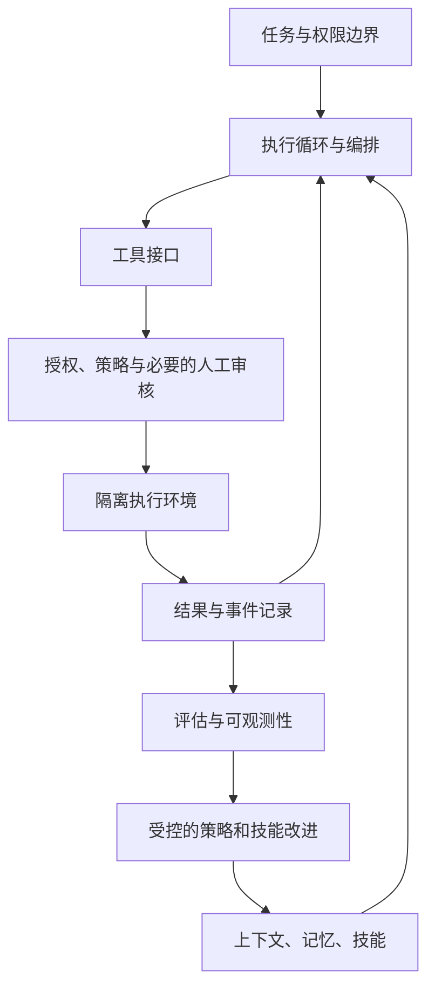

# Agent 基础设施：执行、状态、治理与证据

Agent 的效果取决于模型与运行环境共同作用。执行循环、工具、上下文、编排、可观测性、评估、治理之间存在依赖，却没有一套被所有系统采用的固定四层协议栈。本图按职责组织知识卡片，箭头表示信息流。

```mermaid
flowchart TD
  U[任务与权限边界] --> L[执行循环与编排]
  M[上下文、记忆、技能] --> L
  L --> T[工具接口]
  T --> G[授权、策略与必要的人工审核]
  G --> E[隔离执行环境]
  E --> R[结果与事件记录]
  R --> L
  R --> V[评估与可观测性]
  V --> P[受控的策略和技能改进]
  P --> M
```

## 从循环到可恢复执行

[[Custom-Agent-Harness-Middleware架构]] 描述可组合的运行逻辑；[[Loop-Engineering-多层Agent循环架构]] 区分任务循环和反馈改进；[[Agent-Fault-Tolerance-容错设计]] 关注重试、持久状态及恢复。三者都需要定义副作用：重放模型状态不代表已经发出的邮件或付款可以重放。

重试应结合错误分类、幂等键、调用预算和人工介入。网关可集中实施配额和模型策略，但不能仅凭计费 token 判断所有成本，也不存在适合全部场景的固定退避公式或额度阈值。模型中立抽象降低部分迁移工作，仍需逐工具、消息和能力做适配验证。

## 安全由多个边界共同构成

沙箱约束进程可以触及什么；动作授权决定某次调用是否允许；信息流控制跟踪敏感数据去向；审核与日志服务于追责和恢复。这些机制不能互相替代。gVisor 不应被写成 microVM；凭证放在模型进程之外也不自动排除通过获准工具泄漏的可能。

[[Parallax-Agent安全架构]] 的原文将推理与执行分离，并使用 Tier 0–3 的四层验证。其 assume-compromise 测试直接注入结构化调用：默认配置阻断 277/280 恶意动作，合法误报 0/50；最高安全配置阻断 280/280，同时误拦 18/50。数字来自作者自建测试，规则曾针对测试发现的问题调整，没有独立留出攻击集的等价保证。

延迟也不能省略：表 5 的 Tier 1 / Tier 2 P50 分别为 1947 / 2089 毫秒；更低的推理时间是讨论中的优化预期。Chronicle 可恢复受控资源的状态，不能让第三方忘记已外发的信息。完整条件见 [[知识库/sources/papers/Parallax/arxiv-2604.12986-精读]]。

## 记忆不是天然可信的事实库

[[Agent-Memory-Survey-2026综述]] 提供分类和评价视角；[[Agentic-Memory-语义缓存]] 讨论复用的收益与失效条件。来源、时效、冲突、用户控制和检索权限决定记忆是否有用。成功率提升、token 节约、检索命中和错误记忆传播应分开度量。

[[Hermes-Agent-自进化Agent框架]] 展示持久记忆与技能循环；“自进化”在这里主要是外部状态和流程更新，不是基础模型权重自动学习。压缩多个工具调用也不等于零上下文成本。

## 如何使用综述与工程文章

[[Agent-Harness-Engineering-Survey综述]] 的框架和对照表是研究对象归纳；不同平台的完整/部分/不具备能力三态不能简化成随意的二元打勾。网页实践文章能提供设计线索，却不能替代统一实验。

建议建立版本化任务集，同时记录质量、成本、延迟、外部副作用、安全误报/漏报与恢复成功率。评价多 Agent 时再增加协作通信和共享状态成本。这里的建议是读者可执行的评估设计，不表示本知识库已运行这些实验。
