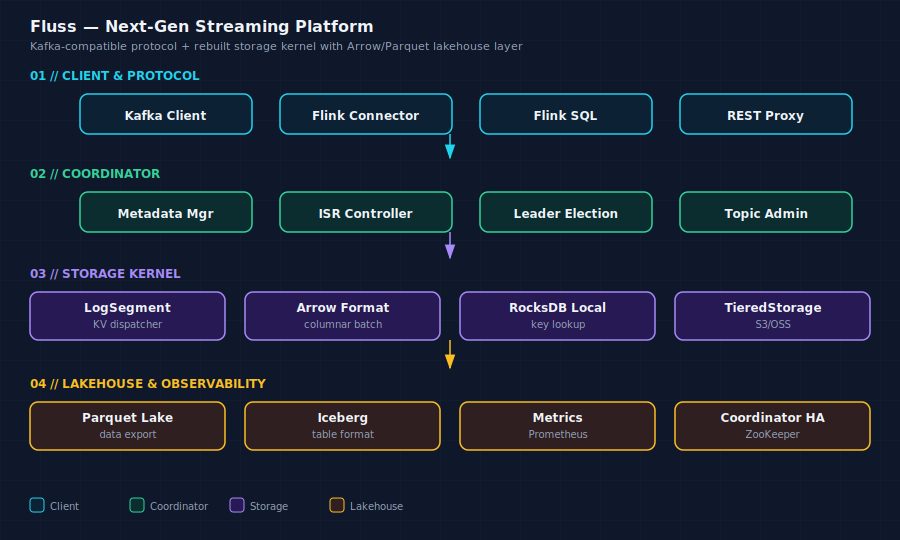

# Fluss 流处理平台架构综述


> 基于 Fluss trunk vs Kafka 2.7.2 源码级对比，综合 10 张 wiki 卡片，覆盖 Fluss 的存储引擎、分布式协调、RPC 网络、客户端集成、Lake 层五大模块。




## 一、定位：Fluss 是什么？

Fluss 是阿里巴巴开源的**下一代流处理平台**，定位为 Kafka 的替代方案。它不像 Pulsar 那样另起炉灶，而是采取了**兼容 Kafka 协议 + 重构存储内核**的策略——Kafka 的客户端和生态工具可以零改动接入 Fluss，但在存储层做了根本性的重构。

Fluss ≈ **Kafka 的协议兼容层** + **RocksDB (LSM-Tree) 作为本地存储引擎** + **Apache Arrow 列式内存格式** + **Iceberg 湖仓集成**

---

## 二、整体架构

```
Producer/Flink/Flink SQL → Fluss Coordinator (metadata + routing)
                                ↓
                         Tablet Servers (RocksDB local store)
                                ↓
                         Remote Lake Storage (Iceberg / HDFS)
```

三层职责分离：
- **Coordinator**：类似 Kafka Controller，管理 tablet 分配、schema、集群拓扑。元数据持久化在外部存储（如 ZooKeeper 或替代方案）
- **Tablet Server**：数据节点。每个 tablet 对应一个 RocksDB 实例，支持横向扩展。通过 ARROW 格式在内存和网络中传输
- **Lake Storage**：冷数据归档到 Apache Iceberg 表，实现计算存储分离

### Kafka 对照

| 组件 | Kafka | Fluss |
|------|-------|-------|
| 消息存储 | Segmented log files (page cache) | RocksDB LSM-Tree |
| 控制器 | Kafka Controller (ZK/KRaft) | Fluss Coordinator |
| 数据节点 | Broker (partition → log segment) | Tablet Server (tablet → RocksDB) |
| 存储格式 | WAL-based binary format | Arrow RecordBatch |
| 冷数据 | Tiered Storage (remote log) | Iceberg Lakehouse |
| 路由 | Partition 分配 | Tablet 分配 |

---

## 三、存储引擎：从 Page Cache 到 LSM-Tree

### Kafka 存储的瓶颈

Kafka 的存储模型依赖 OS page cache：消息写入 segment file → 由 page cache 吸收写入 → 异步刷盘。这个模型在**纯 append 场景**下非常高效（接近 seq write 的磁盘带宽），但有几个硬伤：
- 随机读取需要从磁盘加载 page cache，命中率不可控
- 数据过期删除粒度是 segment（整段删除），不够灵活
- 依赖 OS 的 page cache 策略，无法进行自定义存储优化

### Fluss 的 LSM-Tree 方案

Fluss 用 **RocksDB** 作为本地存储引擎。每个 tablet 对应一个 RocksDB 实例：

- **写入**：MemTable（内存）+ WAL（持久化） → 异步 compaction 到 SST files
- **读取**：从 MemTable → immutable MemTable → SST files 的层次结构中查找
- **Compaction**：后台多线程 merge sorted SST files，减少读放大，回收过期数据

这一步的收益：
- KV 粒度（而非 segment 粒度）的数据过期——支持 **Tiering 分层**（热数据在 RocksDB，冷数据在 Lake Storage）
- 随机读性能更好（LSM-Tree 的 Bloom filter + index block 优化）
- Compaction 时可以做列级删除、TTL 清理、去重

### Arrow 列式记录格式

Fluss 在内存和网络中统一使用 **Apache Arrow RecordBatch** 格式：
- 列式存储：相同列的数据连续存放 → 高压缩率 + SIMD 友好的向量化计算
- 零拷贝：Flink 等计算引擎可以直接消费 Arrow 数据，无需反序列化
- 与 Iceberg 格式天然对齐（Iceberg 也是列式）

Kafka 的 binary format 需要消费者自行反序列化；Fluss 的 Arrow 格式让计算引擎能做到"读到的就是能算的"。

---

## 四、Kafka 兼容层

Fluss 实现了完整的 **Kafka 协议兼容层**：
- 复用 Kafka 的 `ProducerRecord` / `ConsumerRecord` 数据模型
- 兼容 Kafka 的分区（partition）概念——映射到 Fluss 的 tablet
- 支持 Kafka 的 client API（Java / Go / Python）

这意味着：**现有的 Kafka 客户端代码不需要改动，只需要把 bootstrap server 指向 Fluss 集群。**

### 不完全兼容的部分
- **事务消息**：Kafka 的幂等 producer + 事务机制依赖自定义的 coordinator。Fluss 用 RocksDB 的 WAL + MVCC 重新实现，协议层兼容但语义可能有差异
- **压缩策略**：Kafka 支持 `delete` / `compact` / `delete,compact`；Fluss 用 RocksDB compaction 实现，语义等价但实现不同

---

## 五、Lake 层与湖仓融合

Fluss 最关键的差异化是 **Lake 层的原生集成**：
- 冷数据自动分层到 **Apache Iceberg** 表
- Iceberg 表存储在远程对象存储（HDFS / OSS / S3）
- Flink SQL 可以直接查询 Iceberg 表，无需额外的 ETL 管道

### Tiering 分层策略

```
热数据 (最近 1h)         → RocksDB MemTable + SST files
温数据 (1h - 24h)        → RocksDB SST files (compact)
冷数据 (> 24h)           → Iceberg Lake Storage
```

分层迁移由 background tiering task 驱动，对写入/读取透明。消费者从热/温层读取，如果数据已迁移到冷层，自动回退到 Iceberg reader。

### 对比 Kafka Tiered Storage

| 维度 | Kafka Tiered Storage | Fluss Lake Layer |
|------|---------------------|-----------------|
| 冷存储格式 | Kafka 原生 segment file | Iceberg 列式表 |
| 查询能力 | 仅按 offset 读 | Flink SQL 直接查询 |
| Schema | 弱 schema（key/value bytes） | Arrow schema + Iceberg schema evolution |
| 生态工具 | 有限 | Iceberg 生态（Spark, Trino, Flink） |

Kafka 的 Tiered Storage 只是"把冷 segment 搬到远程存储"；Fluss 的 Lake 层让冷数据变成了**可查询的列式表**——这是从 messaging system 到 **streaming data platform** 的质变。

---

## 六、分布式协调

Fluss 使用类似 Kafka 的 Coordinator 模式管理集群：
- **Tablet 分配**：Coordinator 负责将 tablet 映射到 tablet server，类似 Kafka 的 partition → broker 映射
- **故障恢复**：Tablet server 故障 → Coordinator 重新分配 tablet 到其他节点
- **Leader 选举**：依赖外部协调服务（ZooKeeper 或 Fluss 自带的替代方案）

和 Kafka 的区别：
- Fluss 的 tablet 迁移依赖 RocksDB 的 checkpoint/snapshot 机制 → 比 Kafka 的 segment 复制更细粒度
- Fluss 的 Coordinator 承载了 schema registry 功能（Kafka 需要额外的 Schema Registry 服务）

---

## 七、客户端与计算集成

Fluss 深度集成 Flink 生态：
- **Flink Connector**：Flink 可以直接读写 Fluss tablet，利用 Arrow 零拷贝省去序列化开销
- **Flink SQL**：Fluss 的 Iceberg 表对 Flink SQL 透明——Flink 可以无缝查询 streaming 数据和 historical 数据
- **Table API**：提供类似 Kafka Streams 但有更强一致性的流处理 API

### 代码复用度

源码级对比显示：Fluss 约 **30% 代码复用 Kafka**（主要是协议层和 client API），**70% 自研**（存储引擎、协调器、Lake 层、Arrow 集成）。

---

## 八、Fluss 的核心竞争力

| 维度 | Kafka | Apache Pulsar | Fluss |
|------|-------|--------------|-------|
| 存储引擎 | Page cache + segmented log | BookKeeper (Ledger-based) | **RocksDB LSM-Tree** |
| 内存格式 | Binary (custom) | Binary | **Arrow RecordBatch** |
| 冷数据 | Tiered Storage (raw segments) | Tiered Storage | **Iceberg 列式表 (可查询)** |
| 计算集成 | Kafka Streams + ksqlDB | Pulsar Functions | **Flink SQL 原生查询 Iceberg** |
| 协议兼容 | 原生 | 独立协议 | **Kafka 协议兼容** |
| Schema | Schema Registry (附加) | Pulsar Schema | **内建 schema registry + Arrow schema** |

Fluss 的独特价值主张：**Kafka 的生态 + LSM-Tree 的存储灵活性 + Arrow 的计算效率 + Iceberg 的湖仓可查询性**。

---

## 九、适用场景判断

| 场景 | 推荐 | 理由 |
|------|------|------|
| 存量 Kafka 应用迁移 | Fluss | 协议兼容，零代码改动 |
| 流批一体 (Flink 为主) | Fluss | Arrow 零拷贝 + Iceberg SQL 查询 |
| 超大规模纯 append 流 | Kafka | Page cache 模型更简单直接 |
| 多租户 + 地理复制 | Pulsar | 原生的 geo-replication + multi-tenancy |
| 需要 key compaction | Fluss | RocksDB 的 compaction 比 Kafka 更灵活 |
| 实时 OLAP on streams | Fluss | Iceberg + Flink SQL 是天然搭配 |

---

*合成日期：2026-06-15 | 基于 Fluss 源码级分析 10 张 wiki 卡片*
