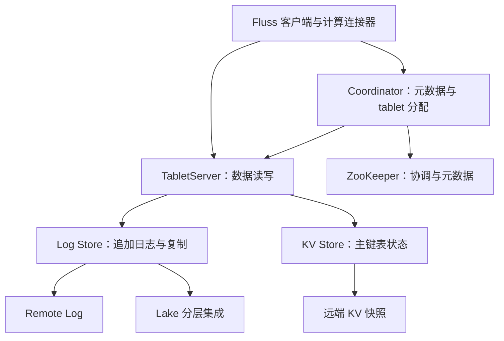

# Fluss 整体架构与 Kafka 2.7.2 对照

## 对照范围

本笔记保留 Kafka 2.7.2 这一历史对照点，并以 Fluss 官方架构文档核对组件职责。旧源码笔记没有固定 Fluss commit，因此类数量与类名只能作为待复核的阅读线索，不能作为当前版本兼容矩阵。没有计数脚本和基准快照，也不能声称精确的 存在日志实现复用与独立设计；比例缺少固定 commit 和计数方法。

```mermaid
flowchart TD
  C[Fluss 客户端与计算连接器] --> CS[Coordinator：元数据与 tablet 分配]
  C --> TS[TabletServer：数据读写]
  CS --> Z[ZooKeeper：协调与元数据]
  CS --> TS
  TS --> L[Log Store：追加日志与复制]
  TS --> K[KV Store：主键表状态]
  L --> R[Remote Log]
  K --> S[远端 KV 快照]
  L --> LA[Lake 分层集成]
```

Log Table 使用 Log Store；Primary Key Table 同时使用 Log 与 KV。Tablet 是数据分片的服务单元，而非整张表的管理单元。日志承担 KV 恢复的 WAL 职责。官方架构说明 Log 数据有副本复制，KV 状态依靠快照和日志恢复；不能把 KV 也画成一套已实现的对等副本复制。

## 需要保留的区别

| 维度 | Fluss | Kafka 2.7.2 |
|---|---|---|
| 数据抽象 | Database、带 schema 的 Table、bucket | Topic、partition、字节记录 |
| 主键状态 | PK 表 KV 状态及更新语义 | 日志压缩保留 key 的较新记录，不等于同样的查询接口 |
| 控制面 | 独立 Coordinator 与 TabletServer | ZooKeeper 与 broker/controller 路径 |
| 持久化 | 本地日志、远端日志、KV 快照及 Lake 集成按职责组合 | 本地 partition log；不含后续 KIP-405 分层能力 |
| 客户端 | 原生 Fluss API 与计算连接器 | Kafka protocol 与客户端 |

Kafka 2.7.2 不应被列成已采用 KRaft 的生产版本；也不能把后来 Kafka 引入的能力回填到这个对照版本。复用日志实现思路不等于线协议完全兼容，Kafka 插件应逐 API、版本和错误语义测试。

## 阅读路径与验证点

从 [[Fluss-存储引擎]] 看 log/KV 分工，经 [[Fluss-分布式协调]] 看副本及故障，再读 [[Fluss-RPC与网络]] 和 [[Fluss-客户端与计算集成]]。[[Fluss-Tiering分层架构]] 与 [[Fluss-Lake层与湖仓融合]] 分别关注数据生命周期和表格式适配。

“控制面独立”本身不足以证明存算完全分离；应具体说明哪种状态由远端持久化、哪个计算引擎可独立扩缩、恢复需要哪些本地或远端状态。

## 核验来源

- [Fluss 官方架构](https://fluss.apache.org/docs/concepts/architecture/)

## 跨模块应检查的不变量

日志复制进度、KV 快照进度、Lake 提交进度不是同一个 offset。删除本地日志前，应满足读者与恢复的保留要求；Lake 文件已经写出也不等于快照已提交。列式 batch 减少部分转换，不代表网络、压缩、持久化全程零拷贝。

[[Fluss-KV存储-RocksDB]] 连接流日志与主键状态，[[Fluss-Tiering分层架构]] 连接热数据与湖表，[[Fluss-Arrow列式记录格式]] 连接类型与向量化访问。把这些路径放在一起时应优先标注持久化和提交边界，而不是用“实时湖仓”“OLTP 级”替代协议说明。
